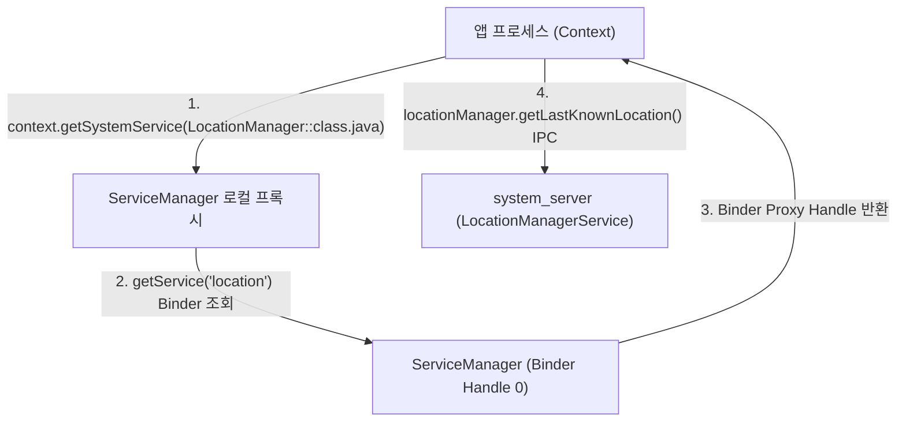

## Context.getSystemService (시스템 서비스 획득 매커니즘)

### 1. 개요 (Overview)

**`Context.getSystemService()`** 는 Android 애플리케이션이 `LocationManager`, `WindowManager`, `NotificationManager` 등 OS 가 제공하는 시스템 수준 서비스의 로컬 핸들(Proxy 매니저 객체)을 획득하기 위해 사용하는 핵심 Android API 이다.

내부적으로 [ServiceManager](service-manager.md) 를 통해 `system_server` 프로세스에 상주하는 Binder 프록시를 조회하며, 반환된 매니저 객체를 통해 [Binder IPC](../../01_system_internals/ipc-and-process/binder-ipc.md) 통신을 수행한다.

---

#### 초보자를 위한 쉽게 이해하는 비유

- **`getSystemService()` (민원실 창구 번호표 매니저 받기)**:
  - 시민(앱 프로세스)이 시청(system_server)의 특정 전문 부서(위치과, 건축과)와 연락하고 싶을 때, 시청 안내소(ServiceManager)로 가서 **해당 부서 전통 내선전화기 핸들(`getSystemService`)**을 발급받아 통화하는 방식.



---

### 2. 주요 메커니즘 및 Context Scope
 
 1. **SystemServiceRegistry 와 정적 캐시 (Cached Manager)**:
    - Android 프레임워크는 `SystemServiceRegistry` 내부에 `SYSTEM_SERVICE_FETCHERS` 맵을 구성하고, `ContextImpl` 생성 시 인스턴스 배열(`mServiceCache`)을 초기화하여 동일 Context 내 반복 호출 시 Binder 조회를 생략한다.
 2. **Context Scope 에 따른 획득 제약**:
    - **`Activity Context`**: `WindowManager`, `LayoutInflater` 등 화면 및 테마(Theme)와 직결된 서비스에 필수. 다이얼로그나 팝업 표출 시 유효한 윈도우 토큰(`WindowToken`)을 제공한다.
    - **`Application Context`**: `ConnectivityManager`, `LocationManager`, `NotificationManager` 등 UI 와 무관한 시스템 전역 서비스에 안전하게 사용. 메모리 릭(Memory Leak)을 방지한다.
    - **`WindowContext` (Android 12+)**: Activity 가 없는 백그라운드 환경(예: Service, InputMethod)에서 화면 기반 UI(오버레이 등)를 띄우기 위해 도입된 비-Activity Context.
 3. **매니저 호출 시의 동기 IPC 오버헤드**:
    - `getSystemService()` 반환 매니저의 메서드 호출은 일반 메서드처럼 보이지만, 내부는 **[Binder IPC](../../01_system_internals/ipc-and-process/binder-ipc.md)** 원격 호출이다. 따라서 메인 스레드에서의 무분별한 폴링 루프 호출은 UI 블로킹 및 ANR(Application Not Responding)을 유발할 수 있다.

---

### 3. 코드 예시 (`Context.getSystemService` 안전한 패턴)

```kotlin
// 1. 타입 기반 getSystemService API 및 하드웨어 피처 검증
val locationManager = context.getSystemService(LocationManager::class.java)

if (context.packageManager.hasSystemFeature(PackageManager.FEATURE_LOCATION)) {
    // 위치 서비스 IPC 요청 수행
    val lastLocation = locationManager?.getLastKnownLocation(LocationManager.GPS_PROVIDER)
}

// 2. UI 경계 관련 서비스는 Activity Context 에서 획득
val windowManager = activity.getSystemService(WindowManager::class.java)

// 3. Android 12+ WindowContext 생성 및 WindowManager 획득 (Activity 없는 UI)
if (Build.VERSION.SDK_INT >= Build.VERSION_CODES.S) {
    val windowContext = context.createWindowContext(
        WindowManager.LayoutParams.TYPE_APPLICATION_OVERLAY,
        null
    )
    val overlayWm = windowContext.getSystemService(WindowManager::class.java)
}
```

---

### 4. CLI 관측 및 디버깅 신호

```bash
# 1. 앱 프로세스가 바인딩 중인 시스템 서비스 상태 확인
adb shell dumpsys activity services <package_name>

# 2. 특정 서비스에 등록된 리스너 및 클라이언트 정보 덤프
adb shell dumpsys location
adb shell dumpsys notification --noredact
```

---

### 5. 연결 문서 (Related Links)

- [ServiceManager](service-manager.md) - Binder Handle 0 시스템 서비스 등록소
- [system_server](../../01_system_internals/boot-and-runtime/system-server/system-server.md) - 시스템 서비스들을 호스팅하는 메인 자바 프로세스
- [Binder IPC](../../01_system_internals/ipc-and-process/binder-ipc.md) - getSystemService 매니저가 통신하는 IPC 파이프라인
- [WindowManagerService](window-manager-service.md) - WMS 서비스 레퍼런스
- [PackageManagerService](package-manager-service.md) - PMS 서비스 레퍼런스
- [ActivityManagerService](activity-manager-service.md) - AMS 서비스 레퍼런스

