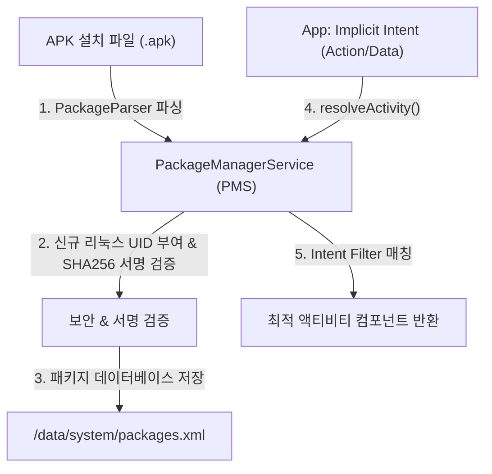
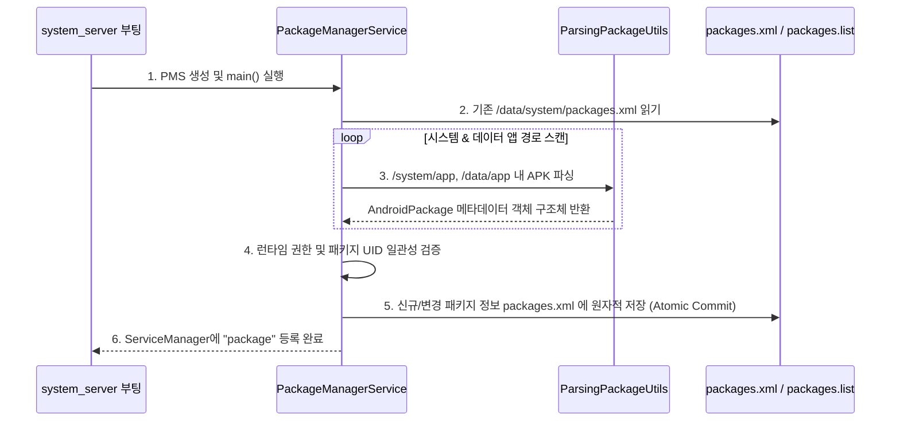

## PackageManagerService (PMS - 출입국 & 패키지 검증 관리소)

### 1. 개요 (Overview)

**PackageManagerService (PMS)**는 `system_server` 프로세스에서 구동되며, Android 기기에 **설치된 모든 애플리케이션 패키지(.apk)의 파싱, 설치/업데이트/삭제, 권한 부여 관리 및 컴포넌트 해소(Intent Resolution)를 담당하는 핵심 시스템 서비스**이다.

기기 부팅 시 `/system/app`, `/vendor/app`, `/data/app` 경로의 APK 파일들을 스캔하여 `AndroidManifest.xml` 정보를 메타데이터DB(`packages.xml`)로 구축하며, 앱이 요구하는 권한 검증 및 Intent 대상 컴포넌트를 정밀 검색하는 출입국 심사대 역할을 수행한다.

---

#### 초보자를 위한 쉽게 이해하는 비유

* **`PackageManagerService` (출입국 심사 및 주민 등록 사무소)**:
  - 기기 안으로 들어오려는 외지인(APK 파일)의 신원 서류(AndroidManifest)를 검사하고, 주민등록증(UID)을 발급하며, 출입 자격(권한)을 부여하는 **출입국 심사관**.
* **`packages.xml` (주민등록 원장 / 패키지 데이터베이스)**:
  - 기기에 등록된 모든 앱의 신원 정보, 발급된 UID, 승인된 권한 상태를 체계적으로 기록해 둔 **중앙 장부**.
* **`PackageParser / ParsingPackageUtils` (서류 검토기)**:
  - APK 포맷 내부의 압축된 바이너리 XML 서류를 읽어 분석하는 **서류 검사 도구**.
* **`Intent Resolution` (업무 처리 담당자 찾기 서비스)**:
  - "이 웹주소(URL) 열어줄 사람?" (Implicit Intent) 요청이 오면 엑셀 장부를 찾아 가장 적절한 앱(브라우저)을 연결해 주는 **주민센터 연결창구**.



---

### 2. PMS의 3대 핵심 기능

#### 1) APK 파싱 및 설치 관리 (Package Scanning & Parsing)
- **APK 파싱**: APK 내부의 `AndroidManifest.xml`, 서명(Signature), 리소스 및 바이트코드 정보를 파싱하여 메모리 내 `AndroidPackage` 데이터 구조로 변환한다.
- **dex2oat 컴파일 트리거**: 앱 설치 시 또는 백그라운드 유지보수 시 `installd` 데몬과 통신하여 APK 바이트코드를 ART AOT/JIT 런타임 최적화 파일(.odex/.art)로 변환한다.

#### 2) 권한 및 Sandbox 관리 (Permission & UID Allocation)
- **독립 Linux UID 할당**: 앱마다 고유한 리눅스 사용자 ID(`u0_aXXX`)를 할당하여 앱 샌드박스(App Sandbox)를 격리한다.
- **권한 승인 관리**: `AndroidManifest.xml`에 선언된 일반 권한(Normal Permission) 및 런타임 권한(Dangerous Permission) 승인 상태를 감시하고 관리한다.

#### 3) 컴포넌트 해소 (Intent Resolution)
- **Explicit Intent**: 대상 클래스명이 명시된 경우 인텐트 대상을 즉시 매칭한다.
- **Implicit Intent**: Action, Category, Data(URI/MIME 타입) 조건이 전달되면, 시스템에 등록된 모든 앱의 `<intent-filter>`를 전수 조사하여 가장 적합한 `ResolveInfo` 리스트를 선별한다.

---

### 3. 기기 부팅 시 PMS 스캔 & 패키지 등록 시퀀스



1. **DB 로딩**: 부팅 시 이전에 등록되어 있던 `packages.xml`을 읽어 기존 UID와 권한 할당 맵을 복원한다.
2. **경로 스캔**: `/system/app`, `/vendor/app`, `/data/app` 디렉터리의 모든 APK를 스캔하여 신규 설치, 변경, 삭제 여부를 파악한다.
3. **서명 검증**: 동일 패키지명 업데이트 시 이전 서명(Signature)과 동일한 키로 서명되었는지 확인하여 앱 하이재킹을 방지한다.
4. **DB 갱신 및 서비스 등록**: 최종 스캔 결과를 파일에 저장하고 `ServiceManager.addService("package", pmsBinder)`로 전역 공개한다.

---

### 4. APEX 패키지 및 현대적 PMS 변화

- **APEX (Android Pony EXpress)**:
  - Android 10부터 도입된 시스템 모듈화 구조로, ART 런타임, Media 등 핵심 OS 컴포넌트를 Google Play 스토어를 통해 업데이트할 수 있도록 PMS가 APEX 패키지 관리를 전담한다.
- **PackageInstaller & installd 분리**:
  - 보안 강화를 위해 권한이 큰 파일 I/O 및 컴파일 작업은 별도 네이티브 데몬인 `installd`가 수행하고, PMS는 하이레벨 제어 로직만 담당한다.

---

### 5. 코드 레벨 및 CLI 관측 (Code & CLI Verification)

```kotlin
// 앱 코드에서 PackageManager 를 통한 컴포넌트 해소 및 권한 확인
val packageManager = context.packageManager
val intent = Intent(Intent.ACTION_VIEW, Uri.parse("https://example.com"))

// API 33+ flags 처리
val resolveInfo = packageManager.resolveActivity(
    intent,
    PackageManager.ResolveInfoFlags.of(PackageManager.MATCH_DEFAULT_ONLY.toLong())
)
val isPermissionGranted = packageManager.checkPermission(
    Manifest.permission.CAMERA,
    context.packageName
) == PackageManager.PERMISSION_GRANTED
```

```bash
# 1. 설치된 패키지 목록 및 경로 조회
adb shell pm list packages -f

# 2. 특정 패키지의 상세 정보 (UID, 서명, 부여된 런타임 권한) 덤프
adb shell dumpsys package <package_name>

# 3. Intent Filter 매칭 결과 CLI 시뮬레이션
adb shell pm query-intent-activities -a android.intent.action.VIEW -d "https://example.com"
```

---

### 6. 연관 문서 (Related Links)

- [system_server](../../01_system_internals/boot-and-runtime/system-server/system-server.md) - PMS가 상주하여 실행되는 안드로이드 메인 시스템 프로세스
- [ServiceManager](service-manager.md) - PMS의 "package" Binder Handle을 조회하는 전역 디렉토리
- [WindowManagerService](window-manager-service.md) - PMS가 파싱한 앱 창 구조 및 시스템 인셋 정보 연동 서비스
- [PackageManager 조회는 Android 11부터 패키지 가시성 제한을 받는다](../system-state/package-visibility-queries.md) - `<queries>` 필터링
- [안드로이드 권한 시스템 & AppOps](../../05_security_privacy/permissions/appops-and-permissions.md) - PMS가 관리하는 런타임 권한 승인 메커니즘

