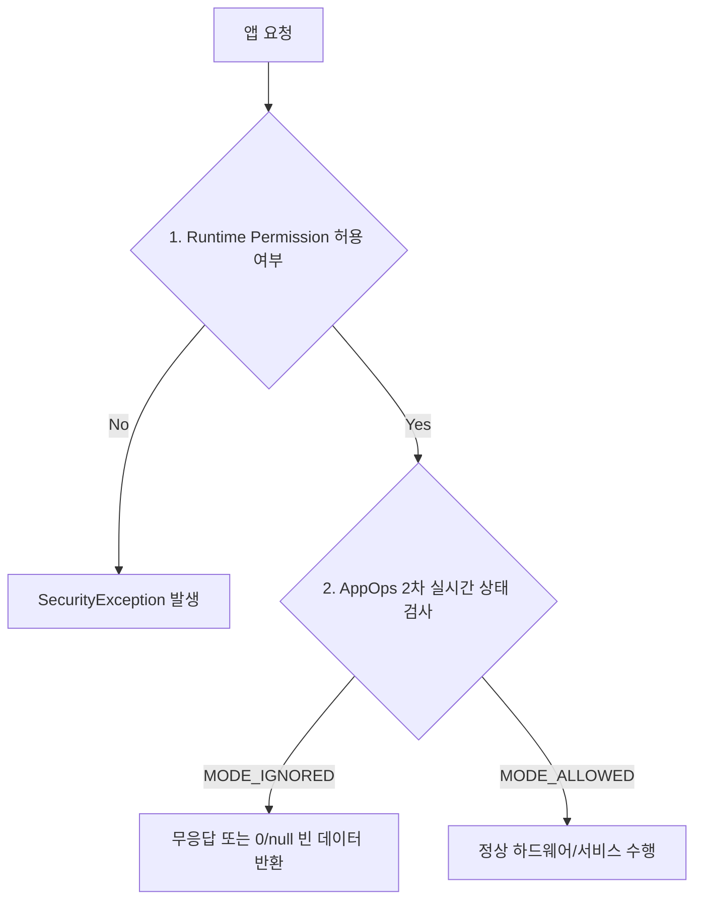

# Appops Permission Denial

## 1. 개요 (Overview)

### 초보자를 위한 쉽게 이해하는 비유
* **AppOps 권한 거부 (출입증은 있으나 내부 세부 구역 출입 통제)**:
  - 건물 출입증(런타임 권한)을 받았더라도, 특정 보안 구역(위치 추적, 카메라 등) 진입 시 개별 센서 관리자(AppOps)가 실시간으로 통제하여 동작을 거부시키는 2차 보안 거부 메커니즘.



---

---

## AppOps 는 permission 승인 뒤에도 실행 시점 정책을 추가로 거부할 수 있다

상위 문서: [Android 시스템 서비스와 기기 기능 지도](../../android-system-services-and-device-capabilities.md)

관련 지도: [시스템 서비스 접근 공통 계약](./service-lookup-contracts.md)

### 핵심 정의

**AppOps**(App Operations, `AppOpsManager`)는 런타임 권한(Permission) 승인 상태와 별개로 동작하는 동적 실행 시점 정책 계층이다. 앱이 dangerous permission을 정상적으로 부여받았더라도, 해당 동작에 대응하는 app-op이 `MODE_IGNORED` 또는 `MODE_ERRORED` 상태면 시스템은 데이터 접근 요청을 조용히 무시하거나 거부한다.

### 메커니즘

플랫폼이 정의한 런타임 permission에는 background modifier를 제외하고 추적용 app-op이 연결되며, 대응 관계는 `AppOpsManager.permissionToOp()`으로 확인할 수 있다(예: `android.permission.CAMERA` ↔ 카메라 op). 실제 보호 API 제공자는 permission 검사와 별도로 `noteOp()`/`startOp()`의 결과를 적용한다. 한 번의 접근은 `noteOp()`, 녹음처럼 지속되는 세션은 `startOp()`와 `finishOp()`가 맞다.

app-op 모드는 사용자의 세부 설정(예: 위치 접근을 "이 앱 사용 중에만 허용"), 배터리/개인정보 관리 기능의 자동 개입, 또는 OS 의 background 제한에 의해 permission grant 상태와 독립적으로 바뀔 수 있다. `noteOp()` 호출 시점은 대개 실제 데이터 접근 순간이며, 이 시점 기록이 시스템 설정의 "최근 접근" UI 에 나타난다.

### 판단 기준

- permission 이 granted 인데 API 가 예외 없이 빈 데이터나 stale 데이터를 반환하면 permission 보다 AppOps 모드를 먼저 의심한다.
- app-op 모드는 사용자가 설정 화면에서 앱별로 개별 조정할 수 있으므로, 같은 permission 을 가진 두 사용자 기기에서 동작이 다를 수 있다.
- Android 10+ 위치의 "이 앱 사용 중에만" 옵션처럼, 하나의 permission 이 여러 app-op 세분화 상태를 가질 수 있다.

### 제공자와 앱의 안전한 확인 흐름

보호 API를 구현하는 시스템·플랫폼 제공자는 실제 접근 직전에 op을 기록하고 반환 모드를 적용해야 한다. 아래는 API 30+ 형태의 축약 예다.

```kotlin
val op = AppOpsManager.permissionToOp(requiredPermission)
    ?: throw SecurityException("No app-op mapping")

context.enforceCallingPermission(requiredPermission, "permission required")
val mode = appOps.noteOpNoThrow(
    op,
    Binder.getCallingUid(),
    verifiedCallingPackage,
    attributionTag,
    "read protected data"
)
if (mode != AppOpsManager.MODE_ALLOWED) return emptyList()
return readProtectedData()
```

일반 앱은 이 코드를 permission 확인의 대체물로 복제하지 않는다. 앱 자신의 사전 check와 실제 사용 사이에도 상태가 바뀔 수 있으므로 보호 API의 콜백 부재·빈 결과·`SecurityException`을 최종 신호로 처리한다. `MODE_FOREGROUND`는 앱 상태에 따라 실제 note 시 `MODE_ALLOWED` 또는 `MODE_IGNORED`로 해석될 수 있다.

### 경계

- 이 노트는 AppOps 가 permission 과 별도 계층이라는 사실과 관찰 지점까지만 다룬다. 개별 서비스(location, camera 등)에서 AppOps 가 구체적으로 어떤 실패로 나타나는지는 각 클러스터 노트가 다룬다.
- 앱이 스스로 AppOps 를 우회하거나 임의로 재정의하는 것은 시스템 권한 없이는 불가능하며, 이 노트는 그런 우회 방법을 다루지 않는다.

### 관찰 가능한 신호

permission grant, 보호 API 결과, app-op 모드의 세 값을 함께 기록한다. `adb shell dumpsys appops`로 패키지별 모드와 마지막 접근 시각을 확인하고, 테스트 기기에서는 `adb shell cmd appops set <pkg> <op> <mode>`로 `allow`/`ignore`를 바꿔 "grant인데 콜백 없음" 경로를 재현한다.

### 공식 문서

- https://developer.android.com/reference/android/app/AppOpsManager

검증일: 2026-08-06. 런타임 permission과 app-op의 관계, `MODE_IGNORED`의 placeholder 동작, 실제 접근을 기록하는 `noteOp()`과 지속 접근용 `startOp()`/`finishOp()` 계약을 확인했다.


## 4. 연결 문서 (Related Links)
- [AppOps 및 권한 표준 레퍼런스](../../../05_security_privacy/appops-and-permissions.md)
- [system_server 표준 레퍼런스](../../system-server.md)
