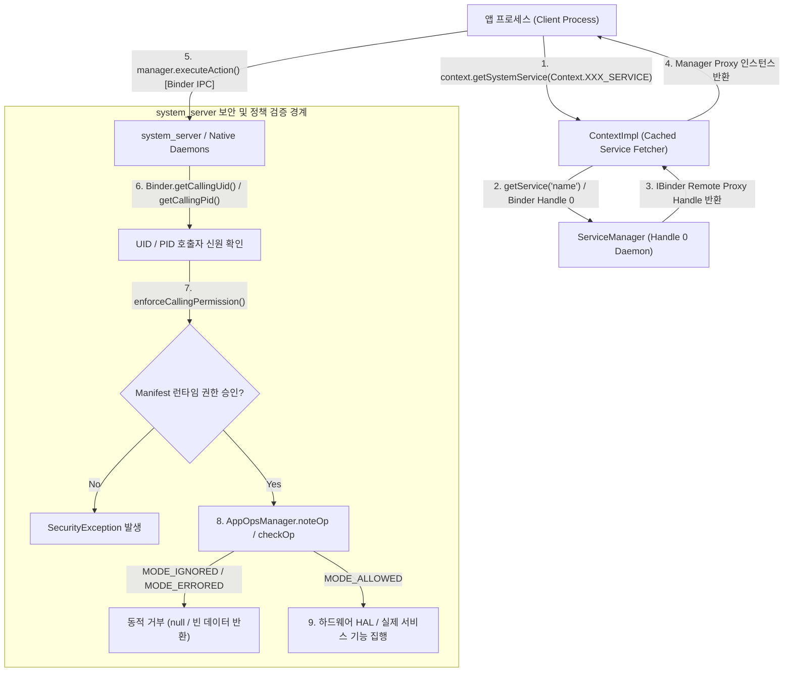

## 시스템 서비스 접근 공통 계약

이 지도는 location, sensors, telephony, power, background 등 모든 개별 시스템 서비스와 하드웨어 기능을 탐색하기 전에 반드시 이해해야 하는 공통 프레임워크 기반을 다룬다. `Context.getSystemService()` 로 클라이언트 프록시를 획득하는 메커니즘, `ServiceManager` (Handle 0)의 중앙 레지스트리 역할, `system_server` 바운더리에서의 호출자 신원(UID/PID) 및 권한 검증, 그리고 실행 시점에 동적으로 개입하는 `AppOpsManager` 정책 계층을 체계적으로 연결한다.



### 주요 메커니즘 및 코드 예시 (Mechanisms & Code Examples)

1. **`Context.getSystemService()`**: Context 싱글톤 형태로 관리되는 매니저 객체 반환. 내부적으로 `SystemServiceRegistry` 및 Binder IPC 프록시를 활용.
2. **`ServiceManager` (Handle 0)**: 부팅 시 Context Manager 로 등록되는 전역 Binder 서비스 디렉토리.
3. **호출자 신원 및 권한 검증**: `system_server` 내부에서 커널이 보증하는 `Binder.getCallingUid()` / `getCallingPid()` 로 호출자의 패키지 귀속 및 권한을 검증.
4. **`AppOpsManager` 동적 정책**: 런타임 권한이 승인된 후에도 백그라운드 상태, 사용자 개별 설정, 프라이버시 인디케이터에 따라 `noteOp()` / `startOp()` 를 통해 실행 시점 접근을 허용하거나 조용히 무시(`MODE_IGNORED`).

```kotlin
// 1. 타입 세이프한 시스템 서비스 획득
val alarmManager = context.getSystemService(AlarmManager::class.java)
val appOpsManager = context.getSystemService(AppOpsManager::class.java)

// 2. 실행 시점 AppOps 상태 사전 확인
val mode = appOpsManager.unsafeCheckOpNoThrow(
    AppOpsManager.OPSTR_FINE_LOCATION,
    Process.myUid(),
    context.packageName
)
when (mode) {
    AppOpsManager.MODE_ALLOWED -> { /* 기능 정상 실행 */ }
    AppOpsManager.MODE_IGNORED -> { /* 데이터 빈 값 처리 또는 안내 UI 표시 */ }
    AppOpsManager.MODE_ERRORED -> { /* 명시적 권한 오류 처리 */ }
}
```

### 관찰 신호 및 CLI 검증 (Observation Signals)

- **등록된 서비스 전체 조회**: `adb shell service list`
- **시스템 서비스 상세 덤프**: `adb shell dumpsys activity services`, `adb shell dumpsys package <package_name>`
- **AppOps 상태 및 이력 조회**: `adb shell dumpsys appops <package_name>`
- **AppOps 모드 강제 변경 (테스트용)**: `adb shell cmd appops set <package_name> <OP_NAME> <allow|ignore|deny|default>`

### 읽는 순서 (Recommended Reading Order)

1. [ServiceManager (중앙 서비스 디렉토리 & Handle 0)](service-manager.md): 커널 레벨 Handle 0 등록 및 전역 Binder 디렉토리 메커니즘 확인.
2. [Context.getSystemService (시스템 서비스 획득 매커니즘)](get-system-service.md): 앱 관점에서의 서비스 조회, Context 타입별 캐싱 및 IPC 오버헤드 이해.
3. [ActivityManagerService (AMS) & ATMS](activity-manager-service.md): 컴포넌트 수명주기, Task 백스택, 프로세스 OOM 점수 관리 확인.
4. [PackageManagerService (PMS)](package-manager-service.md): APK 파싱, `packages.xml`, UID 할당, Intent 해소 메커니즘 확인.
5. [WindowManagerService (WMS)](window-manager-service.md): 윈도우 계층 구조, Z-order, Surface 할당 및 입력 이벤트 디스패칭 확인.
6. [Binder 서비스는 필요한 호출 경계에서 호출자 신원과 정책을 검사한다](system-server-uid-pid-check.md): `system_server`의 UID/PID 검증과 `clearCallingIdentity()` 보안 경계 확인.
7. [AppOps는 permission 승인 뒤에도 실행 시점 정책을 추가로 거부할 수 있다](appops-permission-denial.md): 권한 통과 후 실행 시점 AppOps 개입과 `MODE_IGNORED` 처리 확인.

### 문제 분류 (Troubleshooting Matrix)

| 증상 | 먼저 확인할 경계 | 점검 CLI / 진단 신호 |
| :--- | :--- | :--- |
| `getSystemService()` 가 null 반환 | 지원되지 않는 하드웨어 피처 또는 유효하지 않은 Context | `pm has-system-feature <FEATURE>` |
| UI 관련 서비스에서 토큰 오류 발생 | `ApplicationContext` 에서 윈도우/다이얼로그 획득 시도 | `WindowManager.BadTokenException` 로그 확인 |
| permission 승인 상태인데 데이터가 0/null/무응답 | AppOps 실시간 거부 (`MODE_IGNORED`) | `adb shell dumpsys appops <pkg>` |
| 시스템 서비스 호출 시 UI 프리징/ANR | 메인 스레드에서의 동기 Binder IPC 폴링 루프 | `anr/traces.txt` 내 Binder 트랜잭션 대기 스택 |
| `SecurityException: Permission Denial` | UID 에 필요한 권한 미선언 또는 권한 철회 | `dumpsys package <pkg>` 권한 부여 상태 |

### 책임 경계 (Architectural Boundaries)

- 매니저 객체(`LocationManager`, `NotificationManager` 등)는 클라이언트 프록시이며, 실제 상태와 연산은 `system_server` 또는 하위 네이티브 데몬(SurfaceFlinger, AudioFlinger)에서 실행된다.
- **Permission**은 "이 앱이 해당 기능을 사용할 정적/동적 자격이 있는가"를 검증하고, **AppOps**는 "지금 이 순간(포그라운드 여부, 배터리 상태, 개인정보 토글) 해당 동작을 허용할 것인가"를 판정한다.
- 저수준 Binder IPC 구조(Driver ioctl, Binder 스레드 풀, Marshalling, Parcel)는 `01_system_internals/ipc-and-process/binder-ipc.md`가 담당한다.

### 노트 목록 (Topic Notes)

- [ServiceManager (중앙 서비스 디렉토리 & Handle 0)](service-manager.md)
- [Context.getSystemService (시스템 서비스 획득 매커니즘)](get-system-service.md)
- [ActivityManagerService (AMS) & ATMS](activity-manager-service.md)
- [PackageManagerService (PMS)](package-manager-service.md)
- [WindowManagerService (WMS)](window-manager-service.md)
- [Binder 서비스는 필요한 호출 경계에서 호출자 신원과 정책을 검사한다](system-server-uid-pid-check.md)
- [AppOps는 permission 승인 뒤에도 실행 시점 정책을 추가로 거부할 수 있다](appops-permission-denial.md)

검증일: 2026-08-24. `Context.getSystemService()`, `ServiceManager`, Binder caller identity, AppOps 모델을 Android Open Source Project (AOSP) 공식 소스 및 API 문서와 대조 검증 완료.

