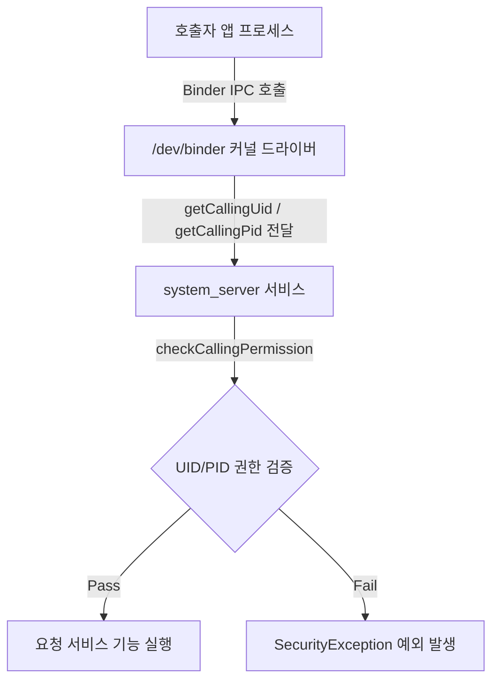

# System Server Uid Pid Check

## 1. 개요 (Overview)

### 초보자를 위한 쉽게 이해하는 비유
* **UID/PID 검사 (시청 민원창구 신분증 및 지장 검인)**:
  - 민원인(앱)이 서류를 제출할 때, 시청 창구(system_server)가 민원인의 신분증 번호(UID)와 현재 방문한 구체적 신원(PID)을 확인하고 IPC 호출을 승인하는 절차.



---

---

## Binder 서비스는 필요한 호출 경계에서 호출자 신원과 정책을 검사한다

상위 문서: [Android 시스템 서비스와 기기 기능 지도](../../android-system-services-and-device-capabilities.md)

배경 지식: [SELinux](../../../../../linux/security/selinux.md)

관련 지도: [시스템 서비스 접근 공통 계약](./service-lookup.md)

### 핵심 정의

**system_server**는 위치, 알림, 패키지 관리 등 여러 Android 핵심 서비스를 실행한다. 원격 Binder 트랜잭션을 처리하는 동안 서비스는 `Binder.getCallingUid()`와 필요할 때 `Binder.getCallingPid()` 로 커널이 전달한 호출자 신원을 얻을 수 있다. 그러나 모든 시스템 API 호출이 system_server 로 가는 것도, 모든 메서드가 UID 와 PID 를 매번 직접 읽어 같은 검사를 수행하는 것도 아니다. 서비스별로 스텁·공통 헬퍼·하위 서비스에서 permission, AppOps, 사용자, 패키지 귀속 등을 필요한 경계에 적용한다.

### 메커니즘

1. 앱 프로세스가 Binder 호출을 보낸다.
2. 커널 Binder 드라이버가 원격 트랜잭션의 호출자 신원을 전달한다. 서비스는 트랜잭션 처리 중 이를 조회할 수 있다.
3. 서비스 구현은 민감한 진입점에서 `enforceCallingPermission()` 같은 헬퍼나 서비스별 정책으로 필요한 권한·AppOps·사용자 범위를 검사한다. 이미 보호된 내부 호출이나 비민감 getter 는 같은 검사를 반복하지 않을 수 있다.
4. permission 이 없으면 `SecurityException` 을 던지거나 조용히 실패값을 반환한다(서비스마다 다르다).

`getCallingPid()`는 권한 주체를 나타내는 만능 식별자가 아니다. 특히 oneway 호출에서는 PID 가 0 일 수 있으므로 보안 판단은 일반적으로 UID 와 서비스가 검증한 패키지/사용자 귀속을 중심으로 설계한다. 또한 서비스가 `clearCallingIdentity()` 를 호출한 뒤에는 원래 호출자 신원을 별도로 보존하지 않으면 조회 결과가 달라진다.

### 판단 기준

- "매니페스트에 permission 을 선언했다"와 "런타임에 permission 이 grant 상태다"는 다른 사실이다. dangerous permission 은 사용자가 거부하거나 나중에 취소할 수 있다.
- 같은 permission 이라도 서비스마다 실패 처리 방식이 다르다(예외 vs 빈 리스트 vs null). 각 서비스 노트에서 이 차이를 확인해야 한다.
- 프로세스 간 신뢰 경계는 UID 이지 패키지 이름이 아니다. 한 UID 를 여러 패키지가 공유하는 `sharedUserId` 구성(레거시)에서는 이 구분이 중요하다.
- 호출자가 전달한 package name 만 신뢰하지 않고 UID 와의 귀속을 서비스가 검증해야 한다. 반대로 PID 는 프로세스 수명에 종속되므로 장기 권한 주체로 저장하지 않는다.

### 최소 안전 Binder 경계

아래는 자체 Binder 서비스를 구현할 때의 축약 패턴이다. UID 를 먼저 보존하고 permission 을 강제한 뒤, 전달받은 패키지가 그 UID 소유인지 확인한다. 서비스 자신의 권한으로 하위 API 를 호출해야 할 때만 identity 를 지우고 반드시 복원한다.

```kotlin
override fun readForPackage(packageName: String): List<Item> {
    val callingUid = Binder.getCallingUid()
    context.enforceCallingPermission(READ_ITEMS, "READ_ITEMS required")

    val ownsPackage = context.packageManager
        .getPackagesForUid(callingUid)
        .orEmpty()
        .contains(packageName)
    if (!ownsPackage) throw SecurityException("package/uid mismatch")

    val token = Binder.clearCallingIdentity()
    return try {
        repository.readAsService(packageName)
    } finally {
        Binder.restoreCallingIdentity(token)
    }
}
```

`clearCallingIdentity()` 전에 필요한 호출자 신원과 정책 판단을 끝낸다. PID 는 로그 상관관계 정도로만 사용하고, oneway 호출의 0 이나 프로세스 재사용 가능성 때문에 승인 키로 저장하지 않는다.

### 경계

- 이 노트는 permission 승인 여부까지만 다룬다. permission 이 승인된 뒤 AppOps 가 추가로 거부하는 계층은 [AppOps는 permission 승인 뒤에도 실행 시점 정책을 추가로 거부할 수 있다](./appops-permission-denial.md) 가 다룬다.
- SELinux 라벨 기반의 커널/native 서비스 접근 통제는 `05_security_privacy/platform-hardening` 이 다룬다.

### 관찰 가능한 신호

서비스 로그에는 검증한 UID·userId·메서드·거부 이유를 남기되 민감 인수는 제외한다. `adb shell dumpsys package <pkg>` 의 UID 와 runtime permission 을 대조하고, package/UID 불일치·permission 거부·하위 호출 실패를 서로 다른 `SecurityException`/오류 코드로 관찰한다. identity 복원 누락은 같은 Binder thread 의 후속 호출이 서비스 UID 로 보이는 심각한 신호다.

### 공식 문서

- https://developer.android.com/guide/topics/permissions/overview
- https://developer.android.com/reference/android/os/Binder
- https://source.android.com/docs/core/architecture/ipc/binder-overview

검증일: 2026-08-06. Binder 호출자 신원은 트랜잭션 문맥에서 제공되지만 모든 호출이 UID/PID 를 모두 직접 검사한다는 보장은 없고, oneway 호출의 PID 는 0 일 수 있음을 반영했다.


## 4. 연결 문서 (Related Links)
- [system_server 표준 레퍼런스](../../system-server.md)
- [Binder IPC 표준 레퍼런스](../../../01_system_internals/binder-ipc.md)
