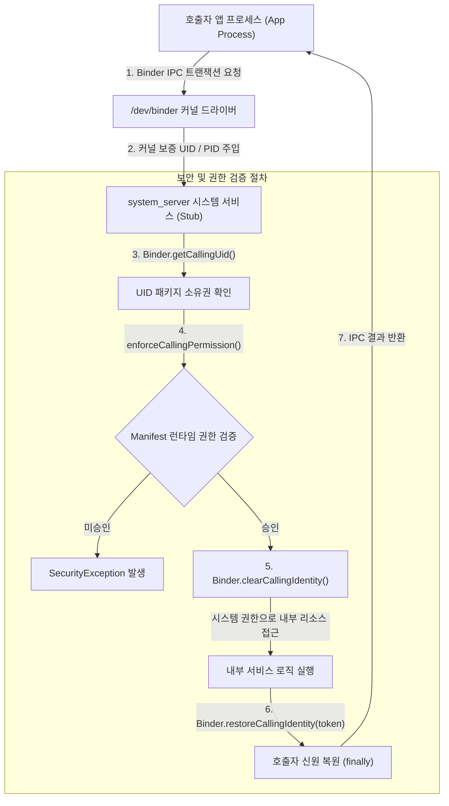

## Binder 서비스는 필요한 호출 경계에서 호출자 신원과 정책을 검사한다

### 1. 개요 (Overview)

`system_server` 및 네이티브 시스템 서비스는 원격 Binder IPC 트랜잭션을 수신할 때, Linux 커널 드라이버(`/dev/binder`)가 전달하는 호출자의 신원 정보인 **`Binder.getCallingUid()`** 및 **`Binder.getCallingPid()`** 를 통해 호출 주체를 판별하고 엄격한 보안 검증을 수행한다.

클라이언트 앱이 전달하는 패키지명 문자열은 위변조될 수 있으므로, 시스템 서비스는 커널이 보증하는 `UID`를 신뢰의 기반(Root of Trust)으로 삼아 런타임 권한과 AppOps 정책을 강제 집행한다.

---

#### 초보자를 위한 쉽게 이해하는 비유

- **UID/PID 검사 (시청 민원창구 신분증 및 지장 검인)**:
  - 민원인(앱)이 "저 구글 앱인데요"라고 구두로 주장하더라도, 시청 창구(system_server)가 커널이 발급한 주민등록번호(UID)를 조회하여 실제 소유주인지 대조하고 서명 및 허가증(Permission)을 확인한 뒤에만 민원 처리를 승인하는 절차.



---

### 2. 핵심 메커니즘 (Key Mechanisms)

#### 1) UID vs PID 검증 차이점
- **`Binder.getCallingUid()`**: 앱 샌드박스의 리눅스 사용자 ID. 불변의 신뢰 경계이며 장기 권한 주체로 사용.
- **`Binder.getCallingPid()`**: 프로세스 ID. 단기적 프로세스 수명에 종속되며, 특히 비동기 단방향 호출(`oneway`)에서는 커널이 PID 를 0 으로 전달할 수 있어 보안 판단의 단독 증거로 사용하지 않는다.

#### 2) `clearCallingIdentity()` 와 `restoreCallingIdentity()`
- 시스템 서비스가 호출자의 요청을 처리하는 도중 시스템 전용 특권(System Privileges)으로 다른 하위 서비스를 호출해야 할 때 `Binder.clearCallingIdentity()` 로 호출자 토큰을 분리하고 자신의 UID(SYSTEM_UID=1000)로 승격한다.
- 작업 완료 후에는 **반드시 `finally` 블록에서 `Binder.restoreCallingIdentity(token)` 를 호출**하여 원래 호출자 신원을 복원해야 하며, 복원 누락 시 동일 Binder 스레드의 후속 IPC 가 보안 취약점에 노출된다.

---

### 3. 최소 안전 Binder 서비스 구현 패턴 (Kotlin Example)

```kotlin
// 시스템 서비스 및 커스텀 AIDL 서비스에서의 표준 보안 패턴
override fun getProtectedDataForPackage(packageName: String): DataResult {
    val callingUid = Binder.getCallingUid()
    val callingPid = Binder.getCallingPid()

    // 1. 1차 런타임 권한 검증 (없으면 SecurityException)
    context.enforceCallingPermission(
        android.Manifest.permission.READ_PRIVILEGED_DATA,
        "Calling process lacks READ_PRIVILEGED_DATA"
    )

    // 2. 전달받은 packageName 이 callingUid 의 소유인지 확인 (스푸핑 방지)
    val packagesForUid = context.packageManager.getPackagesForUid(callingUid)
    if (packagesForUid == null || !packagesForUid.contains(packageName)) {
        throw SecurityException("Package $packageName does not belong to UID $callingUid")
    }

    // 3. 내부 시스템 작업 실행을 위한 신원 임시 승격 및 안전한 복원
    val identityToken = Binder.clearCallingIdentity()
    return try {
        // system_server 내부 시스템 권한으로 I/O 또는 하위 데몬 호출
        internalDatabaseRepository.readInternalData(packageName)
    } finally {
        // 반드시 원래 호출자 신원으로 복원
        Binder.restoreCallingIdentity(identityToken)
    }
}
```

---

### 4. 관측 신호 및 CLI 명령어 (CLI Verification)

```bash
# 1. 특정 패키지에 할당된 리눅스 UID 및 권한 상태 확인
adb shell dumpsys package <package_name> | grep -E "userId=|runtime permissions:"

# 2. Binder IPC 호출 중 권한 거부 발생 시 Logcat 필터링
adb logcat -s ActivityManager WindowManager PackageManager:E

# 3. system_server 프로세스(PID) 및 스레드 풀 상태 점검
adb shell ps -AZ | grep system_server
```

---

### 5. 연관 문서 (Related Links)

- [시스템 서비스 접근 공통 계약](service-lookup.md)
- [AppOps는 permission 승인 뒤에도 실행 시점 정책을 추가로 거부할 수 있다](appops-permission-denial.md)
- [ServiceManager](service-manager.md) - Handle 0 중앙 디렉토리
- [Binder IPC 표준 레퍼런스](../../01_system_internals/ipc-and-process/binder-ipc.md)
- [system_server 표준 레퍼런스](../../01_system_internals/boot-and-runtime/system-server/system-server.md)

