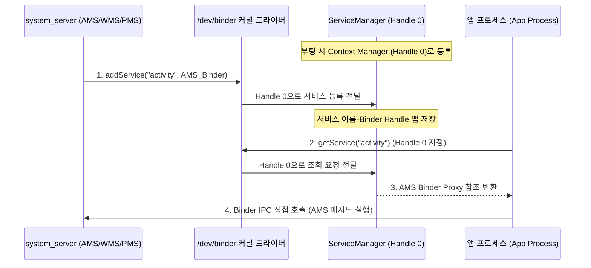
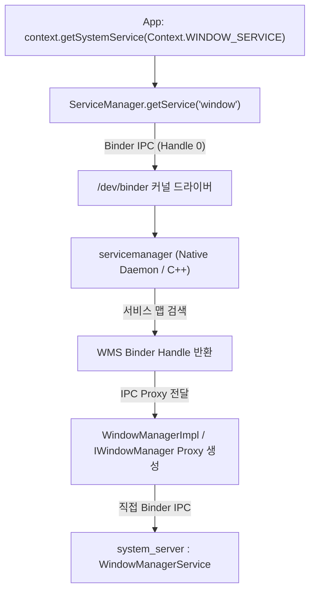

## ServiceManager (중앙 서비스 디렉토리 & Handle 0)

### 1. 개요 (Overview)

**ServiceManager**는 Android OS 부팅 과정에서 가장 먼저 등록되는 **전역 시스템 서비스 디렉토리(Central Service Registry)**이다. Binder IPC 통신 아키텍처의 뿌리이며, **특별한 예약 Binder 핸들 번호인 `Handle 0`**을 점유한다.

`system_server` 에 의해 생성되는 [AMS](activity-manager-service.md)([ActivityManagerService](activity-manager-service.md)), WMS(WindowManagerService), PMS(PackageManagerService) 등 수많은 시스템 서비스들은 부팅 시 자신의 Binder 참조를 ServiceManager 에 등록(`addService`)하고, 일반 앱 프로세스는 ServiceManager 를 거쳐 필요한 시스템 서비스의 Binder 객체(Proxy)를 조회(`getService`)하여 Binder IPC 통신을 시작한다.

---

#### 초보자를 위한 쉽게 이해하는 비유

- **`ServiceManager` (중앙 114 전화번호부 안내센터)**:
  - 기기 내 모든 관공서(시스템 서비스)의 전화번호(Binder Handle)를 독점 관리하는 **중앙 안내상담소**.
- **`Handle 0` (전국 공통 114 직통 전화번호)**:
  - 사전 조회 없이 누구나 바로 걸 수 있는 **114 번호**. 앱 프로세스는 114(Handle 0)에 전화를 걸어 "경찰서([AMS](activity-manager-service.md)) 번호 주세요" 하고 물어본다.
- **`addService` (신규 관공서 개업 신고 및 번호 등록)**:
  - `system_server` 부팅 시 [AMS](activity-manager-service.md), WMS 등의 관공서가 오픈하면서 114 에 내 번호를 등록하는 과정.
- **`getService` (안내소 번호 문의 및 연락처 획득)**:
  - 일반 앱이 시스템 서비스를 이용하기 위해 114 에 번호를 물어보고 직통 연통선(Binder Proxy)을 얻어오는 과정.

---

### 2. ServiceManager 의 핵심 역할 및 Binder Handle 0

#### 1) Binder Context Manager
- Linux Binder 커널 드라이버(`/dev/binder`)에서 `BINDER_SET_CONTEXT_MGR` ioctl 명령을 통해 **시스템 전역 유일의 서비스 등록 디렉토리**로 지정된다.
- 이 등록 과정에 따라 Binder 드라이버 내부에서 무조건 **`Handle 0`** 번호가 부여된다.

#### 2) 서비스 등록 (`addService`)
- 부팅 시 `system_server` 및 원시 C++ 데몬 서비스(SurfaceFlinger, AudioFlinger 등)가 서비스 식별자 문자열(예: `"activity"`, `"window"`, `"package"`)과 Binder 객체를 전달하여 등록한다.
- 보안 권한 검증(SELinux 정책 및 UID 검사)을 수행하여 정해진 시스템 프로세스만 서비스 등록이 가능하도록 제한한다.

#### 3) 서비스 조회 (`getService` & `checkService`)
- 앱 및 프레임워크 컴포넌트가 문자열 이름으로 서비스를 요청하면 해당 서비스의 Binder 핸들을 찾아 IPC Proxy 객체로 마샬링하여 반환한다.

---

### 3. 동작 메커니즘: 앱에서 시스템 서비스 획득까지

1. **Context.getSystemService() 호출**: 앱 개발자가 자바/코틀린 코드에서 시스템 서비스 사용을 요청한다.
2. **ServiceManager 쿼리**: 내부에 래핑된 `ServiceManager.getService()`가 Binder Handle 0 을 이용해 `/dev/binder` 로 쿼리를 송신한다.
3. **Native servicemanager 응답**: C++ 데몬 형태의 `servicemanager` 가 서비스 레지스트리 맵에서 이름을 검색해 해당 Binder Handle 을 반환한다.
4. **Proxy 객체 래핑**: 앱 프로세스 메모리에 `IWindowManager.Stub.Proxy` 같은 AIDL 프록시 객체가 형성된다.
5. **직접 IPC 통신**: 이후 모든 서비스 메서드 호출은 ServiceManager 를 거치지 않고 WMS Binder Handle 로 직접 전달되어 높은 성능을 유지한다.

---

### 4. 실무 활용 및 아키텍처 특성

- **성능 최적화 (서비스 캐싱)**:
  - Android 프레임워크는 `ContextImpl` 내부 캐시 맵(`SYSTEM_SERVICE_FETCHERS`)을 두어 매번 `ServiceManager.getService()` IPC 를 부르지 않고 획득한 Binder Proxy 객체를 재사용한다.
- **SELinux 및 보안 제약**:
  - `servicemanager`는 SELinux 정책에 정의된 domain 과 service_manager_class 라벨을 엄격히 검증한다. 승인되지 않은 써드파티 앱 프로세스가 `addService()` 를 호출하면 즉시 거부된다.
- **Lazy Services (Android 11+)**:
  - 메모리 최적화를 위해 일부 시스템 서비스는 시스템 부팅 시점에 즉시 등록되지 않고 최초 `getService()` 요청이 들어오는 순간 `init` 에 의해 지연 생성(Lazy Initialization)된다.

---

### 5. 연관 문서 (Related Links)

- [system_server](system-server.md) - ServiceManager 에 시스템 서비스를 대량 등록하는 메인 프로세스
- [Binder IPC 레퍼런스](../01_system_internals/binder-ipc.md) - Handle 0 및 /dev/binder 커널 드라이버의 작동 원리
- [WindowManagerService](window-manager-service.md) - ServiceManager 를 통해 조회하는 화면 관리 시스템 서비스
- [PackageManagerService](package-manager-service.md) - ServiceManager 를 통해 조회하는 앱 패키지 관리 시스템 서비스
