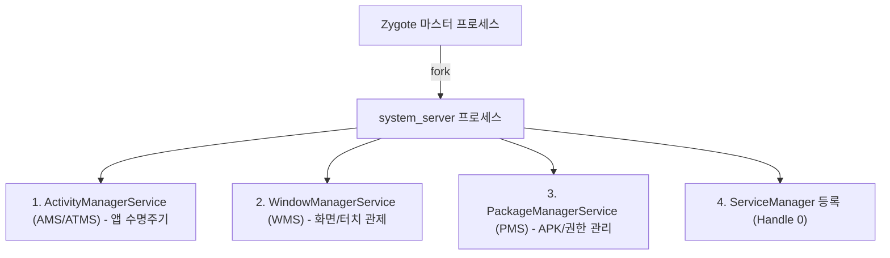

## system_server (안드로이드 프레임워크 핵심 종합 프로세스)

### 1. 개요 (Overview)

**`system_server`** 는 Android OS 가 부팅될 때 [Zygote](../01_system_internals/zygote.md) 에 의해 가장 먼저 생성되는 **안드로이드 프레임워크의 핵심 총괄 자바 프로세스**이다.

앱의 생명주기를 관제하는 `AMS/ATMS`, 화면과 입력 이벤트를 관제하는 `WMS`, 앱 설치 및 권한을 검증하는 `PMS` 등 수십 개의 핵심 시스템 서비스(System Services)가 이 단 하나의 프로세스 내부 스레드들로 상주한다.

---

#### 초보자를 위한 쉽게 이해하는 비유

- **`system_server` (안드로이드 시청 종합 민원 행정 타워)**:
  - 스마트폰이라는 도시에서 여권 발급(PMS - 앱 설치/권한), 도로 건축/위치 지적(WMS - 화면 창 배치), 주민 관리([AMS](activity-manager-service.md) - 앱 생명주기) 업무를 **한 건물(`system_server` 프로세스) 안의 각 과(스레드)에서 종합 처리하는 통합 행정 타워**.

---

### 2. system_server 가 호스팅하는 핵심 3 대 시스템 서비스

1. **`ActivityManagerService (AMS / ATMS)`**:
   - 앱 컴포넌트(`Activity`, `Service`, `BroadcastReceiver`, `ContentProvider`)의 생명주기와 프로세스 복제(`Zygote fork`)를 관리.
   - 상세 내용: [앱 생명주기 및 실행 파이프라인](../00_foundations/overview/foundation/app-launch-crosses-launcher-system-server-zygote-and-activitythread.md)
2. **`WindowManagerService (WMS)`**:
   - 화면 창(Window)의 z-order 겹침 순서, SurfaceFlinger 연동 서피스 할당, 터치/키보드 입력 이벤트 전달.
   - 상세 내용: [WindowManagerService 레퍼런스](window-manager-service.md)
3. **`PackageManagerService (PMS)`**:
   - 기기에 설치된 모든 APK 파싱, 권한 검증 및 Intent 해독.
   - 상세 내용: [PackageManagerService 레퍼런스](package-manager-service.md)

---

### 3. Binder IPC 통신과의 역할 분담

`system_server` 프로세스는 상주하는 시스템 서비스들의 인터페이스를 [ServiceManager](service-manager.md) 에 등록하고, 바인더 스레드 풀(Binder Thread Pool)을 통해 외부 앱의 요청을 처리한다.

- **Binder IPC 통신 메커니즘**: `system_server` 내부 스레드와 외부 앱 프로세스 간의 1 회 메모리 복사(`mmap`), 바인더 트랜잭션 버퍼 제한 및 스레드 풀 동작 원리는 독립된 **[Binder IPC 표준 레퍼런스](../01_system_internals/binder-ipc.md)** 노드를 참고한다.

---

### 4. 연결 문서 (Related Links)

- [Binder IPC 표준 레퍼런스](../01_system_internals/binder-ipc.md) - system_server 통신 IPC 전용 통로 (SSOT)
- [ServiceManager](service-manager.md) - system_server 서비스들이 등록되는 Handle 0 디렉터리
- [Zygote 레퍼런스](../01_system_internals/zygote.md) - system_server 프로세스를 fork 해주는 마스터 프로세스
- [WindowManagerService](window-manager-service.md) - system_server 호스팅 핵심 창 관리 서비스
- [PackageManagerService](package-manager-service.md) - system_server 호스팅 핵심 패키지/권한 서비스
- [JobScheduler](job-scheduler.md) - system_server 호스팅 백그라운드 스케줄러
