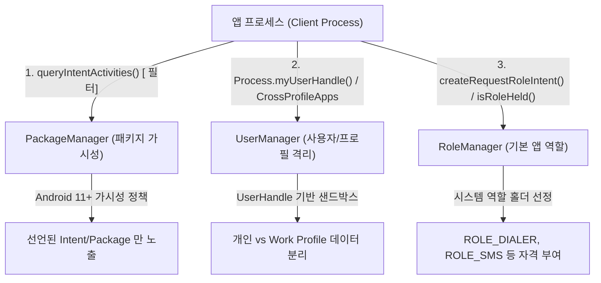

## 패키지/사용자/역할 조회 계약

이 지도는 앱 간 상호운용 및 OS 수준 권한 위임과 관련된 **3가지 독립된 조회 표면(다른 앱 가시성, 다중 사용자/Work Profile 격리, 기본 앱 역할 위임)**을 체계적으로 분리하여 다룬다.



### 주요 메커니즘 및 코드 예시 (Mechanisms & Code Examples)

1. **`PackageManager` 가시성 (`<queries>`)**: Android 11(API 30+)부터 프라이버시 보호를 위해 선언되지 않은 타사 앱은 설치되어 있어도 조회 결과에서 숨김(`NameNotFoundException`).
2. **`UserManager` & `UserHandle`**: 한 기기 내 다중 사용자 및 관리형 업무 프로필(Work Profile)을 고유한 `UserHandle`로 완전 분리. 교차 실행은 `CrossProfileApps` API 를 통해서만 제어.
3. **`RoleManager` (Android 10+)**: 단순 런타임 권한 그룹이 아니라 기본 전화, SMS, 어시스턴트 등 OS 의 핵심 역할을 맡을 단일 기본 앱을 사용자가 선택하도록 중개.

```kotlin
// 1. 패키지 가시성 확인 및 암시적 인텐트 실행
val pm = context.packageManager
val intent = Intent(Intent.ACTION_VIEW, Uri.parse("https://example.com"))
val handlers = pm.queryIntentActivities(intent, PackageManager.ResolveInfoFlags.of(0))

// 2. 현재 프로필 확인 및 업무 프로필 연동
val userManager = context.getSystemService(UserManager::class.java)
val isWorkProfile = userManager.isManagedProfile

// 3. 기본 다이얼러 역할 보유 여부 확인
val roleManager = context.getSystemService(RoleManager::class.java)
val isDefaultDialer = roleManager.isRoleHeld(RoleManager.ROLE_DIALER)
```

### 관찰 신호 및 CLI 검증 (Observation Signals)

```bash
# 1. 패키지 가시성 필터 로그 활성화 및 블록된 앱 확인
adb shell pm log-visibility --enable <package_name>
adb logcat -s AppsFilter

# 2. 기기 내 활성화된 모든 UserHandle 및 프로필 ID 목록 조회
adb shell pm list users

# 3. 특정 역할(Role)의 현재 홀더 패키지 조회
adb shell cmd role get-role-holders android.app.role.DIALER
adb shell cmd role get-role-holders android.app.role.SMS
```

### 읽는 순서 (Recommended Reading Order)

1. [PackageManager 조회는 Android 11부터 패키지 가시성 제한을 받는다](package-visibility-queries.md): `<queries>` 요소 선언, 자동 가시성 규칙, `AppsFilter` 점검.
2. [UserManager는 여러 사용자와 work profile을 별도 UserHandle로 다룬다](user-manager-userhandle.md): `UserHandle` 격리, `CrossProfileApps`, MDM 정책 경계 확인.
3. [RoleManager는 권한 묶음이 아니라 기본 앱 자격을 관리한다](role-manager.md): `ROLE_DIALER`, `createRequestRoleIntent()`, 역할 자격 요건 확인.

### 문제 분류 (Troubleshooting Matrix)

| 증상 | 먼저 확인할 경계 | 점검 CLI / 진단 신호 |
| :--- | :--- | :--- |
| 타사 앱이 설치되어 있는데 `queryIntentActivities` 결과가 비어 있음 | `AndroidManifest.xml` 내 `<queries>` 선언 누락 | `adb shell pm log-visibility --enable <pkg>` |
| Work Profile 환경에서 앱 간 데이터 공유/클립보드 차단 | 프로필 간 이동 정책 제한 (MDM) | `CrossProfileApps.getTargetUserProfiles()` |
| `createRequestRoleIntent()` 호출 시 팝업이 뜨지 않음 | 역할 요구 인텐트 필터/권한 미충족 | `roleManager.isRoleAvailable(role)` |
| `startActivity()` 시도 시 `ActivityNotFoundException` 발생 | 가시성 문제가 아닌 실제 처리기 부재 | `pm query-intent-activities` |

### 책임 경계 (Architectural Boundaries)

- **PackageManager**는 "어떤 패키지와 컴포넌트가 설치되어 있는가"를 묻고, **RoleManager**는 "이 앱이 특정 시스템 기본 앱 역할을 맡을 자격이 있는가"를 검증한다.
- **UserManager**가 분리하는 `UserHandle`은 OS 차원의 프로세스/파일시스템 격리이며, 앱 내부 계정(Google 로그인, 자체 회원 ID)과는 완전히 독립된 계층이다.

### 노트 목록 (Topic Notes)

- [PackageManager 조회는 Android 11부터 패키지 가시성 제한을 받는다](package-visibility-queries.md)
- [UserManager는 여러 사용자와 work profile을 별도 UserHandle로 다룬다](user-manager-userhandle.md)
- [RoleManager는 권한 묶음이 아니라 기본 앱 자격을 관리한다](role-manager.md)

검증일: 2026-08-24. [패키지 가시성 가이드](https://developer.android.com/training/package-visibility), [Work Profile 가이드](https://developer.android.com/work/managed-profiles), [RoleManager 문서](https://developer.android.com/reference/android/app/role/RoleManager)를 기준으로 Android 15/16 최신 플랫폼 계약 검증 완료.

