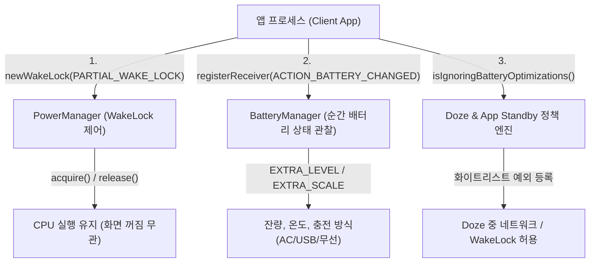

## 전력 상태 접근 계약

이 지도는 Android 앱이 기기의 전력 및 배터리 상태를 관찰하고 제어하는 지점을 **즉각적 하드웨어 락(WakeLock), 관찰 전용 배터리 상태 조회(BatteryManager), 정책적 유휴 예외(Doze/App Standby Exemption)**의 3가지 핵심 경계로 분리하여 다룬다.



### 주요 메커니즘 및 코드 예시 (Mechanisms & Code Examples)

1. **`PowerManager.WakeLock`**: CPU 가 슬립(Deep Sleep) 상태로 전환되는 것을 방지. 화면 유지는 WakeLock 대신 `FLAG_KEEP_SCREEN_ON` 권장.
2. **`BatteryManager` (Sticky Broadcast)**: `Intent.ACTION_BATTERY_CHANGED` 로 현재 잔량, 충전 플러그 상태 등을 폴링 없이 1회성 스냅샷 및 변경 이벤트로 수신.
3. **배터리 최적화 예외 (`isIgnoringBatteryOptimizations`)**: Doze 모드 진입 시 네트워크 제한에서 앱을 부분적으로 제외하는 정책적 우회로(Google Play 엄격 심사 대상).

```kotlin
// 1. 안전한 WakeLock 획득 (Timeout 필수)
val powerManager = context.getSystemService(PowerManager::class.java)
val wakeLock = powerManager.newWakeLock(PowerManager.PARTIAL_WAKE_LOCK, "myapp:sync_lock")
wakeLock.acquire(10_000L) // 10초 타임아웃
try {
    performQuickSync()
} finally {
    if (wakeLock.isHeld) wakeLock.release()
}

// 2. Sticky 배터리 잔량 계산
val batteryIntent = context.registerReceiver(null, IntentFilter(Intent.ACTION_BATTERY_CHANGED))
val level = batteryIntent?.getIntExtra(BatteryManager.EXTRA_LEVEL, -1) ?: -1
val scale = batteryIntent?.getIntExtra(BatteryManager.EXTRA_SCALE, -1) ?: -1
val batteryPct = if (level >= 0 && scale > 0) (level * 100f / scale) else null
```

### 관찰 신호 및 CLI 검증 (Observation Signals)

```bash
# 1. 시스템 내 보유 중인 WakeLock 목록 및 배터리 소모 통계 덤프
adb shell dumpsys power

# 2. 실시간 배터리 상태 (잔량, 전압, 온도, 충전기 연결 여부) 덤프
adb shell dumpsys battery

# 3. Doze 화이트리스트 (배터리 최적화 제외 앱 목록) 확인
adb shell dumpsys deviceidle whitelist

# 4. 배터리 연결 해제 및 Doze 강제 진입 시뮬레이션
adb shell dumpsys battery unplug
adb shell dumpsys deviceidle force-idle
adb shell dumpsys battery reset
```

### 읽는 순서 (Recommended Reading Order)

1. [PowerManager 웨이크락은 화면과 CPU를 분리해서 제어한다](./wakelock-cpu-screen-control.md): `PARTIAL_WAKE_LOCK`, 타임아웃 acquire, 화면 유지 플래그(`FLAG_KEEP_SCREEN_ON`) 확인.
2. [BatteryManager는 순간 배터리 상태를 관찰 전용으로 노출한다](./battery-manager-state.md): sticky broadcast, `EXTRA_LEVEL`/`EXTRA_SCALE`, WorkManager 충전 제약 연동 확인.
3. [배터리 최적화 예외는 예외 상황을 위한 것이지 기본 설계가 아니다](./battery-optimization-exemption.md): Doze/App Standby 예외 요청, Play Store 정책 제약 확인.

### 문제 분류 (Troubleshooting Matrix)

| 증상 | 먼저 확인할 경계 | 점검 CLI / 진단 신호 |
| :--- | :--- | :--- |
| 화면이 꺼지면 백그라운드 다운로드가 멈춤 | `PARTIAL_WAKE_LOCK` 미획득 또는 WorkManager 제약 누락 | `adb shell dumpsys power` |
| wake lock 을 획득했는데도 네트워크 요청이 실패 | Doze 모드 진입으로 인한 네트워크 차단 | `dumpsys deviceidle` 및 화이트리스트 상태 |
| 배터리 잔량 표출 시 0% 또는 부정확한 값 출력 | `EXTRA_LEVEL` 단독 사용 (`EXTRA_SCALE` 분모 누락) | `dumpsys battery` 실시간 잔량과 대조 |
| 배터리 최적화 제외 팝업이 반복해서 뜸 | 설정 화면 진입 후 복귀 시 상태 미재조회 | `powerManager.isIgnoringBatteryOptimizations()` |

### 책임 경계 (Architectural Boundaries)

- **WakeLock**은 "화면/CPU를 지금 당장 켜둔다"는 즉각적 하드웨어 제어이며, **배터리 최적화 예외**는 "Doze 상태에서 네트워크/웨이크락 제한을 해제한다"는 정책적 예외다.
- 배터리 상태 조회(`BatteryManager`)는 읽기 전용 스냅샷이며 충전 속도나 배터리 보호 모드를 앱이 직접 변경할 수 없다.
- 장시간 지연 가능한 백그라운드 작업의 스케줄링(WorkManager, JobScheduler)은 `04_system_services/background-and-notifications/background-work.md`가 담당한다.

### 노트 목록 (Topic Notes)

- [PowerManager 웨이크락은 화면과 CPU를 분리해서 제어한다](./wakelock-cpu-screen-control.md)
- [BatteryManager는 순간 배터리 상태를 관찰 전용으로 노출한다](./battery-manager-state.md)
- [배터리 최적화 예외는 예외 상황을 위한 것이지 기본 설계가 아니다](./battery-optimization-exemption.md)

검증일: 2026-08-24. [PowerManager 문서](https://developer.android.com/reference/android/os/PowerManager)와 [배터리 최적화 가이드](https://developer.android.com/training/monitoring-device-state/doze-standby)를 기준으로 Android 15/16 최신 전력 정책 검증 완료.

