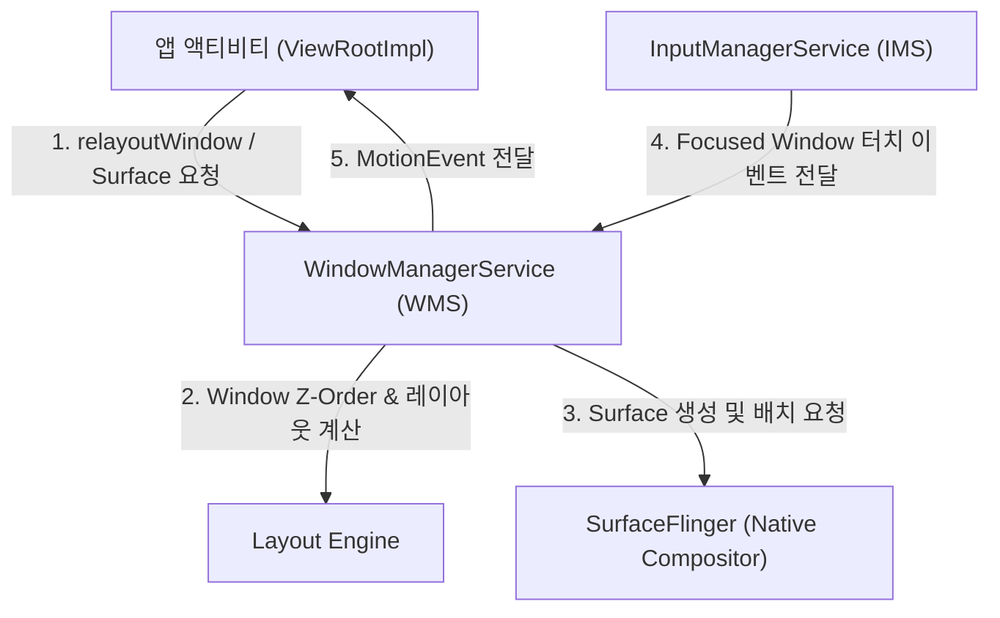
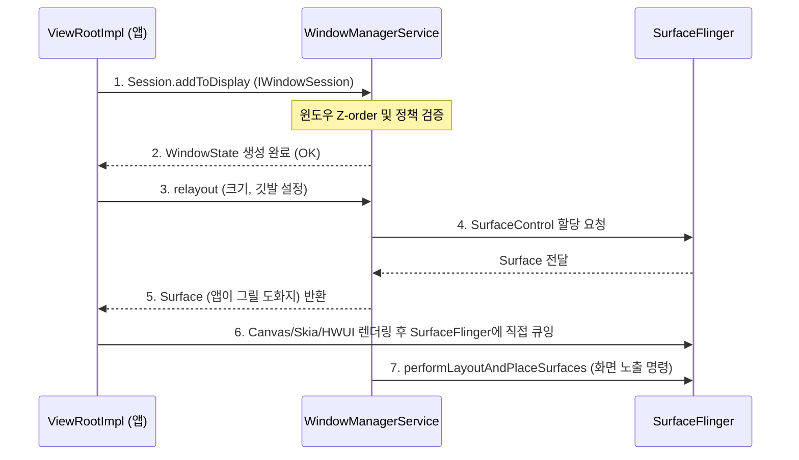

## WindowManagerService (WMS - 무대 연출 & 화면 레이아웃 감독)

### 1. 개요 (Overview)

**WindowManagerService (WMS)** 는 `system_server` 프로세스 내에서 동작하며, Android 화면에 표시되는 **모든 창(Window)의 생명주기, 위치, 겹침 순서(Z-ordering), 서피스(Surface) 할당 및 입력 이벤트 디스패칭을 총괄하는 핵심 시스템 서비스**이다.

앱의 Activity 창뿐만 아니라 시스템 상태바(Status Bar), 네비게이션바(Navigation Bar), 다이얼로그(Dialog), 토스트(Toast), 팝업 레이어 등 디스플레이 위의 모든 조각을 통합 제어하며, 네이티브 그래픽 합성기인 **SurfaceFlinger** 및 입력 시스템인 **InputManagerService (IMS)** 와 긴밀하게 협력한다.

---

#### 초보자를 위한 쉽게 이해하는 비유

- **`WindowManagerService` (연극 무대 연출 감독 / Stage Manager)**:
  - 연극 무대(스마트폰 화면) 위 어떤 배우(배경, 주연 액티비티, 자막, 팝업 창)가 어느 위치에 서고, 누구 앞으로 나와야 하는지(Z-order) 총감독하는 **무대 연출 감독**.
- **`Z-ordering` (배우들의 앞뒤 배치 순서)**:
  - 상태바와 팝업창은 항상 일반 앱 화면보다 앞에 위치해야 하듯, 무대 위 앞뒤 레이어 순서를 결정하는 규칙.
- **`Surface` (배우가 연기할 전용 무대 세트판)**:
  - 각 앱이 그림을 그릴 수 있도록 WMS 가 SurfaceFlinger 를 통해 할당해 주는 메모리 도화지.
- **`Input Dispatching` (관객 대사/조명 전달)**:
  - 터치 스크린 신호가 입력되었을 때, 현재 가장 앞에 있는 포커스된 배우(Window)에게 정확히 터치 좌표를 전달하는 역할.

---

### 2. WMS 의 3 대 핵심 기능

#### 1) Window Z-Ordering & Layout Management
- **윈도우 타입 구분**: `TYPE_APPLICATION` (앱 화면), `TYPE_APPLICATION_SUB_PANEL` (다이얼로그), `TYPE_SYSTEM_OVERLAY` (시스템 패널 등)에 따라 레이어의 겹침 순서(Z-order)를 관리한다.
- **인셋(Insets) 계산**: 상태바, 네비게이션바, 소프트 키보드(IME), 컷아웃(노치) 영역이 앱 화면을 가리지 않도록 윈도우 크기와 여백(Insets)을 동적으로 계산한다.

#### 2) Surface Allocation & SurfaceControl 연동
- 각 Window 가 화면을 그리기 위해 필요한 캔버스인 **`Surface`** 를 Native 그래픽 계층(SurfaceFlinger)으로부터 할당받아 앱의 `ViewRootImpl` 로 전달한다.
- 윈도우 이동, 리사이즈, 애니메이션 전환 시 `SurfaceControl.Transaction` 을 사용하여 부드러운 화면 변화를 보장한다.

#### 3) Touch & Input Event Dispatching
- **InputManagerService (IMS)** 가 캡처한 하드웨어 터치/키보드 이벤트를 수신하여, 현재 화면의 최상단 포커스 윈도우(Focused Window)로 전달한다.
- ANR(Application Not Responding) 감지: 윈도우가 입력 이벤트를 5 초 이상 처리하지 못하고 응답이 없으면 WMS 가 ANR 다이얼로그 팝업을 트리거한다.

---

### 3. 앱 윈도우 추가 및 표출 시퀀스

1. **WindowManager.addView()**: `WindowManagerImpl` 및 `ViewRootImpl` 이 생성되어 WMS 의 `IWindowSession` IPC 를 호출한다.
2. **WindowState 생성**: WMS 내부 메모리에 해당 윈도우의 상태 객체(`WindowState`)가 등록된다.
3. **relayout & Surface 획득**: WMS 는 SurfaceFlinger 와 통신하여 전용 캔버스(`Surface`)를 생성하고 앱에 바인딩한다.
4. **그리기 및 디스플레이**: 앱은 HWUI(Skia) 렌더러를 통해 Surface 에 뷰 트리를 그리고, WMS 는 해당 Surface 의 가시성(Visibility) 상태를 전환하여 최종 출력한다.

---

### 4. 화면 전환 및 다중 창 (Multi-Window / Foldable) 지원

- **Shell Transitions (Android 12+)**:
  - 액티비티 전환 애니메이션, 윈도우 오픈/클로즈 애니메이션 로직을 WMS 내부에서 처리하던 방식에서 **WM Shell (SystemUI)**로 이전하여 렌더링 성능과 커스텀 유연성을 대폭 향상시켰다.
- **분할 화면 (Split-Screen) 및 팝업 윈도우**:
  - 폴더블폰 및 태블릿 환경에서 다중 윈도우의 바운드(Bounds)와 분할 비율을 동적으로 관리하며, 설정 변경(Configuration Change) 이벤트를 앱에 통지한다.

---

### 5. 연관 문서 (Related Links)

- [system_server](system-server.md) - WMS 가 상주하여 실행되는 안드로이드 시스템 서버 프로세스
- [ServiceManager](service-manager.md) - WMS 의 "window" Binder Handle 을 조회하는 전역 디렉토리
- [PackageManagerService](package-manager-service.md) - 앱 패키지 구성 및 창 권한 정보 관련 상호작용 서비스
- [Binder IPC 레퍼런스](../01_system_internals/binder-ipc.md) - 앱과 WMS 간 IWindowSession IPC 통신 통로
