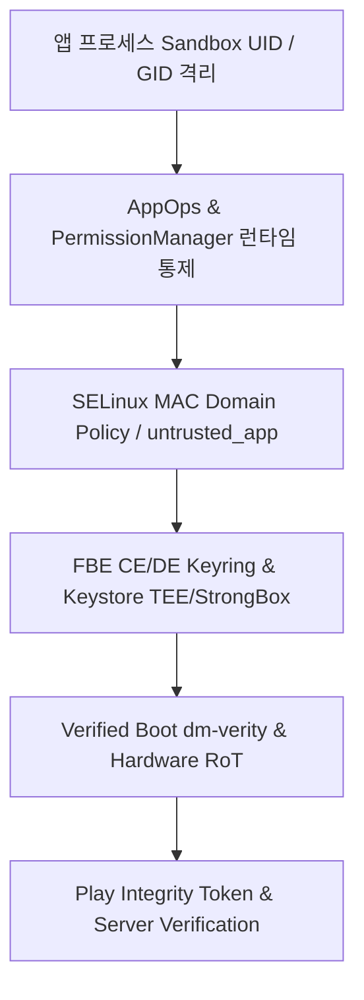

## Android 보안과 개인정보 지도
배경 지식: [Root of Trust](01_inbox/security/fundamentals/root-of-trust-and-chain-of-trust.md)

학습 경로: [Learning Spine 9장 — identity, permission, 독립 security gate](../00_foundations/learning-spine/09-identity-permission-and-independent-security-gates.md)

Android 보안 아키텍처는 단일 보안 장치에 의존하지 않는 다계층 심층 방어(Defense in Depth) 모델을 따른다. 권한(Permissions), 샌드박스(Sandbox), 플랫폼 하드닝(Platform Hardening), 무결성 검증(Integrity & Attestation), 보안 저장소(Secure Storage)는 각기 다른 공격 표면과 관찰 경계를 담당한다.



### 내부 동작 메커니즘

1. **하드웨어 및 커널 경계**: Verified Boot(AVB)가 Bootloader부터 **Root of Trust**(RoT — 더 이상 다른 무언가로 검증되지 않고 그 자체로 신뢰되는, 하드웨어에 물리적으로 새겨진 검증 체인의 출발점) 체인을 검증하며, Linux Kernel UID/GID 및 SELinux MAC(Mandatory Access Control) 정책이 프로세스 간 메모리와 자원 접근을 차단한다.
2. **프레임워크 및 OS 서비스 계층**: PermissionManagerService와 AppOpsService가 런타임 권한 승인 상태와 민감 API(카메라, 마이크, 위치 등)의 실제 호출 동작을 감시 및 제한한다.
3. **데이터 및 키 보안 계층**: File-Based Encryption(FBE)을 통해 데이터 저장소를 CE(Credential Encrypted)와 DE(Device Encrypted)로 분리한다. Android Keystore key material은 앱 프로세스 밖에 유지되며, 기기·알고리즘·key 설정이 지원할 때 TEE 또는 StrongBox 같은 secure hardware에 결합될 수 있다. hardware-backed 여부는 `KeyInfo.getSecurityLevel()`로 확인한다.
4. **원격 무결성 검증 계층**: Play Integrity API가 기기 펌웨어 무결성과 앱 패키지 서명을 토큰 형태로 캡슐화하여 백엔드 서버에서 원격 인가를 결정하게 만든다.

### 진단 및 디버깅 스크립트

Android 시스템의 각 보안 계층 상태를 `adb` 명령어로 진단할 수 있다.

```bash
# 1. SELinux 동작 모드 확인 (Enforcing 여부)
adb shell getenforce

# 2. Verified Boot 상태 확인 (green / yellow / orange / red)
adb shell getprop ro.boot.verifiedbootstate

# 3. 대상 앱의 Linux UID 및 프로세스 샌드박스 속성 확인
adb shell dumpsys package com.example.app | grep -E "userId|pkgFlags"

# 4. 앱의 AppOps 민감 작업 상태 조회
adb shell appops get com.example.app
```

### 관찰 가능한 증거 (Observable Evidence)

- `adb shell getenforce` 결과가 `Enforcing`으로 나타남.
- `adb shell getprop ro.boot.verifiedbootstate` 결과가 `green`으로 출력되어 펌웨어 체인 무결성이 확보되었음을 확인.
- `adb shell dumpsys package` 명령에서 앱마다 고유한 `userId=10xxx`가 할당되어 Linux UID 샌드박스 경계가 형성됨.

### 정본 지도

- [Android 권한 계약](permissions-and-sandbox/permission-contracts/permission-contracts.md)
- [Android 플랫폼 보안 경계 계약](platform-hardening/platform-security-contracts/platform-security-contracts.md)
- [무결성과 attestation 계약](integrity-and-attestation/integrity-contracts/integrity-contracts.md)
- [보안 저장소 계약](secure-storage/secure-storage-contracts/secure-storage-contracts.md)
- [저장소 수명과 백업 경계](secure-storage/storage-lifecycle-and-backup/storage-lifecycle-and-backup.md)
- [Android 보안 실무는 클라이언트 신뢰가 아니라 방어 계층 설계다](security-practices/security-practice-contracts/android-security-practice-is-defense-in-depth-not-client-trust.md)
