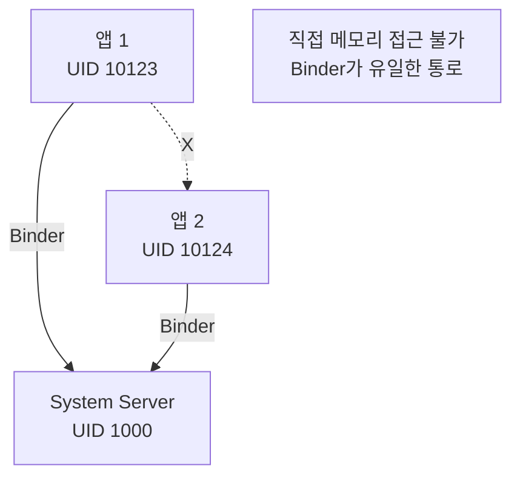

# [[mobile-security]] > [[android-security-sandbox]]

## Android Sandbox and UID Isolation

앱 샌드박싱은 안드로이드 보안의 근간으로, 각 앱을 독립된 리눅스 사용자(UID)로 격리하여 서로의 데이터나 프로세스에 접근하지 못하게 한다.

### UID 기반 격리 (Linux User Isolation)

**핵심 원칙**: 각 앱은 설치 시 **독립된 Linux UID**를 할당받는다. 이는 전통적인 다중 사용자 리눅스 시스템에서 사용자 간 독립성을 보장하는 방식을 앱 단위로 확장한 것이다.

```bash
$ adb shell ps -A | grep -E "u0_a[0-9]+"

u0_a123  12345  1234  com.example.app1
u0_a124  12346  1234  com.example.app2
```

- `u0`: 사용자 0 (primary user)
- `a123`: 앱 UID (10123 = 10000 + 123)

**UID 범위**:
- `10000-19999`: 일반 앱 (User 0)
- `20000-29999`: 격리 프로세스 (`isolatedProcess="true"`)
- `1000-9999`: 시스템 서비스 (system, radio, phone 등)

### 파일 시스템 격리

각 앱은 자신만의 전용 데이터 디렉토리를 가지며, 리눅스 파일 시스템 권한(`rwx------`, 700)을 통해 소유 UID 외의 접근을 차단한다.

```bash
/data/data/com.example.app/
drwx------  10  u0_a123  u0_a123  files/
drwx------   2  u0_a123  u0_a123  cache/
```

**앱 간 데이터 차단 시뮬레이션**:
```bash
$ adb shell
$ run-as com.example.app2  # UID u0_a124 로 전환
$ cat /data/data/com.example.app1/databases/data.db
# 결과: Permission denied
```

### 프로세스 간 격리 (IPC)

앱은 자신의 프로세스 공간 밖으로 직접 접근할 수 없으며, 반드시 [[android-binder-and-ipc]]를 통해 시스템 서비스를 거쳐야 한다.



### 연관 문서
- [[android-security-permissions]] - 권한을 통한 샌드박스 확장
- [[android-security-selinux]] - MAC을 통한 강제적 격리
- [[android-binder-and-ipc]] - 안전한 프로세스 간 통신
