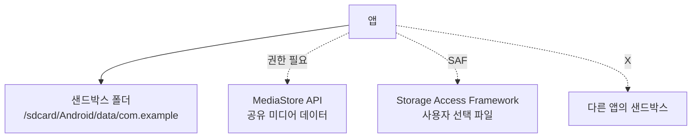

# [[mobile-security]] > [[android-security-storage]]

## Android Storage Security

안드로이드는 데이터의 기밀성 보장을 위해 앱 단위의 저장소 제한(Scoped Storage)과 하드웨어 기반 암호화(FBE)를 사용한다.

### Scoped Storage (Android 10+)

모든 앱이 공유 저장소(`SDCard`) 전체를 읽던 구 시대적 방식에서 탈피하여, 앱은 자신의 샌드박스 폴더 외에는 명시적 사용자 승인이나 API를 통해서만 접근 가능하도록 제한되었다.



### 파일 기반 암호화 (FBE)

**File-Based Encryption**은 파일마다 서로 다른 키로 암호화하며, 부팅 직후에도 알람이나 전화 수신이 가능하도록 하는 **Direct Boot** 기능을 지원한다.

- **CE (Credential Encrypted)**: 사용자 잠금 해제 시에만 복호화 (대부분의 앱 데이터).
- **DE (Device Encrypted)**: 부팅 직후 잠금 해제 전에도 복호화 (알람, 시스템 서비스).

```kotlin
// DE Storage 접근 예시
val deContext = context.createDeviceProtectedStorageContext()
val deFile = File(deContext.filesDir, "alarm_config.xml")
```

### Hardware-backed Keystore

암호화 키는 TEE (Trusted Execution Environment) 내부의 하드웨어 보안 모듈(StrongBox)에 저장되어, 소프트웨어(또는 커널) 레벨에서 키를 절대 추출할 수 없도록 보장한다.

---
### 연관 문서
- [[mobile-android-secure-storage]] - Keystore 실무 구현 가이드
- [[android-security-sandbox]] - 파일 시스템 격리의 기초
