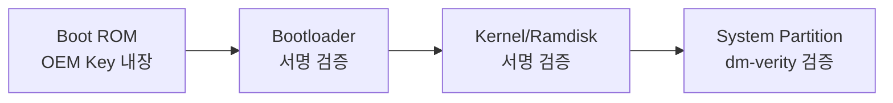

# [[mobile-security]] > [[android-security-verified-boot]]

## Android Verified Boot (AVB)

Verified Boot는 하드웨어 수준에서 소프트웨어의 무결성을 바통 터치(Chain of Trust) 방식으로 검증하여, 변조되지 않은 시스템 소스만 실행됨을 보장한다.

### 부팅 체인 (Chain of Trust)

1. **Boot ROM**: 칩셋 출시 시 하드웨어에 구워진 공개 키로 Bootloader 검증.
2. **dm-verity**: 런타임에 시스템 파티션의 블록을 읽을 때마다 해시 트리(Merkle Tree)를 사용하여 변조 여부를 즉각 판단.

### Verified Boot States

- **Green**: 모든 검증 통과 (순정 기기).
- **Yellow**: 사용자 정의 키로 검증 통과 (커스텀 ROM).
- **Orange**: 부트로더가 언락되어 보안을 보장할 수 없음.
- **Red**: 검증 실패 (부팅 중단).

### 실무적 의의
공격자가 `/system/app` 내부의 바이너리를 수정(Backdoor 삽입)하더라도, `dm-verity`의 해시 불일치로 인해 부팅 단계에서 차단된다. 이는 OS의 무결성을 보장하는 가장 강력한 장치 중 하나이다.

---
### 연관 문서
- [[android-init-and-services]] - 부팅 중 Init 프로세스의 보안 역학
- [[android-security-selinux]] - 런타임 보안의 핵심
