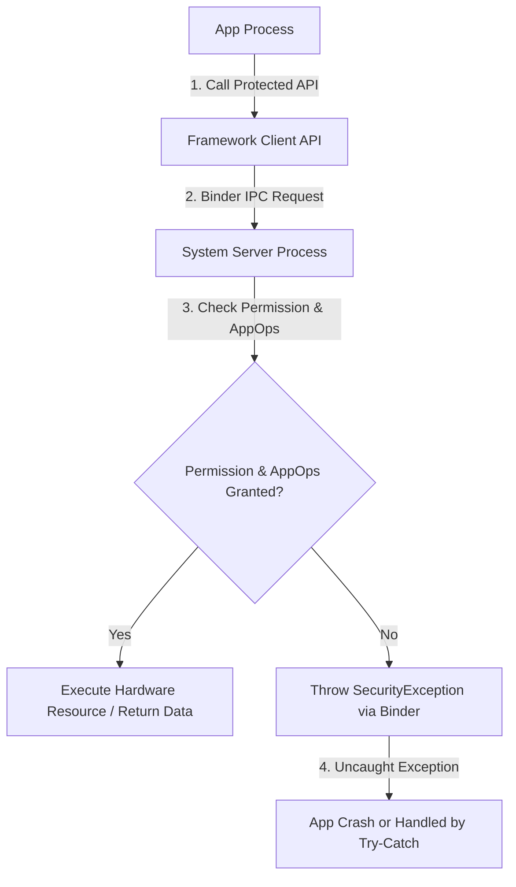

## 안드로이드 권한 시스템 & AppOps (AppOps and Permissions)

안드로이드 운영체제는 앱이 사용자의 민감한 개인정보(위치, 연락처, 카메라 등)나 기기 하드웨어 자원(마이크, 센서 등)에 무단으로 접근하는 것을 막기 위해 **2중 보안 검문소**를 운영합니다. 이 보안 체계의 두 축이 바로 **권한 시스템(Permission System)**과 **AppOps(Application Operations)**입니다.

---

### 초보자를 위한 쉬운 비유

* **권한 시스템 (Permission System)**: **"건물 출입증(Keycard)"**과 같습니다. "이 앱이 카메라나 위치 정보 건물에 들어갈 수 있는 자격이 있는가?"를 1차적으로 확인합니다.
* **AppOps (Application Operations)**: **"실내 보안 경비원(Security Guard)"**과 같습니다. 출입증이 있더라도 "지금 백그라운드 상태인데 마이크를 쓰려 하는가?", "사용자가 카메라 사용 조용히 차단 모드를 켜두었는가?"를 실시간 관찰하며 미세하게 접근을 통제하거나 추적 기록(Audit)합니다.

---

### 1. 안드로이드 권한 시스템 (Permission System)

권한 시스템은 앱 개발자가 `AndroidManifest.xml`에 필요한 권한을 명시하고, OS 및 사용자가 승인했는지 확인하는 **1차 접근 제어관문**입니다.

#### 1.1 설치 시점 권한 (Install-time Permissions)
앱을 플레이 스토어 등에서 설치할 때 자동으로 승인되는 권한입니다.
* **일반 권한 (Normal Permissions)**: 사용자 개인정보나 기기 보안에 위험을 주지 않는 기본적인 권한입니다. (예: 인터넷 연결 `INTERNET`, 네트워크 상태 조회 `ACCESS_NETWORK_STATE`). 별도의 팝업 없이 설치 시 자동 부여됩니다.
* **서명 권한 (Signature Permissions)**: 동일한 제조사/개발사의 인증서 서명키로 서명된 앱끼리만 공유할 수 있는 강력한 특수 권한입니다.

#### 1.2 런타임 권한 (Runtime Permissions / Dangerous Permissions)
Android 6.0(API 레벨 23)부터 도입된 제도로, 민감한 개인정보를 다루는 **위험 권한(Dangerous Permissions)**이 해당합니다.
* **대상**: 위치 정보(`ACCESS_FINE_LOCATION`), 카메라(`CAMERA`), 마이크(`RECORD_AUDIO`), 연락처(`READ_CONTACTS`) 등.
* **작동 방식**: 앱을 처음 실행하거나 해당 기능이 실제로 필요한 시점(Runtime)에 **사용자 팝업 대화상자**를 띄워 직접 동의를 받습니다.
* **철회 가능성**: 사용자는 설정 앱에서 언제든지 이미 승인한 런타임 권한을 취소할 수 있습니다.

---

### 2. AppOps (Application Operations): 런타임 미세 통제

`AppOps`는 Android 4.3부터 내부적으로 도입되어 발전한 **세밀한 런타임 접근 제어 및 오디팅(Auditing) 메커니즘**입니다.

#### 2.1 권한 시스템 vs AppOps 비교

| 구분 | 권한 시스템 (Permission System) | AppOps (Application Operations) |
| :--- | :--- | :--- |
| **비유** | 건물 출입증 | 실내 보안 경비원 |
| **판단 시점** | API 호출 전 자격 여부 검사 | 실제 실행 시점의 상황/상태 검사 |
| **차단 방식** | 자격 없으면 `SecurityException` 크래시 발생 | 상황에 따라 예외 없이 **묵시적 거부(Silent Ignore, 빈 데이터 반환)** 가능 |
| **상태 제어** | 허용(Granted) / 거부(Denied) 이분법 | 포그라운드 전용 허용, 묵시적 거부, 모니터링 전용 등 세분화 |

#### 2.2 AppOps의 3대 핵심 기능
1. **사용 기록 추적 (Auditing & Tracking)**: 앱이 카메라, 마이크, 위치 자원을 언제 얼마나 사용했는지 타임스탬프를 기록합니다. (안드로이드 상단 바의 녹색 점 카메라/마이크 표시등이 AppOps 기반입니다.)
2. **상황별 미세 제어 (Contextual Control)**: 앱이 화면에 떠 있을 때(Foreground)만 허용하고, 백그라운드에서는 차단하는 식의 제어를 수행합니다.
3. **AppOpsManager 모드**: `AppOpsManager` 서비스 API를 통해 각 작업의 상태를 관리합니다.
   * `MODE_ALLOWED`: 동작 허용
   * `MODE_IGNORED`: 동작 거부 (크래시를 내지 않고 빈 데이터/0개 결과 반환)
   * `MODE_ERRORED`: 동작 거부 후 예외 발생

---

### 3. 권한 및 AppOps 검증과 SecurityException 흐름

앱이 적절한 권한 없이 보호된 시스템 API(예: 위치 조회, 카메라 열기)를 호출할 때 일어나는 내부 작동 과정입니다.

#### 검증 및 발생 단계
1. **API 호출**: 앱이 `LocationManager.getLastKnownLocation()` 같은 함수를 호출합니다.
2. **Binder 통신 전달**: 요청이 [Binder IPC](../01_system_internals/binder-ipc.md)를 통해 [system-server](../04_system_services/system-server.md) 내부의 해당 서비스(예: `LocationManagerService`)로 전달됩니다.
3. **권한 검증 (`checkCallingPermission`)**:
   * 시스템 서비스는 Binder 통신으로 넘어온 호출 앱의 UID와 PID를 확인합니다.
   * `Context.checkCallingPermission()` 및 `AppOpsManager.noteOp()`을 실행해 권한과 AppOps 모드를 동시 검증합니다.
4. **SecurityException 반환**: 권한이나 AppOps 상태가 거부되면 시스템 서비스는 `SecurityException`을 던져 Binder 응답으로 앱 프로세스에 전달하며, 예외 처리가 없으면 앱이 종료됩니다.

---

### 4. 연관 문서 및 참고

- [안드로이드 시스템 서비스 (system-server)](../04_system_services/system-server.md)
- [Binder IPC](../01_system_internals/binder-ipc.md)

