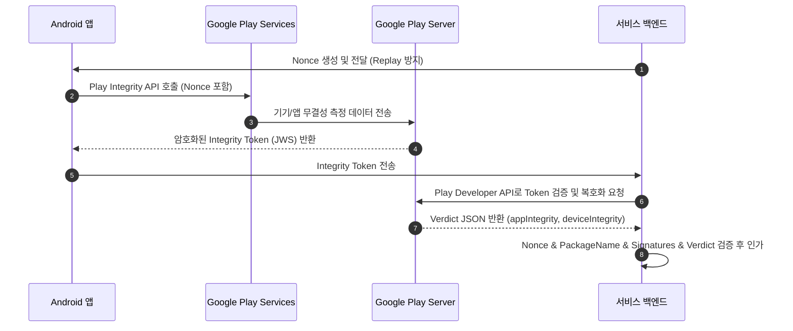

## 무결성과 attestation 계약
배경 지식: [Root of Trust](../../../../../security/fundamentals/root-of-trust-and-chain-of-trust.md)

무결성 검증(Integrity & Attestation)은 앱 바이너리 변조, 루팅/커스텀 ROM 환경, 계정 및 요청 재조작 위험을 하드웨어 및 서버 신호로 변환하는 계층이다. 클라이언트에 전달되는 attestation 토큰은 신뢰의 최종 인가가 아니며, 반드시 백엔드 서버에서 독립적으로 검증해야 한다.



### 내부 동작 메커니즘

1. **Hardware-Backed Key Attestation**: **TEE**(Trusted Execution Environment — 메인 프로세서에서 물리적으로 격리된 보안 실행 영역) 및 **StrongBox**(자체 CPU와 저장소를 가진 전용 보안 칩)에서 생성된 비대칭 키 쌍을 바탕으로 부팅 상태(AVB) 및 펌웨어 서명 체인을 X.509 인증서 체인 형태로 증명한다.
2. **Play Integrity API 핸드셰이크**: Play Services가 기기의 하드웨어 판정 결과, 부트로더 상태, 앱 바이너리의 SHA-256 인증서 디지스트, 계정 위험 신호를 수집하여 서명된 JWS(JSON Web Signature) 토큰을 생성한다.
3. **서버 측 검증(Server Verification)**: 백엔드는 Play Developer API 호출 또는 Google 공개키 검증을 통해 JWS의 암호학적 서명을 확인하고, 내부 payload의 Nonce 일치 여부와 `deviceRecognitionVerdict`를 평가한다.

### 서버 측 토큰 검증 구현 예시 (Kotlin/Java)

```kotlin
// 서버 서비스 계층: Google Play Developer API Client를 활용한 Play Integrity Verdict 검증
import com.google.api.services.playintegrity.v1.PlayIntegrity
import com.google.api.services.playintegrity.v1.model.DecodeIntegrityTokenRequest

fun verifyIntegrityToken(
    playIntegrityClient: PlayIntegrity,
    packageName: String,
    rawToken: String,
    expectedNonce: String
): Boolean {
    val request = DecodeIntegrityTokenRequest().setIntegrityToken(rawToken)
    val response = playIntegrityClient.gateways()
        .decodeIntegrityToken(packageName, request)
        .execute()

    val payload = response.tokenPayloadExternal
    val requestDetails = payload.requestDetails
    val appIntegrity = payload.appIntegrity
    val deviceIntegrity = payload.deviceIntegrity

    // 1. Nonce 및 패키지명 일치 확인 (Replay attack 방지)
    if (requestDetails.nonce != expectedNonce || appIntegrity.packageName != packageName) {
        return false
    }

    // 2. 기기 무결성 판정 확인 (MEETS_DEVICE_INTEGRITY 이상 요구)
    val deviceVerdict = deviceIntegrity.deviceRecognitionVerdict ?: emptyList()
    val isDeviceTrusted = deviceVerdict.contains("MEETS_DEVICE_INTEGRITY") ||
                          deviceVerdict.contains("MEETS_STRONG_INTEGRITY")

    // 3. 앱 바이너리 인정 상태 확인
    val isAppTrusted = appIntegrity.appRecognitionVerdict == "PLAY_RECOGNIZED"

    return isDeviceTrusted && isAppTrusted
}
```

### 관찰 가능한 증거 (Observable Evidence)

- Play Integrity API 실패 시 `IntegrityServiceException` 발생 (예: `errorCode = -100` -> `NO_CALLER_RECOGNITION`, `errorCode = -1` -> `API_NOT_AVAILABLE`).
- logcat 필터링을 통해 서비스 통신 관찰:
  ```bash
  adb logcat | grep -i "PlayIntegrity"
  ```
- 백엔드에 수신된 JWS Payload JSON 예시:
  ```json
  {
    "requestDetails": { "nonce": "SGVsbG8gV29ybGQ=", "timestampMillis": 1722768000000 },
    "appIntegrity": { "appRecognitionVerdict": "PLAY_RECOGNIZED", "packageName": "com.example.app" },
    "deviceIntegrity": { "deviceRecognitionVerdict": ["MEETS_DEVICE_INTEGRITY", "MEETS_BASIC_INTEGRITY"] }
  }
  ```

### 정본 노트

- [Play Integrity token은 서버가 검증하는 위험 신호이지 권한 자체가 아니다](play-integrity-token-is-server-verified-risk-signal-not-authorization.md)
- [Verified Boot는 기기 소프트웨어의 chain of trust를 만든다](../../platform-hardening/platform-security/verified-boot-establishes-device-software-chain-of-trust.md)

관련 지도: [Android 플랫폼 보안 경계 계약](../../platform-hardening/platform-security/platform-security.md), [Android 보안 실무는 클라이언트 신뢰가 아니라 방어 계층 설계다](../../security-practices/security-practice/android-security-practice-is-defense-in-depth-not-client-trust.md)
