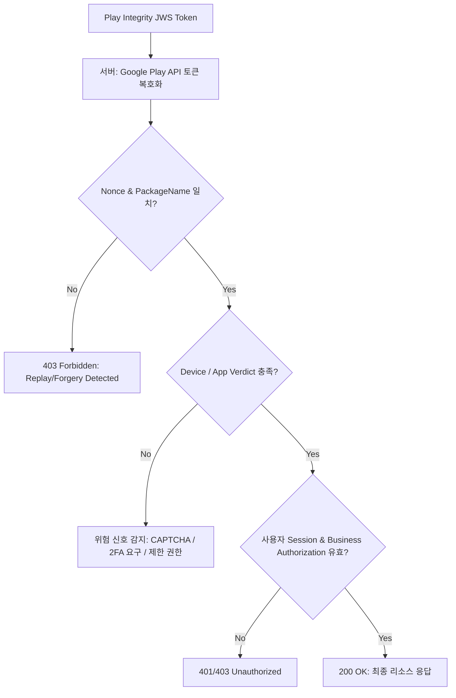

## Play Integrity token 은 서버가 검증하는 위험 신호이지 권한 자체가 아니다

Play Integrity API는 앱 바이너리, 실행 기기, 계정 환경에 대한 무결성 Verdict를 제공한다. 클라이언트 앱이 Integrity Token을 전달받았다는 사실 그 자체는 리소스 접근 권한(Authorization)을 증명하지 않으며, 단지 백엔드 서버가 인가 판단을 내리기 위한 **리스크 측정 신호(Risk Signal)**로 동작한다.

Request hash 또는 Nonce는 토큰을 특정 사용자 세션이나 결제/인증 거래 요청에 바인딩하여 재사용 공격(Replay Attack)을 차단한다. 서버는 검증된 Verdict 결과와 함께 세션 인증 상태, 사용자 역할 권한, 비즈니스 룰, Rate Limit을 종합하여 최종 요청 승인 여부를 결정해야 한다.



### 내부 동작 메커니즘

1. **Nonce Binding**: 클라이언트가 난수 또는 세션 페이로드의 SHA-256 해시를 생성하여 Integrity API에 전달한다. 이 값은 Google 서버가 서명하는 JWS Payload의 `requestDetails.nonce`에 인코딩된다.
2. **Attestation Collection**: Google Play Services의 보안 에이전트가 로컬 Kernel 상태, AVB(Android Verified Boot) 상태, 루팅 바이너리(`su`, Magisk) 존재 여부, Play Store 패키지 설치 출처를 측정한다.
3. **Decryption & Verdict Processing**: 클라이언트는 받은 복호화 불가 JWS 토큰을 백엔드로 보낸다. 백엔드는 Google Cloud IAM 기반의 Play Integrity API 서비스 계정을 사용해 토큰을 복호화하고 Verdict 정보를 분석한다.

### 클라이언트 측 토큰 요청 구현 (Kotlin)

```kotlin
import com.google.android.play.core.integrity.IntegrityManagerFactory
import com.google.android.play.core.integrity.IntegrityTokenRequest
import java.security.MessageDigest
import android.content.Context

fun requestIntegrityToken(
    context: Context,
    userSessionId: String,
    onSuccess: (String) -> Unit,
    onError: (Exception) -> Unit
) {
    val integrityManager = IntegrityManagerFactory.create(context)
    
    // 세션 및 타임스탬프 기반 Nonce 생성 (Replay 방지)
    val rawNonce = "$userSessionId:${System.currentTimeMillis()}"
    val nonceBytes = MessageDigest.getInstance("SHA-256").digest(rawNonce.toByteArray())
    val encodedNonce = android.util.Base64.encodeToString(
        nonceBytes, 
        android.util.Base64.URL_SAFE or android.util.Base64.NO_WRAP
    )

    val request = IntegrityTokenRequest.builder()
        .setNonce(encodedNonce)
        .build()

    integrityManager.requestIntegrityToken(request)
        .addOnSuccessListener { response ->
            onSuccess(response.token())
        }
        .addOnFailureListener { exception ->
            onError(exception)
        }
}
```

### 관찰 가능한 증거 (Observable Evidence)

- **adb logcat 필터링을 통한 PlayIntegrity 측정 모니터링**:
  ```bash
  adb logcat | grep -i "PlayIntegrity"
  ```

- **API 예외 로그**: 구글 서비스 미지원 기기나 네트워크 장애 시 `IntegrityServiceException` 발생.
  ```text
  com.google.android.play.core.integrity.IntegrityServiceException: -100: Integrity API error (-100): Request missing caller identity.
  ```
- **서버 검증 실패 응답**: 기기가 루팅되었거나 훅킹 프레임워크(Xposed/Frida)가 동작 중일 경우 Payload 예시:
  ```json
  {
    "deviceIntegrity": {
      "deviceRecognitionVerdict": ["MEETS_BASIC_INTEGRITY"]
    }
  }
  ```
  (`MEETS_DEVICE_INTEGRITY` 또는 `MEETS_STRONG_INTEGRITY`가 누락됨).

### 판단 기준

Platform security 노트는 앱 권한보다 낮은 계층에서 device integrity 와 mandatory policy 가 어떻게 강제되는지 판단하는 기준으로 읽는다.

### 경계

client-side check 를 authorization 으로 오해하지 않고 server verification, boot trust, sandbox boundary 를 분리한다.

관련 노트: [Verified Boot는 기기 소프트웨어의 chain of trust를 만든다](../../platform-hardening/platform-security/verified-boot-establishes-device-software-chain-of-trust.md)
