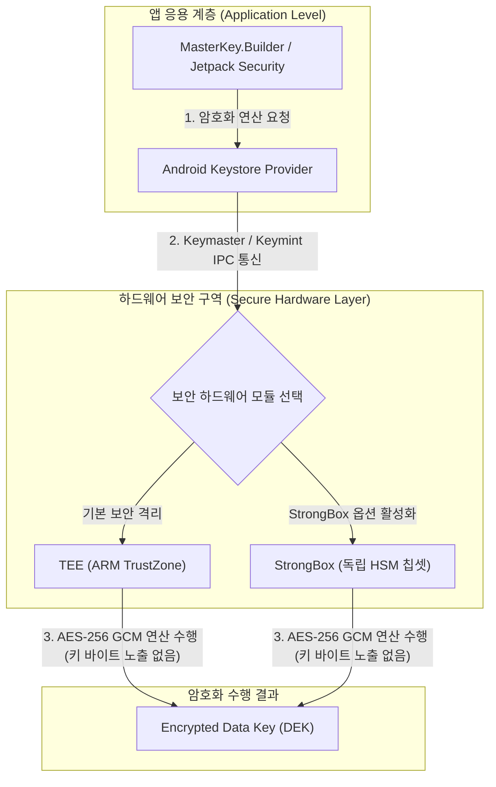

# master-key

Android 보안 아키텍처의 **MasterKey**는 [EncryptedSharedPreferences](./encrypted-shared-preferences.md) 또는 보안 저장소의 데이터 암호화 키(DEK)를 암호화하기 위해 사용되는 최상위 AES-256 마스터 암호화 키입니다.

---

## 1단계: 개념 및 비유 (Concept & Analogy)

### 개념
`MasterKey`는 Jetpack Security(`androidx.security:security-crypto`) 라이브러리에서 제공하는 하드웨어 지원 마스터 키 관리 객체입니다. 

- **보안 격리**: 마스터 키 바이트(Raw Key Bytes)는 앱 프로세스의 메모리(RAM)에 절대 노출되지 않으며, **Android Keystore** 하드웨어 영역 내부에서만 생성되고 연산됩니다.
- **키 래핑 (Key Wrapping)**: 앱에서 사용되는 개별 암호화 키(Data Keys)들을 암호화(Wrap)하여 안전하게 보관하는 역할을 수행합니다.
- **하드웨어 바인딩**: TEE(Trusted Execution Environment) 또는 StrongBox HSM 하드웨어 칩셋과 바인딩되어 물리적/소프트웨어적 공격으로부터 키를 보호합니다.

### 직관적 비유: 무장 경비원이 지키는 마스터 금고 열쇠 (Master Vault Key guarded by Armored Guard)
- **데이터 암호화 키 (DEK)**: 각 개별 서류함을 잠그는 작은 열쇠들입니다.
- **MasterKey**: 그 작은 열쇠들을 한데 넣어 잠그는 **최고 등급의 마스터 열쇠**입니다.
- **TEE / StrongBox 하드웨어**: 이 마스터 열쇠는 외부로 절대 가지고 나갈 수 없으며, 요철 처리나 서류 암호화 작업 요청이 들어올 때마다 **무장 경비원(보안 하드웨어)**이 중앙 금고 내부에서 직접 암호화 도장을 찍어서 결과물만 전달해줍니다.

---

## 2단계: 하드웨어 보관 및 동작 아키텍처 (Architecture & Hardware Security)

`MasterKey`는 하드웨어 수준의 계층 구조를 거쳐 보안 연산을 수행합니다.

### 보안 계층 및 하드웨어 구성도



### 보안 하드웨어 요소 비교 (TEE vs StrongBox)

| 항목 | TEE (Trusted Execution Environment) | StrongBox (Hardware Security Module) |
| :--- | :--- | :--- |
| **구현 방식** | 메인 CPU 내 물리적/논리적 격리 구역 (ARM TrustZone) | 별도의 독립된 전용 보안 칩셋 (스마트카드급 보안 칩) |
| **적용 범위** | Android 6.0 (API 23) 이상 대부분의 Android 기기 | Android 9.0 (API 28) 이상 일부 프리미엄 기기 |
| **물리적 공격 방어** | 메인 SoC 공유로 물리적 공격에 대한 제한적 방어 | 전용 RAM/Flash, 물리적 변조 방지 (Tamper-Resistant) |
| **연산 성능** | 상대적으로 빠른 암호화 연산 속도 | 물리적 보안 검증으로 인해 다소 제한된 연산 속도 |

---

## 3단계: 핵심 코드 및 사용법 (Core Implementation)

### 1. 기본 MasterKey 생성 (AES256_GCM)
```kotlin
import android.content.Context
import androidx.security.crypto.MasterKey

// 표준 AES256_GCM 마스터 키 생성
val masterKey = MasterKey.Builder(context)
    .setKeyScheme(MasterKey.KeyScheme.AES256_GCM)
    .build()
```

### 2. StrongBox 및 생체 인증(Biometric) 조건이 포함된 고급 MasterKey 생성
```kotlin
import android.content.Context
import androidx.security.crypto.MasterKey

fun createAdvancedMasterKey(context: Context): MasterKey {
    val builder = MasterKey.Builder(context)
        .setKeyScheme(MasterKey.KeyScheme.AES256_GCM)
        
    // 1. StrongBox 전용 보안 칩셋 사용 요청 (기기가 지원하는 경우)
    if (context.packageManager.hasSystemFeature(android.content.pm.PackageManager.FEATURE_STRONGBOX_KEYSTORE)) {
        builder.setRequestStrongBoxBacked(true)
    }

    // 2. 사용자의 생체 인증 또는 화면 잠금 해제 필요 조건 추가 (선택)
    // builder.setUserAuthenticationRequired(true, 30) // 30초 간 유효

    return builder.build()
}
```

---

## 4단계: 하드웨어 보안 요소 심화 (Deep Dive & Security Features)

### 1. Key Attestation (키 증명)
Android Keystore에 생성된 `MasterKey`가 소프트웨어 에뮬레이션이 아닌 실제 하드웨어(TEE/StrongBox) 내부에서 안전하게 생성되었음을 구글 서버 서명을 통해 기기 외부에서 검증하는 기능입니다.

### 2. User Authentication Requirement (사용자 인증 바인딩)
`setUserAuthenticationRequired(true)`를 활성화하면, 사용자가 핑거프린트(지문), 얼굴 인식, 또는 PIN/패턴으로 화면 잠금을 해제한 직후 일정 시간 동안만 `MasterKey`를 사용한 암호화/복호화 연산이 승인됩니다.

### 3. Key Permanently Invalidated (키 무효화 메커니즘)
사용자가 기기에 새로운 지문/생체 정보를 추가하거나 화면 잠금 설정을 변경하면, Keystore에 저장된 마스터키가 자동으로 무효화(`KeyPermanentlyInvalidatedException`)되어 데이터가 안전하게 보호됩니다.

---

## 5단계: 실무 주의사항 및 관련 문서 (Best Practices & Related Links)

### 1. StrongBox Fallback 처리
모든 기기가 StrongBox HSM 칩셋을 탑재하고 있지 않습니다. `setRequestStrongBoxBacked(true)` 설정 시 하드웨어가 지원하지 않으면 `IllegalArgumentException` 또는 `StrongBoxUnavailableException`이 발생할 수 있으므로, 반드시 기기의 `FEATURE_STRONGBOX_KEYSTORE` 지원 여부를 체크하거나 예외 발생 시 TEE 기반으로 Fallback 처리해야 합니다.

### 2. 백업 파일 생성 시 키 분리 문제
Android 앱 백업(`Full Backup` 또는 `Auto Backup`) 시 SharedPreference XML 파일만 백업되고 Keystore의 `MasterKey`는 백업 대상에서 제외되거나 다른 기기에서 복호화가 불가능합니다. 데이터 복호화 실패 오류를 방지하기 위해 보안 저장소 관련 파일은 항상 백업 대상에서 제외하는 설정이 필요합니다.

### 3. 관련 개념 노트
- [EncryptedSharedPreferences - 보안 Key-Value 저장소](./encrypted-shared-preferences.md)
