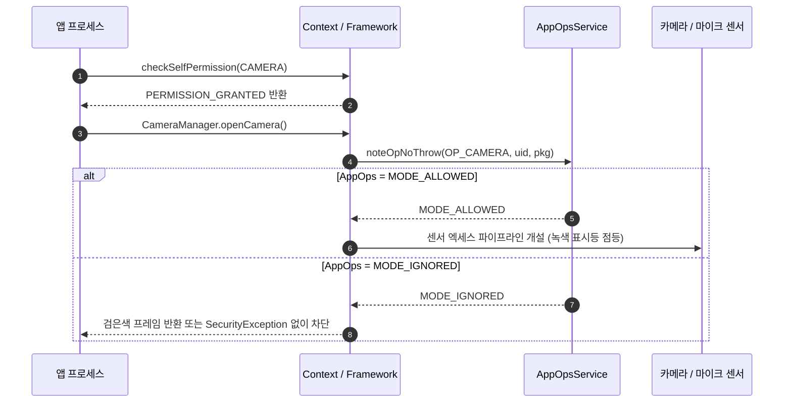

## AppOps 는 권한 이후의 민감 작업 실행 상태를 관찰하고 제어한다

AppOps(Application Operations)는 Linux 권한 및 Manifest/Runtime Grant와 별개로, 특정 민감 작업(카메라, 마이크, 위치, 클립보드 읽기 등)의 실제 런타임 execution을 추적하고 게이팅하는 Android 내부 하위 제어 시스템이다. 런타임 권한이 승인(`GRANTED`)되어 있어도, 시스템 퀵 설정 토글 차단, OS 미사용 권한 자동 회수, 센서 대시보드 상태에 따라 AppOps 동작 상태가 `MODE_IGNORED` 또는 `MODE_ERRORED`로 변경될 수 있다.



### 내부 동작 메커니즘

1. **Op Mode Evaluation**: 프레임워크 API 호출 시 `AppOpsManager.checkOpNoThrow()`, `noteOpNoThrow()`, 또는 `startOpNoThrow()`가 호출된다.
2. **Mode Values**:
   - `MODE_ALLOWED` (0): 작업 정상 허용.
   - `MODE_IGNORED` (1): 작업 거부. 예외 발생 없이 더미 데이터(빈 프레임, null 위치 데이터) 반환.
   - `MODE_ERRORED` (2): 작업 거부 시 `SecurityException`을 던짐.
   - `MODE_FOREGROUND` (4): 앱이 포그라운드 프로세스일 때만 허용.
3. **Privacy Indicators**: `startOpNoThrow()` 호출 시 OS 상태바 상단에 카메라/마이크 활성 표시(Green Dot) 아이콘을 시스템 UI에 표시한다.

### 안전한 AppOps pre-check 구현 (Kotlin)

```kotlin
import android.app.AppOpsManager
import android.content.Context
import android.os.Process

fun isCameraOpAllowed(context: Context): Boolean {
    val appOpsManager = context.getSystemService(Context.APP_OPS_SERVICE) as AppOpsManager
    // checkOpNoThrow / unsafeCheckOpNoThrow 로 SecurityException 없이 모드 확인
    val mode = appOpsManager.unsafeCheckOpNoThrow(
        AppOpsManager.OPSTR_CAMERA,
        Process.myUid(),
        context.packageName
    )
    return mode == AppOpsManager.MODE_ALLOWED
}
```

### 관찰 가능한 증거 (Observable Evidence)

- **adb를 통한 AppOps 상태 점검 및 가속 테스트**:
  ```bash
  # 앱의 마이크 사용 권한 및 AppOps 모드 조회
  adb shell appops get com.example.app RECORD_AUDIO

  # 마이크 사용을 IGNORED 상태로 강제 전환
  adb shell appops set com.example.app RECORD_AUDIO ignore
  ```
- **AppOps 차단 시 관찰 결과**: 앱에 `SecurityException`이 던져지지 않고 오디오 입력이 무음 0바이트 스트림으로 전달되어 센서 수신 실패 발생.

### 판단 기준

Permission 노트는 manifest 선언, runtime grant, AppOps, sandbox boundary 가 서로 다른 판단 축임을 구분하는 기준으로 읽는다.

### 경계

권한 요청 UX 와 실제 sensitive operation 성공 여부를 같은 문제로 보지 않는다.

관련 노트: [Runtime permission은 사용자에게 기능 사용 시점에 요청하는 접근 계약이다](runtime-permission-is-user-mediated-access-contract.md), [권한 디버깅은 manifest, grant state, AppOps를 분리해 확인한다](permission-debugging-separates-manifest-grant-and-appops-state.md)
