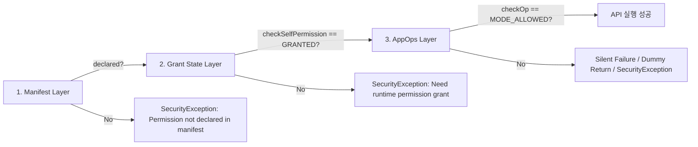

## 권한 디버깅은 manifest, grant state, AppOps 를 분리해 확인한다

Android 권한 관련 실패나 API 거부 문제를 디버깅할 때는 **1) Manifest 선언여부**, **2) Runtime Grant State(승인 상태)**, **3) AppOps Execution Mode(실행 차단 모드)**의 3가지 독립적인 파이프라인 레이어를 개별 검증해야 한다. 단 하나라도 거부 상태에 있으면 민감 API 동작은 최종 실패한다.



### 내부 동작 메커니즘

1. **Manifest Layer**: `PackageManagerService`가 앱 바이너리의 `AndroidManifest.xml`에 포함된 `<uses-permission>` 태그 존재 여부를 평가한다. 미선언 시 런타임 승인 요청이 거부되거나 `SecurityException`이 발생한다.
2. **Grant State Layer**: 사용자 또는 시스템에 의해 dangerous permission 승인 상태(`PERMISSION_GRANTED` vs `PERMISSION_DENIED`)를 `runtime-permissions.xml` 데이터베이스에서 검사한다.
3. **AppOps State Layer**: OS 프레임워크 센서/자원 게이트웨이가 `AppOpsService`를 통해 사용자의 퀵설정 토글(카메라/마이크 킬스위치), 미사용 권한 OS 자동 회수, 대시보드 설정을 검사한다.

### 삼단계 자동화 디버깅 셸 스크립트

```bash
#!/bin/bash
PKG="com.example.app"
PERM="android.permission.ACCESS_FINE_LOCATION"
OP="FINE_LOCATION"

echo "=== 1. Manifest 선언 확인 ==="
adb shell pm dump $PKG | grep -A 10 "requested permissions:" | grep $PERM

echo "=== 2. Runtime Grant State 확인 ==="
adb shell dumpsys package $PKG | grep -A 15 "runtime permissions:" | grep $PERM

echo "=== 3. AppOps Mode 확인 ==="
adb shell appops get $PKG $OP
```

### 관찰 가능한 증거 (Observable Evidence)

| 실패 레이어 | 진단 명령어 / 로그 증거 | 원인 및 해결방안 |
| :--- | :--- | :--- |
| **Manifest** | `java.lang.SecurityException: Permission Denial: requires android.permission.X` | `AndroidManifest.xml`에 `<uses-permission>` 누락 |
| **Grant State** | `dumpsys package`에 `granted=false` 출력 | 사용자가 런타임 승인을 거부함. `requestPermissions()` 호출 필요 |
| **AppOps** | `appops get` 출력에 `mode=ignore` 표시됨 | 시스템 설정 퀵 토글이나 OS 미사용 권한 회수에 의해 억제됨 |

### 판단 기준

Permission 노트는 manifest 선언, runtime grant, AppOps, sandbox boundary 가 서로 다른 판단 축임을 구분하는 기준으로 읽는다.

### 경계

권한 요청 UX 와 실제 sensitive operation 성공 여부를 같은 문제로 보지 않는다.

관련 노트: [AppOps는 권한 이후의 민감 작업 실행 상태를 관찰하고 제어한다](appops-observes-and-gates-sensitive-operations-after-permission.md), [Runtime permission은 사용자에게 기능 사용 시점에 요청하는 접근 계약이다](runtime-permission-is-user-mediated-access-contract.md)
