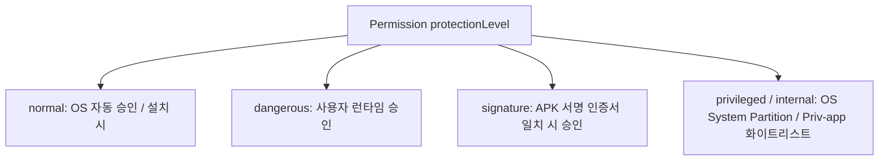

## Permission protection level 은 접근 승인 주체를 정의한다

Android permission의 `protectionLevel` 속성은 권한의 민감도와 함께 **누구가 해당 권한을 승인할 수 있는 주체(Granting Authority)인가**를 결정한다. 승인 주체는 시스템 패키지 매니저(자동), 일반 사용자(런타임 다이얼로그), 서명 키(APK Key), 또는 시스템 이미지(OEM/Priv-app)로 나뉜다.



### 내부 동작 메커니즘

1. **`normal` (0x0)**: 위험성이 낮아 앱 설치 시 `PackageManagerService`에 의해 사용자의 직접 동의 없이 자동으로 `PERMISSION_GRANTED` 처리된다 (예: `INTERNET`, `VIBRATE`).
2. **`dangerous` (0x1)**: 사용자 데이터나 기기 제어에 영향을 주는 권한으로, 사용자가 애플리케이션 실행 중 런타임에 직접 동의해야 한다 (예: `CAMERA`, `READ_CONTACTS`).
3. **`signature` (0x2)**: 권한을 정의한 패키지의 서명 키와 권한을 요청하는 앱의 서명 키가 완전히 동일할 때만 승인된다. 다이얼로그 없이 자동 승인된다.
4. **`privileged` (0x10) / `signatureOrSystem`**: `/system/priv-app` 파티션에 위치하고 `etc/permissions/privapp-permissions-xml` 화이트리스트 명세에 등록된 시스템 앱만 승인 가능하다.

### 커스텀 Signature 권한 정의 및 사용 예시 (XML & Manifest)

```xml
<!-- A 앱 (권한 제공자): Signature 권한 정의 -->
<manifest xmlns:android="http://schemas.android.com/apk/res/android"
    package="com.example.providerapp">

    <permission
        android:name="com.example.providerapp.CUSTOM_IPC_ACCESS"
        android:protectionLevel="signature"
        android:label="Custom IPC Access Permission" />

    <application>
        <service
            android:name=".SecureInternalService"
            android:exported="true"
            android:permission="com.example.providerapp.CUSTOM_IPC_ACCESS" />
    </application>
</manifest>
```

### 관찰 가능한 증거 (Observable Evidence)

- **adb를 활용한 권한 보호 수준 확인**:
  ```bash
  # 특정 권한의 protectionLevel 및 상세 속성 조회
  adb shell pm list permissions -f | grep -A 5 "android.permission.CAMERA"
  ```
- **Signature mismatch 거부 로그**: 서명 키가 다른 타사 앱이 `signature` 권한 요청 시 logcat 및 dumpsys 출력:
  ```text
  java.lang.SecurityException: Permission Denial: Accessing service com.example.providerapp/.SecureInternalService from pid=4521, uid=10243 requires com.example.providerapp.CUSTOM_IPC_ACCESS
  ```

### 판단 기준

Permission 노트는 manifest 선언, runtime grant, AppOps, sandbox boundary 가 서로 다른 판단 축임을 구분하는 기준으로 읽는다.

### 경계

권한 요청 UX 와 실제 sensitive operation 성공 여부를 같은 문제로 보지 않는다.

공식 문서: [Request runtime permissions](https://developer.android.com/training/permissions/requesting)

관련 노트: [Android app sandbox는 UID와 프로세스 경계로 앱을 격리한다](../../platform-hardening/platform-security-contracts/android-app-sandbox-is-uid-and-process-boundary.md)
