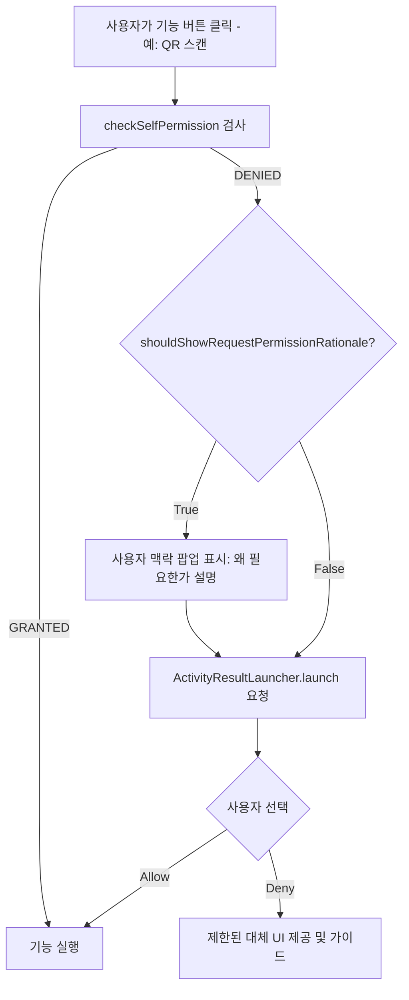

## 권한 요청 UX 는 최소 권한과 사용 시점 설명으로 설계한다

권한 요청 UX 설계의 대전제는 **최소 권한의 원칙(Principle of Least Privilege)**과 **사용 시점 맥락 제공(Point-of-use Rationale)**이다. 앱 런치 시점에 필요한 모든 권한을 한 번에 동의받으려는 형태는 사용자의 거부감을 일으키며, 거부 시 권한 다이얼로그 재노출이 차단되는 영구 거부(Permanently Denied) 상태에 빠지게 만든다.



### 내부 동작 메커니즘

1. **`shouldShowRequestPermissionRationale()`**: 사용자가 권한을 한 번 거부한 후 기능 사용을 시도할 때 `true`를 반환한다. 앱은 사용자가 왜 해당 데이터가 필요한지 이해할 수 있는 custom 설명 팝업을 표시해야 한다.
2. **Permanent Denial (Don't ask again)**: 사용자가 권한 요청 다이얼로그에서 거부 후 다시 요청받았을 때 2회 이상 연속 거부하면 `shouldShowRequestPermissionRationale()`은 `false`를 반환하며, 시스템 런타임 다이얼로그가 더 이상 뜨지 않는다.
3. **Auto-Revoke (OS 미사용 권한 회수)**: Android 11(API 30) 이상에서는 몇 달 동안 사용되지 않은 앱의 런타임 권한을 OS가 자동 회수한다.

### Jetpack Compose / Activity Result API 구현 예시 (Kotlin)

```kotlin
import androidx.activity.compose.rememberLauncherForActivityResult
import androidx.activity.result.contract.ActivityResultContracts
import androidx.compose.runtime.*
import androidx.compose.platform.LocalContext
import android.Manifest
import android.content.pm.PackageManager
import androidx.core.content.ContextCompat
import androidx.core.app.ActivityCompat
import android.app.Activity

@Composable
fun CameraFeatureScreen() {
    val context = LocalContext.current
    val activity = context as Activity
    var showRationaleDialog by remember { mutableStateOf(false) }

    val permissionLauncher = rememberLauncherForActivityResult(
        contract = ActivityResultContracts.RequestPermission()
    ) { isGranted ->
        if (isGranted) {
            // 카메라 기능 실행
        } else {
            // 거부 처리: Fallback UI 노출
        }
    }

    fun onScanButtonClick() {
        when {
            ContextCompat.checkSelfPermission(context, Manifest.permission.CAMERA) == 
                PackageManager.PERMISSION_GRANTED -> {
                // 이미 승인됨
            }
            ActivityCompat.shouldShowRequestPermissionRationale(activity, Manifest.permission.CAMERA) -> {
                // 사용자 맥락 설명 팝업 띄움
                showRationaleDialog = true
            }
            else -> {
                // 최초 요청 또는 영구 거부 상태
                permissionLauncher.launch(Manifest.permission.CAMERA)
            }
        }
    }
}
```

### 관찰 가능한 증거 (Observable Evidence)

- **adb로 OS 자동 회수 상태 및 영구 거부 테스트**:
  ```bash
  # 앱의 미사용 권한 자동 회수 옵션 확인
  adb shell appops get com.example.app AUTO_REVOKE_PERMISSIONS_IF_UNUSED

  # 특정 권한을 영구 거부 상태로 강제 설정 (디버깅용)
  adb shell pm revoke com.example.app android.permission.CAMERA
  ```

### 판단 기준

Permission 노트는 manifest 선언, runtime grant, AppOps, sandbox boundary 가 서로 다른 판단 축임을 구분하는 기준으로 읽는다.

### 경계

권한 요청 UX 와 실제 sensitive operation 성공 여부를 같은 문제로 보지 않는다.

관련 노트: [Runtime permission은 사용자에게 기능 사용 시점에 요청하는 접근 계약이다](runtime-permissions-user-mediation.md)
