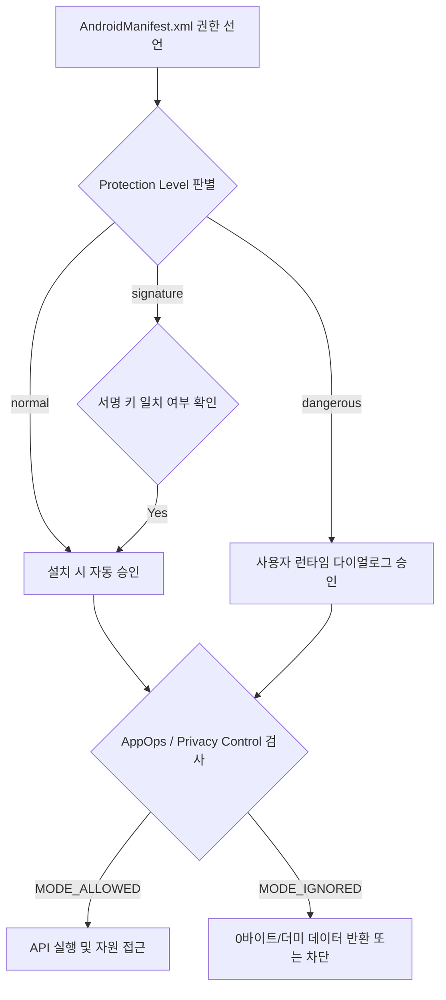

## Android 권한 계약

Android 권한은 앱 샌드박스 바깥의 민감 데이터나 기기 기능에 접근하기 위해 사용자 및 시스템으로부터 승인을 얻는 접근 계약이다. 권한 선언(Manifest), 런타임 승인(Grant State), 특수 접근(Special App Access), 런타임 통제(AppOps), 시점별 UX, 삼단계 디버깅 파이프라인을 별도의 책임 경계로 분리한다.



### 내부 동작 메커니즘

1. **Manifest Parsing**: 패키지 매니저(`PackageManagerService`)가 앱 설치 시 `AndroidManifest.xml`의 `<uses-permission>`을 스캔하고 `ProtectionLevel`을 확인한다.
2. **Runtime Permission Control**: `PermissionController` 앱이 사용자의 런타임 승인 다이얼로그 응답을 수집하고 `runtime-permissions.xml`에 허용/거부 상태를 기록한다.
3. **AppOps Execution Gate**: 런타임 권한이 `PERMISSION_GRANTED` 상태라 하더라도, 실제 API 호출 시 `AppOpsService`가 `checkOpNoThrow`를 실행하여 시스템 토글, 개인정보 보호 대시보드, 자동 회수 정책에 따른 차단을 2차 적용한다.

### 권한 검사 진단 명령어

```bash
# 앱 패키지의 전체 권한 부여 상태 확인
adb shell dumpsys package com.example.app | grep -A 20 "runtime permissions:"

# 앱의 AppOps 런타임 실행 통제 상태 확인
adb shell appops get com.example.app

# 특정 권한의 AppOps 상태 강제 설정 (예: 카메라 차단)
adb shell appops set com.example.app CAMERA ignore
```

### 관찰 가능한 증거 (Observable Evidence)

- `adb shell pm list permissions -g`로 OS 권한 그룹 목록 확인.
- AppOps가 `ignore` 상태일 때 API 호출 시 Exception 없이 비어 있는 리스트나 0바이트 결과를 반환하는 시동 동작 확인.

### 정본 노트

- [안드로이드 권한 시스템 & AppOps](appops-and-permissions.md)
- [Runtime Permissions vs AppOps 비교](runtime-permissions-vs-appops.md)
- [Permission protection level은 접근 승인 주체를 정의한다](permission-protection-levels.md)
- [Runtime permission은 사용자에게 기능 사용 시점에 요청하는 접근 계약이다](runtime-permissions-user-mediation.md)
- [Special app access는 일반 runtime permission이 아니라 설정 기반 capability다](special-app-access-settings.md)
- [AppOps는 권한 이후의 민감 작업 실행 상태를 관찰하고 제어한다](appops-sensitive-operations.md)
- [권한 요청 UX는 최소 권한과 사용 시점 설명으로 설계한다](permission-request-ux.md)
- [권한 디버깅은 manifest, grant state, AppOps를 분리해 확인한다](permission-debugging-appops.md)

관련 지도: [Android 플랫폼 보안 경계 계약](../platform-hardening/platform-security.md)
