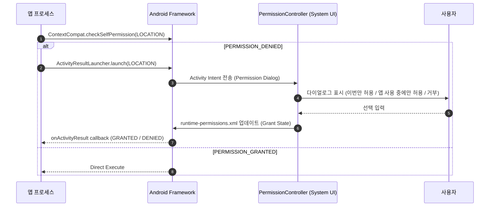

## Runtime permission 은 사용자에게 기능 사용 시점에 요청하는 접근 계약이다

Runtime Permission은 Android 6.0(API 23)부터 도입된 사용자가 매개하는 동적 접근 승인 계약이다. dangerous permission으로 분류된 모든 API는 단순 `AndroidManifest.xml` 선언만으로 동가하지 않으며, API를 실행하기 전 실행 시점에 승인 상태를 확인하고 사용자의 동의를 얻어야 한다.



### 내부 동작 메커니즘

1. **System IPC Handshake**: `ActivityCompat.requestPermissions()` 또는 `ActivityResultLauncher`는 `com.android.permissioncontroller` 패키지의 시스템 액티비티를 Intent로 실행한다.
2. **Grant Persistence**: 승인 결과는 `/data/system/users/0/runtime-permissions.xml`에 패키지 UID와 권한 이름별로 저장된다.
3. **One-Time Permissions (이번만 허용)**: Android 11 이상에서는 위치, 카메라, 마이크에 대해 "이번만 허용(Only this time)" 옵션이 지원된다. 앱 프로세스가 종료되면 OS가 권한 승인 상태를 즉시 무효화한다.

### 표준 런타임 권한 처리 가이드 (Kotlin)

```kotlin
import androidx.activity.result.contract.ActivityResultContracts
import androidx.appcompat.app.AppCompatActivity
import androidx.core.content.ContextCompat
import android.Manifest
import android.content.pm.PackageManager

class LocationActivity : AppCompatActivity() {

    private val requestPermissionLauncher = registerForActivityResult(
        ActivityResultContracts.RequestPermission()
    ) { isGranted: Boolean ->
        if (isGranted) {
            startLocationUpdates()
        } else {
            showLocationDisabledState()
        }
    }

    private fun checkAndRequestLocation() {
        when {
            ContextCompat.checkSelfPermission(
                this,
                Manifest.permission.ACCESS_FINE_LOCATION
            ) == PackageManager.PERMISSION_GRANTED -> {
                startLocationUpdates()
            }
            else -> {
                requestPermissionLauncher.launch(Manifest.permission.ACCESS_FINE_LOCATION)
            }
        }
    }

    private fun startLocationUpdates() { /* GPS 수신 */ }
    private fun showLocationDisabledState() { /* fallback */ }
}
```

### 관찰 가능한 증거 (Observable Evidence)

- **adb 명령어를 통한 런타임 권한 동적 부여 및 회수**:
  ```bash
  # 앱에 런타임 위치 권한 직접 부여
  adb shell pm grant com.example.app android.permission.ACCESS_FINE_LOCATION

  # 런타임 위치 권한 즉시 회수
  adb shell pm revoke com.example.app android.permission.ACCESS_FINE_LOCATION
  ```
- **권한 거부 시 예외 덤프**:
  ```text
  java.lang.SecurityException: Client must have ACCESS_FINE_LOCATION to response location updates
  ```

### 판단 기준

Permission 노트는 manifest 선언, runtime grant, AppOps, sandbox boundary 가 서로 다른 판단 축임을 구분하는 기준으로 읽는다.

### 경계

권한 요청 UX 와 실제 sensitive operation 성공 여부를 같은 문제로 보지 않는다.

관련 노트: [Permission protection level은 접근 승인 주체를 정의한다](permission-protection-levels.md)
