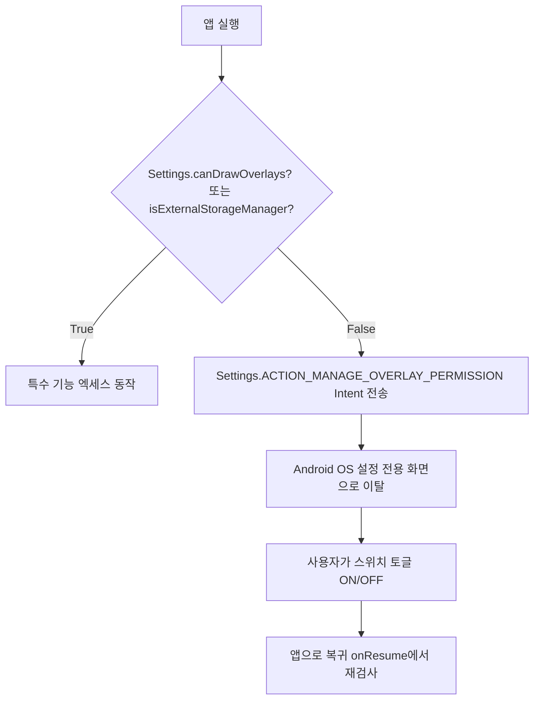

## Special app access 는 일반 runtime permission 이 아니라 설정 기반 capability 다

Special App Access(특수 앱 접근 권한)는 표준 인앱 런타임 다이얼로그(`requestPermissions`)로 승인받을 수 없는 고위험 시스템 능력이다. 다른 앱 위에 그리기(`SYSTEM_ALERT_WINDOW`), 시스템 설정 변경(`WRITE_SETTINGS`), 모든 파일 접근(`MANAGE_EXTERNAL_STORAGE`), 사용정보 접근(`PACKAGE_USAGE_STATS`) 등은 OS **설정(Settings) 전용 UI 화면**으로 사용자를 이탈시켜 동의를 받아야 하는 기능 기반 Capability다.



### 내부 동작 메커니즘

1. **Settings Intent Redirection**: 특수 접근 권한은 `Intent(Settings.ACTION_...)`을 통해 시스템 설정의 개별 전용 토글 페이지로 전환된다.
2. **AppOps Backing**: Special Access의 실제 상태는 AppOps의 전용 OP 항목(`OP_SYSTEM_ALERT_WINDOW`, `OP_MANAGE_EXTERNAL_STORAGE`)으로 매핑되어 관리된다.
3. **Google Play Policy Review**: 특수 접근 권한을 요구하는 APK는 구글 플레이 스토어 제출 시 정당성 검토(Policy Declaration)를 거쳐야 하며, 남용 시 앱 삭제 사유가 된다.

### Special Access 요청 및 검사 구현 (Kotlin)

```kotlin
import android.content.Context
import android.content.Intent
import android.net.Uri
import android.provider.Settings

fun requestOverlayPermission(context: Context) {
    if (!Settings.canDrawOverlays(context)) {
        val intent = Intent(
            Settings.ACTION_MANAGE_OVERLAY_PERMISSION,
            Uri.parse("package:${context.packageName}")
        ).apply {
            addFlags(Intent.FLAG_ACTIVITY_NEW_TASK)
        }
        context.startActivity(intent)
    } else {
        // Overlay 창 표시 가능
    }
}
```

### 관찰 가능한 증거 (Observable Evidence)

- **adb 명령어를 통한 Special Access 관리**:
  ```bash
  # Overlay 특수 권한 상태 조회
  adb shell appops get com.example.app SYSTEM_ALERT_WINDOW

  # Overlay 특수 권한 허용 모드로 변경
  adb shell appops set com.example.app SYSTEM_ALERT_WINDOW allow
  ```
- **권한 미획득 상태에서 창 생성 시 예외**:
  ```text
  android.view.WindowManager$BadTokenException: Unable to add window -- token null is not valid; is your activity running?
  ```

### 판단 기준

Permission 노트는 manifest 선언, runtime grant, AppOps, sandbox boundary 가 서로 다른 판단 축임을 구분하는 기준으로 읽는다.

### 경계

권한 요청 UX 와 실제 sensitive operation 성공 여부를 같은 문제로 보지 않는다.

관련 노트: [AppOps는 권한 이후의 민감 작업 실행 상태를 관찰하고 제어한다](appops-sensitive-operations.md)
