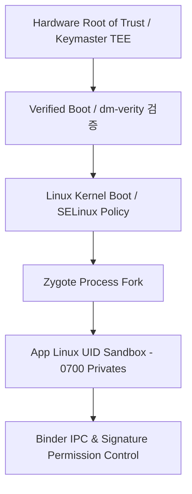

## Android 플랫폼 보안 경계 계약
배경 지식: [Root of Trust](01_inbox/security/fundamentals/root-of-trust-and-chain-of-trust.md), [Device Mapper와 dm-verity](02_references/operating-systems/device-mapper-and-dm-verity.md)

Android 플랫폼 보안은 앱 UID 샌드박스(Linux Kernel Isolation), Binder IPC 통신 경계, SELinux Mandatory Access Control(MAC), Verified Boot(AVB) Chain of Trust가 상호 보완적으로 작동하는 계층형 보호 모델이다. 어느 한 계층이 우회되더라도 상위/하위 계층이 피해 범위를 국소적으로 억제한다.



### 내부 동작 메커니즘

1. **Hardware RoT & AVB**: 기기 전원 온 시 Boot ROM(칩 제조 단계에 새겨져 소프트웨어 업데이트로도 바뀌지 않는 최초 부트 코드)이 부트로더와 시스템 파티션의 해시 서명을 **dm-verity**(디스크 블록을 읽을 때마다 미리 계산해 둔 해시 트리와 실시간으로 비교해 변조를 탐지하는 커널 Device Mapper 타겟)로 체인 검증한다.
2. **Kernel & SELinux Domain**: 부팅된 커널은 모든 앱 프로세스를 `u:r:untrusted_app:s0` 도메인으로 라벨링하고, `neverallow` 규칙으로 커널 노드 접근 및 raw socket 생성을 원천 금지한다.
3. **Linux UID Sandbox**: 앱 설치 시 고유 UID(`u0_a150`)를 부여하여 `/data/data/<package>` 디렉터리를 `0700` 권한으로 격리한다.

### 플랫폼 보안 진단 명령어

```bash
# 프로세스의 SELinux 도메인 및 Linux UID 상태 확인
adb shell ps -AZ | grep com.example.app

# 앱의 데이터 디렉터리 권한 스펙트럼 조회
adb shell ls -ld /data/data/com.example.app

# SELinux 위반 (AVC denied) 실시간 로그 모니터링
adb shell "logcat | grep avc"
```

### 관찰 가능한 증거 (Observable Evidence)

- `ps -AZ` 명령 결과: `u:r:untrusted_app:s0:c512,c768 u0_a150 2040 ... com.example.app` 형태로 프로세스 도메인 및 UID 고유 할당 관찰.
- 타 앱 디렉터리 접근 시 Kernel level에서 `Permission denied` 반환.

### 정본 노트

- [Android app sandbox는 UID와 프로세스 경계로 앱을 격리한다](android-app-sandbox-is-uid-and-process-boundary.md)
- [SELinux는 Linux 사용자 권한을 넘어 mandatory policy를 강제한다](selinux-enforces-mandatory-policy-beyond-linux-user-permissions.md)
- [Verified Boot는 기기 소프트웨어의 chain of trust를 만든다](verified-boot-establishes-device-software-chain-of-trust.md)

관련 지도: [Android 권한 계약](../../permissions-and-sandbox/permission-contracts/permission-contracts.md), [무결성과 attestation 계약](../../integrity-and-attestation/integrity-contracts/integrity-contracts.md)
