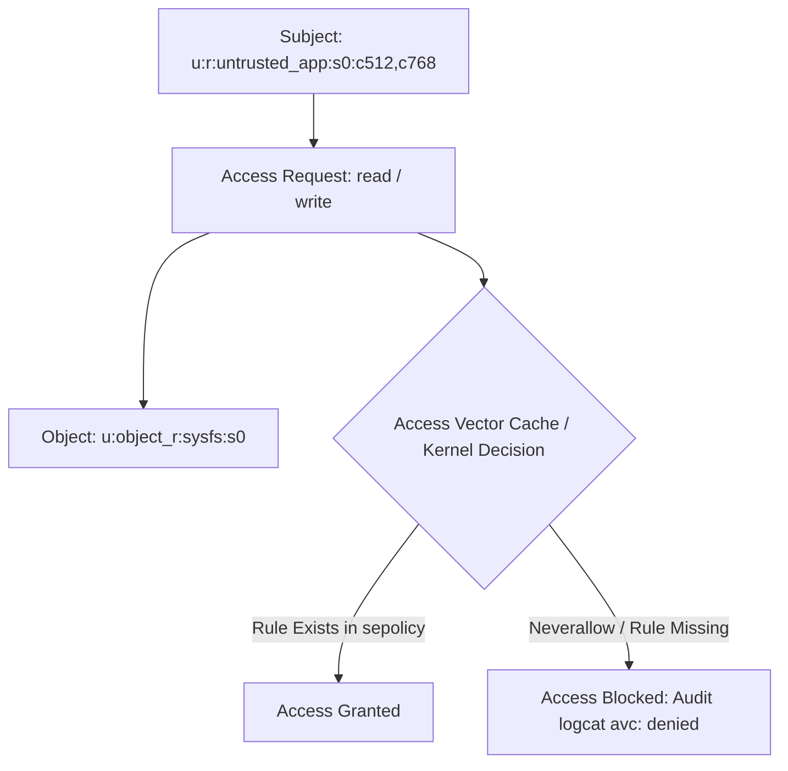

## SELinux 는 Linux 사용자 권한을 넘어 mandatory policy 를 강제한다

Android의 **SELinux(Security-Enhanced Linux)**는 전통적인 Linux DAC(Discretionary Access Control, UID/GID 기반) 권한 위에 **MAC(Mandatory Access Control)** 정책을 추가로 강제한다. 프로세스는 보안 도메인(Domain)을 갖고 파일, 소켓, 서비스 등은 타입(Type) 보안 라벨을 부여받으며, 중앙 정책(`sepolicy`)에 명시적으로 허용되지 않은 모든 행위는 root 권한(`UID 0`)으로도 커널에서 즉시 차단된다.



### 내부 동작 메커니즘

1. **Security Context Format**: `user:role:type:sensitivity` (예: `u:r:untrusted_app:s0:c512,c768`). 일반 일반 앱 프로세스는 `untrusted_app` 도메인과 고유한 MLS(Multi-Level Security) 카테고리를 할당받는다.
2. **Enforcing Mode**: Android 5.0 이상부터 SELinux는 기본적으로 `Enforcing` 모드로 동작한다 (`setenforce 1`).
3. **Neverallow Enforcement**: 커널 빌드 타임에 컴파일된 `neverallow` 규칙으로 인해 `untrusted_app` 도메인은 `/dev/kmem`, raw network sockets, 타 시스템 프로세스의 `/proc/` 노드 접근이 결코 허용되지 않는다.

### SELinux 진단 및 Policy 검사 (adb & TE Syntax)

```bash
# 1. SELinux Enforcing 상태 확인
adb shell getenforce

# 2. 커널 메시지 버퍼에서 AVC 위반 로그 탐색
adb shell "dmesg | grep avc"

# 3. 특정 파일 및 노드의 SELinux Security Context 라벨 조회
adb shell ls -Z /data/data/com.example.app
```

```text
# Android AOSP SEPolicy 규격 예시 (untrusted_app.te)
# untrusted_app이 system_file에 대해 write 시도를 절대 금지함
neverallow untrusted_app system_file:file { write execute_no_trans };
```

### 관찰 가능한 증거 (Observable Evidence)

- **logcat 및 dmesg 상의 AVC Denied 트레이스 예시**:
  ```text
  type=1400 audit(1722768000.123:45): avc: denied { read } for pid=2040 comm="com.example.app" name="kmsg" dev="proc" ino=4026532041 scontext=u:r:untrusted_app:s0:c512,c768 tcontext=u:object_r:proc_kmsg:s0 tclass=file permissive=0
  ```
  `permissive=0`으로 인해 커널 레벨에서 `EACCES` 오류를 반환하여 샌드박스 이탈 방지.

### 판단 기준

Platform security 노트는 앱 권한보다 낮은 계층에서 device integrity 와 mandatory policy 가 어떻게 강제되는지 판단하는 기준으로 읽는다.

### 경계

client-side check 를 authorization 으로 오해하지 않고 server verification, boot trust, sandbox boundary 를 분리한다.

관련 노트: [Android app sandbox는 UID와 프로세스 경계로 앱을 격리한다](android-app-sandbox-is-uid-and-process-boundary.md)
