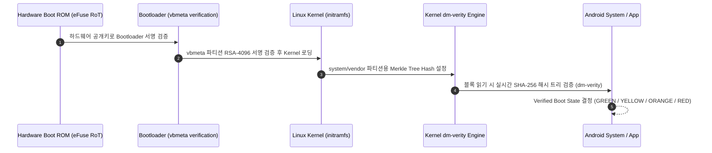

## Verified Boot 는 기기 소프트웨어의 chain of trust 를 만든다

Android **Verified Boot(AVB, Android Verified Boot 2.0)**는 전원이 켜지는 순간부터 하드웨어 기반 **Root of Trust(RoT)**를 시작으로 Bootloader, Kernel, System/Vendor 파티션 바이너리가 정품 하드웨어 제조업체(OEM)의 암호학적 서명과 해시 체인을 통과했는지를 검증하는 체인 오브 트러스트(Chain of Trust)를 구축한다.



### 내부 동작 메커니즘

1. **`vbmeta` Partition**: AVB 2.0은 `vbmeta` 파티션에 각 파티션(boot, system, vendor, product)의 서명과 Merkle Tree Root Hash를 저장한다.
2. **Real-time `dm-verity`**: 커널의 `dm-verity` 드라이버가 디스크 블록을 읽을 때마다 블록의 SHA-256 해시를 Merkle Tree 노드와 실시간 비교하여, 파티션이 1비트라도 변조되면 I/O 에러를 발생시키거나 기기를 리부팅시킨다.
3. **Boot State Evaluation**:
   - `GREEN`: 락된 부트로더 및 OEM 서명 일치. 완전 신뢰 상태.
   - `YELLOW`: 사용자가 커스텀 Root 서명 키를 등록함.
   - `ORANGE`: 부트로더 락 해제 상태 (Unlocked Bootloader).
   - `RED`: 서명 검증 실패 또는 변조 감지 (Boot Halt).

### Verified Boot 상태 확인 코드 & adb 명령어

```bash
# 1. Verified Boot State 프로퍼티 확인 (green / yellow / orange / red)
adb shell getprop ro.boot.verifiedbootstate

# 2. 부트로더 락 상태 확인 (locked / unlocked)
adb shell getprop ro.boot.flash.locked
```

```kotlin
// Android KeyAttestation을 통한 클라이언트 측 부팅 무결성 덤프 확인
import java.security.KeyStore
import java.security.cert.X509Certificate

fun checkVerifiedBootAttestation(): String? {
    val keyStore = KeyStore.getInstance("AndroidKeyStore").apply { load(null) }
    val chain = keyStore.getCertificateChain("my_attestation_key_alias") ?: return null
    val leafCert = chain[0] as X509Certificate
    
    // Attestation extension(OID: 1.3.6.1.4.1.11129.2.1.17) 데이터 해석을 통해
    // Verified Boot State 및 Bootloader Lock 상태 추출 가능
    return leafCert.sigAlgName
}
```

### 관찰 가능한 증거 (Observable Evidence)

- **adb getprop 조회의 표준 결과**:
  ```text
  [ro.boot.verifiedbootstate]: [green]
  [ro.boot.flash.locked]: [1]
  ```
- **부트로더 락 해제 시 관찰 결과**: `ro.boot.verifiedbootstate`가 `orange`로 변경되어 Play Integrity의 `MEETS_STRONG_INTEGRITY` 실패 원인이 됨.

### 판단 기준

Platform security 노트는 앱 권한보다 낮은 계층에서 device integrity 와 mandatory policy 가 어떻게 강제되는지 판단하는 기준으로 읽는다.

### 경계

client-side check 를 authorization 으로 오해하지 않고 server verification, boot trust, sandbox boundary 를 분리한다.

공식 문서: [Verified Boot](https://source.android.com/docs/security/features/verifiedboot)

관련 노트: [Play Integrity token은 서버가 검증하는 위험 신호이지 권한 자체가 아니다](../../integrity-and-attestation/integrity-contracts/play-integrity-token-is-server-verified-risk-signal-not-authorization.md)
