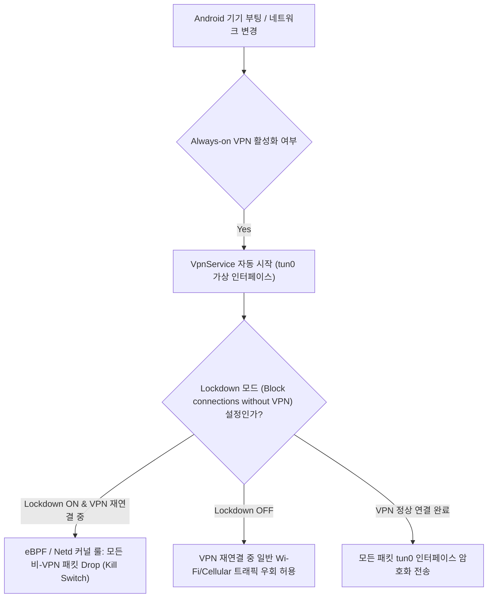

# VPN Always-on vs Lockdown (안드로이드 VPN 트래픽 차단 메커니즘)

## 1. 개요 (Overview)

**VPN Always-on 과 Lockdown** 은 기업 보안 및 프라이버시 보호를 위해 Android OS 가 제공하는 **두 가지 수준의 전역 가상 사설망(VPN) 자동 연결 및 트래픽 통제 정책**이다.

단순 VPN 연결과 달리, **Always-on** 은 스마트폰 부팅 시 사용자의 개입 없이 VPN 을 즉시 자동 실행하고, **Lockdown 모드 ("VPN 없이 연결 차단" - Block connections without VPN)** 는 VPN 이 연결되지 않았거나 재연결 중일 때 **앱의 비-VPN 일반 인터넷 패킷을 커널 방화벽 단에서 100% 전면 차단(Kill Switch)** 하여 데이터 누출을 방지한다.

---

### 초보자를 위한 쉽게 이해하는 비유

* **Always-on (자동 전속 보안 에스코트 차량 탑승)**:
  - 출근(부팅)할 때 경호차량(VPN)이 집 앞에 자동으로 와서 기다리는 시스템 (경호차가 오기 전에는 잠시 일반 도로로 걸어갈 수도 있음).
* **Lockdown 모드 (에스코트 차량 미도착 시 출입문 완전 봉쇄 셔터)**:
  - 경호차량(VPN)이 내 집 대문에 딱 밀착하여 연결되어 있지 않다면, **집의 모든 문과 창문(스마트폰의 모든 소켓 통신)에 철제 셔터를 내리고 1mm 도 나가지 못하게 완전 봉쇄하는 비상 봉쇄 모드**.



---

## 2. Always-on 대 Lockdown 모드 핵심 상세 비교표

| 비교 항목 | Always-on VPN | Lockdown Mode (VPN 전면 봉쇄) |
| :--- | :--- | :--- |
| **자동 실행** | **기기 부팅 시 VPN 앱 자동 실행** | **Always-on 활성화 상태에서만 설정 가능** |
| **VPN 끊김 시 동작** | 일반 Wi-Fi / Cellular 인터넷으로 우회 통신 | **모든 일반 인터넷 트래픽 100% 전면 차단 (Kill Switch)** |
| **패킷 누출 위험** | 재연결되는 수 초 동안 평문 패킷 누출 가능 | **패킷 누출 가능성 0% (완전 차단)** |
| **예외 우회 앱** | VPN 시스템 앱 및 캐티브 포털(Wi-Fi 로그인) 우회 | 지정된 시스템 예외 외 모든 일반 앱 통신 불가능 |
| **설정 위치** | `설정 > 네트워크 > VPN > 상시 연결 VPN` | `설정 > 네트워크 > VPN > VPN 없이 연결 차단` |

---

## 3. 코드 예시 및 CLI 진단 명령어

`adb shell` 로 안드로이드 기기 내 활성화된 Always-on 및 Lockdown VPN 의 상태를 진단할 수 있다:

```bash
# dumpsys vpn 을 통해 Always-on 패키지명 및 Lockdown 활성화 현황 덤프
adb shell dumpsys vpn

# 글로벌 시스템 설정에서 Always-on 패키지 및 Lockdown 상태 조회
adb shell settings get secure always_on_vpn_app
adb shell settings get secure always_on_vpn_lockdown
```

---

## 4. 연결 문서 (Related Links)

- [Android Connectivity 런타임](../../01_system_internals/connectivity/android-connectivity.md) - Connectivity 서비스 계층
- [NetId & Multi-Routing Table](../../01_system_internals/connectivity/netid-routing-table.md) - VPN tun0 라우팅 테이블
- [Private DNS & DNS-over-TLS](../../../../computer-science/networking/dns-over-tls-dot.md) - VPN 환경에서의 DNS 통제
- [dumpsys 시스템 진단 도구](../../06_testing_performance/debugging/dumpsys.md) - dumpsys vpn 디버깅
