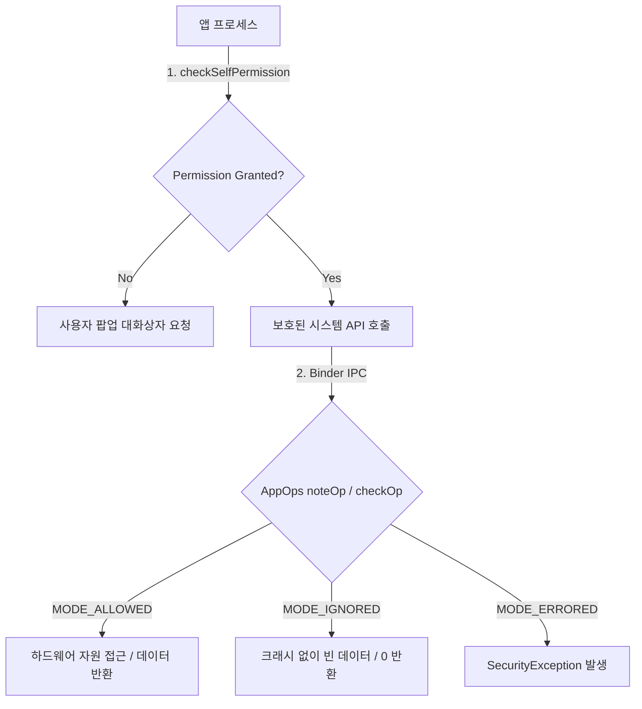

# Runtime Permissions vs AppOps (런타임 권한과 AppOps 비교)

## 1. 개요 및 비유로 이해하는 개념 (Overview & Definition)

안드로이드 앱이 마이크, 카메라, 위치 정보 등 사용자의 민감한 정보나 기기 하드웨어 자원에 접근할 때, OS는 **1차 권한 동의 체계인 런타임 권한(Runtime Permissions)**과 **2차 미세 제어 및 감시 체계인 AppOps(Application Operations)**를 함께 작동시킵니다.

### 초보자를 위한 쉬운 비유

* **런타임 권한 (Runtime Permissions)**: **"놀이공원 자유이용권 (License / Admission Ticket)"**과 같습니다. 사용자가 팝업 대화상자에서 "허용"을 누름으로써 앱이 해당 자원(카메라, 마이크 등)에 접근할 자격이 있음을 공식 동의받은 라이선스 상태입니다.
* **AppOps (Application Operations)**: **"놀이기구 개별 안전 통제관 및 감제실 (Operational Guard & Surveillance)"**과 같습니다. 자유이용권이 있더라도, "앱이 백그라운드 상태이므로 놀이기구 작동 금지", "사용자가 상단바에서 카메라 스위치(Privacy Toggle)를 끔"과 같은 실시간 상태를 감시하여, 앱이 알지 못하게 조용히 접근을 차단(Silent Ignore)하거나 사용 타임스탬프 기록(Auditing)을 수행합니다.

---

## 2. 런타임 권한 vs AppOps 핵심 차이점 (Key Differences)

런타임 권한과 AppOps는 접근 통제의 수준과 반응 방식에서 다음과 같은 명확한 차이점을 갖습니다.

| 구분 | 런타임 권한 (Runtime Permissions) | AppOps (Application Operations) |
| :--- | :--- | :--- |
| **비유** | 놀이공원 자유이용권 (자격 동의) | 놀이기구 개별 안전 통제관 (실시간 제어) |
| **주요 목적** | 사용자의 명시적 허가 획득 및 권한 부여 | 실시간 동작 제어, 백그라운드 제한 & 사용 추적 |
| **판단 주체** | 사용자 (Pop-up Dialog UI) | OS 내부 관제 서비스 (AppOpsService) |
| **판단 시점** | 기능 사용 전 동의 요청 시 (`requestPermissions`) | 실제 API 호출 및 자원 접근 매 순간 (`noteOp` / `startOp`) |
| **거부 시 동작** | `SecurityException` 크래시 발생 | 예외 발생 (`MODE_ERRORED`) 또는 **Silent Ignore (`MODE_IGNORED`, 빈/null 데이터 반환)** |
| **상태 제어** | 허용(Granted) / 거부(Denied) 이분법 | `MODE_ALLOWED`, `MODE_IGNORED`, `MODE_ERRORED`, `MODE_FOREGROUND` 등 세분화 |

---

## 3. 런타임 권한과 AppOps 상호작용 흐름 (Interaction Mechanism)

앱이 민감 자원 API를 호출할 때 런타임 권한 검사와 AppOps 검사가 순차적으로 이루어지는 내부 동작 흐름입니다.

### 상호작용 검증 3단계
1. **1차 런타임 권한 확인 (`checkSelfPermission`)**: 앱 개발자가 자원 접근 전 런타임 권한 동의 여부를 확인합니다. 동의를 받지 못했다면 권한 요청 팝업을 띄워야 하며, 동의 없이 API를 직접 호출하면 `SecurityException`이 발생합니다.
2. **2차 AppOps 런타임 상태 평가 (`noteOp` / `startOp`)**: [system-server](../04_system_services/system-server.md) 내부의 서비스는 [Binder IPC](../01_system_internals/ipc-and-process/binder-ipc.md) 통신 요청을 받은 후 `AppOpsManager`를 통해 현재 앱의 호출 상태(포그라운드 여부, 센서 차단 스위치 켜짐 여부 등)를 검증합니다.
3. **결과 처리 및 Silent Ignore**: AppOps 모드가 `MODE_IGNORED`인 경우 시스템은 앱 프로세스를 강제 종료하지 않고 성공 응답인 것처럼 속여 **빈 데이터(empty list, null location 등)**를 반환합니다. 이를 통해 앱의 불필요한 크래시를 방지하면서 사용자의 개인정보를 보호합니다.

---

## 4. 초보자가 범하기 쉬운 안티패턴 및 주의사항 (Anti-Patterns & Pitfalls)

1. **런타임 권한 승인만 믿고 백그라운드 접근을 방치하는 안티패턴**:
   - 사용자가 런타임 권한을 허용했더라도, 앱이 백그라운드로 전환되면 AppOps에 의해 위치나 마이크 접근이 `MODE_IGNORED`로 전환될 수 있습니다. 런타임 권한 승인 상태가 항상 데이터 수신 성공을 보장하지 않음을 인지해야 합니다.
2. **Silent Ignore에 의한 빈 데이터 수신을 네트워크 오류로 오진**:
   - AppOps 차단 시 예외가 던져지지 않고 null이나 empty 객체가 반환되므로, 데이터가 비어있을 때 앱 로직이 무한 재시도(Retry Loop)에 빠지지 않도록 유의해야 합니다.
3. **사용자 동의 팝업 확인 없는 API 즉시 호출**:
   - `checkSelfPermission` 검사 없이 지능적으로 API를 호출하면, 런타임 권한 미승인 상태에서 `SecurityException`이 발생하여 앱이 즉시 종료됩니다.

---

## 5. 연결 문서 (Related Links)

- [안드로이드 권한 시스템 & AppOps](appops-and-permissions.md) - 안드로이드 2중 보안 검문소 개요 및 권한 체계
- [안드로이드 시스템 서비스 (system-server)](../04_system_services/system-server.md) - AppOpsManagerService 및 PermissionManagerService가 실행되는 시스템 프로세스
- [Binder IPC](../01_system_internals/ipc-and-process/binder-ipc.md) - 앱 프로세스에서 시스템 서비스로 권한 및 AppOps 검증을 요청하는 통신 경계
