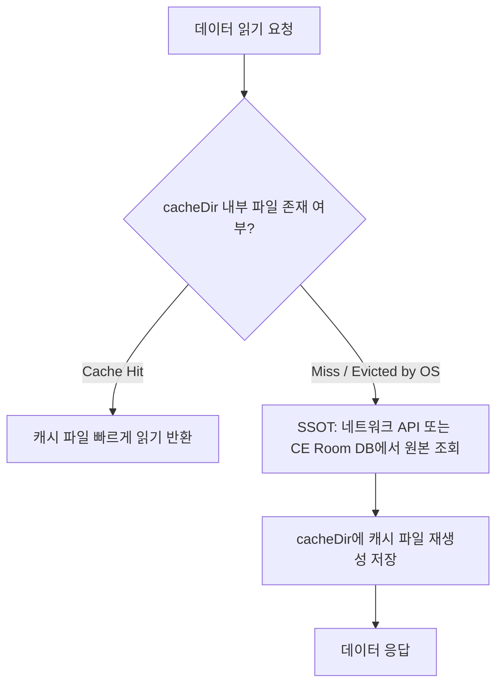

## 캐시와 재생성 가능한 데이터의 수명

캐시 디렉터리(`context.cacheDir`, `context.externalCacheDir`, `codeCacheDir`)에 보관되는 데이터는 **임시적이며(Transient) 언제든지 재구성이 가능한 부차적 데이터**여야 한다. OS는 저장 공간 부족(Low Disk Space) 상황이 발생하면 사용자 동의 없이 캐시 디렉터리의 파일을 수시로 자동 트리밍(Trimming) 및 삭제하므로, 캐시를 앱 데이터의 유일한 정본([single source of truth](../../02_app_framework/jetpack-compose/runtime/compose-ssot.md))으로 설계해서는 안 된다.



### 내부 동작 메커니즘

1. **OS Automatic Trim**: Android OS의 `StorageManager` 서비스는 저장소가 꽉 차면 `ACTION_CLEAR_DATA_BUFFERS`를 트리거하여 각 앱의 `cacheDir` 파일들을 LRU(Least Recently Used) 순서로 자동 제거한다.
2. **Quota Management**: Android 8.0(API 26)부터 `StorageManager.getCacheQuotaBytes()`를 통해 앱별 적정 캐시 쿼터가 할당되며, 쿼터 초과 시 캐시 삭제 1순위 대상이 된다.
3. **Atomic File Operations**: 캐시 파일 생성 도중 OS 트리밍이나 프로세스 킬로 인한 파일 손상을 막기 위해 `AtomicFile` 조작을 권장한다.

### 안전한 캐시 관리 및 Atomic Write 구현 (Kotlin)

```kotlin
import android.content.Context
import androidx.core.util.AtomicFile
import java.io.File

class SafeCacheManager(private val context: Context) {

    fun writeToCache(fileName: String, data: ByteArray) {
        val cacheFile = File(context.cacheDir, fileName)
        val atomicFile = AtomicFile(cacheFile)
        
        var fos = atomicFile.startWrite()
        try {
            fos.write(data)
            atomicFile.finishWrite(fos)
        } catch (e: Exception) {
            atomicFile.failWrite(fos)
        }
    }

    fun readFromCacheOrNull(fileName: String): ByteArray? {
        val cacheFile = File(context.cacheDir, fileName)
        return if (cacheFile.exists() && cacheFile.isFile) {
            try {
                AtomicFile(cacheFile).readFully()
            } catch (e: Exception) {
                cacheFile.delete() // 손상 파일 삭제
                null
            }
        } else {
            null
        }
    }
}
```

### 관찰 가능한 증거 (Observable Evidence)

- **adb를 활용한 OS 캐시 트리밍 강제 시뮬레이션**:
  ```bash
  # 저장 공간 부족 상황을 가상으로 발생시켜 캐시 강제 정리 (1GB 요구)
  adb shell pm trim-caches 1000M

  # 앱의 캐시 디렉터리 내부 파일 소멸 확인
  adb shell ls -la /data/data/com.example.app/cache/
  ```

### 판단 기준

Storage lifecycle 노트는 FBE CE/DE 가용 시점, Direct Boot 단계, 캐시 휘발성, 백업 복원 경계가 서로 다른 판단 축임을 구분하는 기준으로 읽는다.

### 경계

저장 위치 선택을 보안 등급 선택과 동일시하지 않고, 가용성(availability)과 기밀성(confidentiality)을 분리해서 판단한다.

상위 문서: [저장소 생명주기와 백업 계약](storage-lifecycle-and-backup.md)
