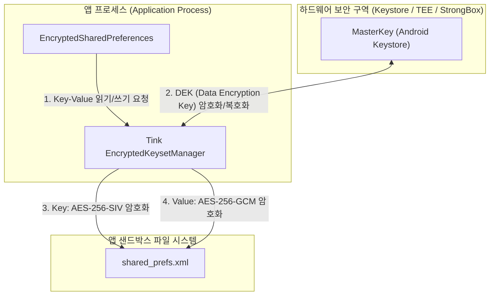

## EncryptedSharedPreferences (보안 Key-Value 저장소)

Android Jetpack Security 라이브러리에서 제공하는 **EncryptedSharedPreferences**는 MasterKey와 Android Keystore 기반으로 데이터를 하드웨어 수준에서 안전하게 저장하는 보안 Key-Value 저장소입니다.

> [!NOTE]
> `androidx.security:security-crypto:1.1.0` 버전부터 `EncryptedSharedPreferences`를 포함한 관련 API가 Deprecated 되었습니다. 신규 프로젝트에서는 Android Keystore + 표준 JCA AES-GCM 또는 Jetpack DataStore 기반의 암호화 저장소 설계를 권장합니다. 상세한 경계 설계와 마이그레이션 전략은 [암호화 저장소 API는 키와 데이터 경계 설계를 대체하지 않는다](encrypted-storage-boundaries.md)를 참조하십시오.

---

### 1단계: 개념 및 비유 (Concept & Analogy)

#### 개념
`EncryptedSharedPreferences`는 기존 Android의 `SharedPreferences` 인터페이스를 그대로 유지하면서, 저장되는 모든 **Key(키)**와 **Value(값)**를 고성능 암호화 알고리즘으로 자동 암호화/복호화하는 Jetpack Security 객체입니다.

- **Key 암호화**: `AES256_SIV` (Synthetic Initialization Vector) 기반 결정론적 암호화를 사용하여 고속 검색을 지원합니다.
- **Value 암호화**: `AES256_GCM` (Galois/Counter Mode) 기반 비결정론적 무결성 암호화를 사용하여 데이터 위변조 방지 및 높은 보안 수준을 보장합니다.
- **키 관리**: 저장소 내부의 데이터 암호화 키(DEK)는 하드웨어에 저장된 [MasterKey](./master-key.md)로 감싸져(Key Wrapping) 관리됩니다.

#### 직관적 비유: 이중 잠금 은행 금고 (Double-locked Bank Safe Box)
- **일반 SharedPreferences**: 누구나 읽을 수 있는 투명한 락커룸 상자입니다. 이름표(Key)와 내용물(Value)이 평문으로 나열되어 있어 루팅이나 백업 추출 시 쉽게 유출됩니다.
- **EncryptedSharedPreferences**: 은행의 **이중 잠금 안전 금고**입니다.
  - 상자 바깥의 이름표(Key)는 암호화 표기되어 있고, 내부의 서류(Value)는 엄격히 암호화 봉인되어 있습니다.
  - 이 금고를 열기 위한 마스터 열쇠([MasterKey](./master-key.md))는 은행 중앙 보안실(Android Keystore)의 무장 경비원(TEE/StrongBox)이 엄격하게 지키고 있어 외부로 절대 반출되지 않습니다.

---

### 2단계: 동작 원리 및 아키텍처 (How It Works & Architecture)

`EncryptedSharedPreferences`는 Google의 암호화 라이브러리인 **Tink**를 내부 엔진으로 사용하며, Android Keystore에 존재하는 `MasterKey`와 연동하여 데이터를 보호합니다.

#### 데이터 읽기/쓰기 시퀀스



#### 키 및 데이터 암호화 방식 비교

| 구분 | 대상 | 사용 알고리즘 | 암호화 특성 | 주요 목적 |
| :--- | :--- | :--- | :--- | :--- |
| **Key 암호화** | SharedPreferences Key | `AES256_SIV` | 결정론적 (Deterministic) | 동일한 키 조회 시 고속 검색(Lookup) 가능 |
| **Value 암호화** | SharedPreferences Value | `AES256_GCM` | 비결정론적 (Nondeterministic) | 매번 새로운 IV(초기화 벡터) 생성, 데이터 무결성 보장 |

---

### 3단계: 핵심 코드 및 사용법 (Core Implementation)

#### 1. Build Gradle 의존성 추가
```kotlin
// build.gradle.kts (app)
dependencies {
    implementation("androidx.security:security-crypto:1.1.0-alpha06")
}
```

#### 2. EncryptedSharedPreferences 생성 및 데이터 저장/조회
```kotlin
import android.content.Context
import androidx.security.crypto.EncryptedSharedPreferences
import androidx.security.crypto.MasterKey

class SecureStorageManager(context: Context) {

    // 1. MasterKey 생성 (하드웨어 backed AES-256 마스터 키)
    private val masterKey = MasterKey.Builder(context)
        .setKeyScheme(MasterKey.KeyScheme.AES256_GCM)
        .build()

    // 2. EncryptedSharedPreferences 인스턴스 생성
    private val encryptedPreferences = EncryptedSharedPreferences.create(
        context,
        "secure_user_prefs",
        masterKey,
        EncryptedSharedPreferences.PrefKeyEncryptionScheme.AES256_SIV,
        EncryptedSharedPreferences.PrefValueEncryptionScheme.AES256_GCM
    )

    // 3. 보안 데이터 저장 (Write)
    fun saveAuthToken(token: String) {
        encryptedPreferences.edit()
            .putString("KEY_AUTH_TOKEN", token)
            .apply()
    }

    // 4. 보안 데이터 조회 (Read)
    fun getAuthToken(): String? {
        return encryptedPreferences.getString("KEY_AUTH_TOKEN", null)
    }

    // 5. 보안 데이터 삭제 (Remove)
    fun clearAuthToken() {
        encryptedPreferences.edit()
            .remove("KEY_AUTH_TOKEN")
            .apply()
    }
}
```

---

### 4단계: CLI 진단 및 디버깅 명령어 (ADB Verification)

```bash
# 1. 암호화되어 저장된 SharedPreference XML 파일 내용 확인 (Key/Value 암호화 확인)
adb shell cat /data/data/com.example.app/shared_prefs/secure_user_prefs.xml

# 2. Keystore2 서비스에서 마스터 키 바인딩 확인
adb shell dumpsys keystore2 | grep com.example.app
```

---

### 5단계: 주요 특징 및 내부 기술 사양 (Key Features & Technical Deep Dive)

#### 1. 하드웨어 기반 마스터 키 연동
`EncryptedSharedPreferences`는 단독으로 동작하지 않고, 시스템 수준의 하드웨어 보안 키인 [MasterKey](./master-key.md)에 의존합니다. 하드웨어가 지원하는 경우 TEE(Trusted Execution Environment) 또는 StrongBox HSM 칩셋 내부에서 키가 관리됩니다.

#### 2. Google Tink 암호화 엔진 적용
개발자가 직접 암호화 블록 알고리즘이나 바이트 스트림을 처리할 필요 없이, Google의 오픈소스 암호화 라이브러리인 Tink가 주입되어 표준화된 키 세트(Keyset)를 안전하게 순환(Rotation) 및 관리합니다.

#### 3. 장점 및 단점 비교

| 장점 (Pros) | 단점 및 한계점 (Cons) |
| :--- | :--- |
| 기존 `SharedPreferences` API와 100% 동일한 사용법 | 디스크 I/O가 메인 쓰레드에서 발생할 수 있음 (UI 블로킹 위험) |
| 루팅된 기기에서도 파일 인스펙션을 통한 데이터 유출 방지 | Keystore 손상 시 앱 재설치 전까지 데이터 읽기 불가 예외 발생 가능 |
| Key와 Value의 이중 암호화 체계로 보안 수준 극대화 | 데이터 변경이 많거나 큰 데이터 저장 시 성능 저하 (Proto DataStore 권장) |

---

### 6단계: 실무 주의사항 및 관련 문서 (Best Practices & Related Links)

#### 1. 키셋 손상(KeySet Corruption) 예외 처리
기기 펌웨어 업데이트, OS 복원, Keystore 락 해제 실패 등으로 인해 암호화 키셋이 손상될 수 있습니다. 이에 대응하는 안전한 팩토리 메서드 구현이 필수적입니다.

```kotlin
fun getSafeEncryptedSharedPreferences(context: Context): SharedPreferences {
    return try {
        val masterKey = MasterKey.Builder(context)
            .setKeyScheme(MasterKey.KeyScheme.AES256_GCM)
            .build()

        EncryptedSharedPreferences.create(
            context,
            "secure_prefs",
            masterKey,
            EncryptedSharedPreferences.PrefKeyEncryptionScheme.AES256_SIV,
            EncryptedSharedPreferences.PrefValueEncryptionScheme.AES256_GCM
        )
    } catch (e: Exception) {
        // Keystore 손상 예외 시 기존 파일 삭제 후 재생성 (Fallback)
        context.deleteSharedPreferences("secure_prefs")
        
        val masterKey = MasterKey.Builder(context)
            .setKeyScheme(MasterKey.KeyScheme.AES256_GCM)
            .build()

        EncryptedSharedPreferences.create(
            context,
            "secure_prefs",
            masterKey,
            EncryptedSharedPreferences.PrefKeyEncryptionScheme.AES256_SIV,
            EncryptedSharedPreferences.PrefValueEncryptionScheme.AES256_GCM
        )
    }
}
```

#### 2. 백업 옵션 제외 필수 (`AndroidManifest.xml`)
안드로이드 자동 백업 기능에 의해 암호화 파일만 클라우드에 백업되고 Keystore 마스터키는 백업되지 않아, 기기 복원 시 데이터 복호화가 실패할 수 있습니다. `xml/data_extraction_rules.xml`에서 암호화된 SharedPreference 파일을 백업 대상에서 제외해야 합니다.

#### 3. 관련 개념 노트
- [MasterKey - 하드웨어 기반 마스터 키 구조](./master-key.md)
- [암호화 저장소 API는 키와 데이터 경계 설계를 대체하지 않는다](encrypted-storage-boundaries.md)
- [보안 저장소 계약](secure-storage.md)
- [백업과 복원에서 데이터 경계를 설계하기](backup-restore-boundaries.md)
