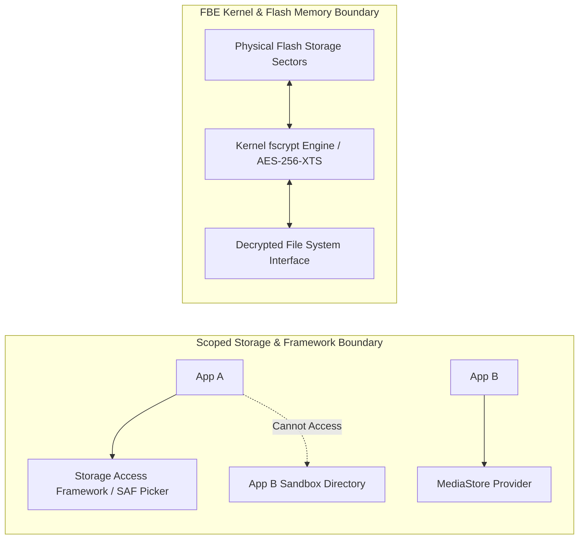

## Scoped Storage 와 암호화가 나누는 서로 다른 개인정보 경계

**Scoped Storage(구역화된 저장소)**와 **File-Based Encryption(암호화)**은 서로 다른 보안 관점을 갖는 독립된 방어선이다. Scoped Storage는 **"어떤 앱/프로세스가 이 파일 경로에 접근할 수 있는가(Access Control)"**를 통제하며, 암호화(FBE/Keystore)는 **"저장 매체(Flash Storage)가 물리적으로 탈취되거나 라즈베리 파이 등으로 추출되었을 때 내용을 읽을 수 있는가(Confidentiality at Rest)"**를 보호한다.



### 내부 동작 메커니즘

1. **Scoped Storage (Framework Level)**: FUSE(Filesystem in Userspace) 래퍼 드라이버 및 `MediaProvider`가 공유 미디어 저장소(`/sdcard/`) 조회를 앱별 소유권 및 URI Grant 권한 기반으로 제한한다.
2. **Encryption (Kernel / Hardware Level)**: FBE `fscrypt` 드라이버가 디스크 블록 IO 레벨에서 `AES-256-XTS` 또는 `Adiantum` 암호화 알고리즘으로 데이터를 암복호화한다.
3. **Complementary Security Model**: Scoped Storage가 다른 앱의 무단 파일 조회를 막아주고, 암호화는 기기 루팅나 수리 과정에서의 물리적 플래시 메모리 칩 추출 공격으로부터 민감 정보를 보호한다.

### SAF 및 MediaStore 안전한 파일 내보내기 구현 예시 (Kotlin)

```kotlin
import android.content.ContentValues
import android.content.Context
import android.net.Uri
import android.provider.MediaStore
import java.io.OutputStream

fun saveExportedDocumentToMediaStore(context: Context, filename: String, content: ByteArray): Uri? {
    val resolver = context.contentResolver
    val contentValues = ContentValues().apply {
        put(MediaStore.MediaColumns.DISPLAY_NAME, filename)
        put(MediaStore.MediaColumns.MIME_TYPE, "application/pdf")
        put(MediaStore.MediaColumns.RELATIVE_PATH, "Download/MyExports")
    }

    val uri = resolver.insert(MediaStore.Downloads.EXTERNAL_CONTENT_URI, contentValues)
    uri?.let {
        resolver.openOutputStream(it)?.use { os: OutputStream ->
            os.write(content) // 사용자 승인된 경로로 안전하게 내보내기
        }
    }
    return uri
}
```

### 관찰 가능한 증거 (Observable Evidence)

- **Scoped Storage 위반 시 관찰 예외**:
  ```text
  java.lang.SecurityException: Permission Denial: reading com.android.providers.media.MediaProvider uri content://media/external/file/1024 requires READ_EXTERNAL_STORAGE
  ```
- **adb 명령으로 Scoped Storage AppOps 게이팅 상태 조회**:
  ```bash
  adb shell appops get com.example.app MANAGE_EXTERNAL_STORAGE
  ```

### 판단 기준

Storage lifecycle 노트는 FBE CE/DE 가용 시점, Direct Boot 단계, 캐시 휘발성, 백업 복원 경계가 서로 다른 판단 축임을 구분하는 기준으로 읽는다.

### 경계

저장 위치 선택을 보안 등급 선택과 동일시하지 않고, 가용성(availability)과 기밀성(confidentiality)을 분리해서 판단한다.

상위 문서: [저장소 생명주기와 백업 계약](storage-lifecycle-and-backup.md)

관련 노트: [Android 민감 데이터는 암호화와 키 소유권을 함께 설계한다](sensitive-data-encryption.md)
