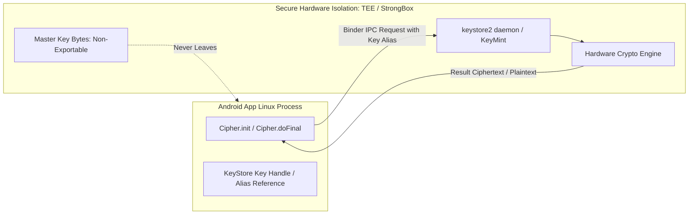

## Android Keystore 는 추출 불가능성으로 키를 보호한다

Android Keystore 시스템의 근본적인 보안 가치는 **비추출성(Non-exportability)**에 있다. Keystore에 보관된 마스터 키의 바이너리 원본은 애플리케이션 프로세스의 메모리(RAM) 공간이나 파일 시스템으로 절대 내보내지지 않으며(`key.isExportable() == false`), 모든 암복호화 및 서명 연산은 보안 하드웨어 경계(TEE 또는 StrongBox) 안에서만 수행된다.



### 내부 동작 메커니즘

1. **TEE vs StrongBox**:
   - **TEE (Trusted Execution Environment)**: 메인 CPU(ARM TrustZone 등) 내 물리적으로 분리된 보안 OS 환경. **Keymaster / KeyMint** HAL 인터페이스를 통해 암호화 연산을 수행한다.
   - **StrongBox (Secure Element)**: 전용 고립 하드웨어 보안 모듈(HSM). 자체 CPU, 보안 스토리지, 무작위 수 생성기(TRNG) 및 변조 방지(Tamper-resistant) 칩셋을 지닌 독립 하드웨어로 최고 수준의 물리적 비추출성을 제공한다.
2. **Hardware-Backed Key Generation**: `KeyGenParameterSpec`으로 생성된 키는 `KeyInfo.isInsideSecureHardware()`가 `true`를 반환하며, 루팅된 기기에서 root 권한을 얻은 공격자라 할지라도 RAM 덤프를 통해 키 원본을 추출할 수 없다.
3. **Key Invalidated on New Biometrics**: `setInvalidatedByBiometricEnrollment(true)` 속성을 부여하면 새로운 손가락 생체 정보가 기기에 추가 등록되는 순간 하드웨어에 의해 기존 키가 영구 무효화된다.
4. **Initialization Vector (IV) Unique Constraint**: AES-GCM 암호화 시 IV(Initialization Vector) 재사용은 보안 파괴 위험이 있으므로 `setRandomizedEncryptionRequired(true)`를 통해 매 암호화 시 무작위 IV 생성을 보장해야 한다.

### Hardware-Backed Keystore AES 키 생성 구현 (Kotlin)

```kotlin
import android.security.keystore.KeyGenParameterSpec
import android.security.keystore.KeyProperties
import java.security.KeyStore
import javax.crypto.KeyGenerator
import javax.crypto.SecretKey

fun getOrCreateMasterKey(keyAlias: String): SecretKey {
    val keyStore = KeyStore.getInstance("AndroidKeyStore").apply { load(null) }
    
    if (keyStore.containsAlias(keyAlias)) {
        val entry = keyStore.getEntry(keyAlias, null) as KeyStore.SecretKeyEntry
        return entry.secretKey
    }

    val keyGenerator = KeyGenerator.getInstance(
        KeyProperties.KEY_ALGORITHM_AES, 
        "AndroidKeyStore"
    )
    
    val spec = KeyGenParameterSpec.Builder(
        keyAlias,
        KeyProperties.PURPOSE_ENCRYPT or KeyProperties.PURPOSE_DECRYPT
    )
        .setBlockModes(KeyProperties.BLOCK_MODE_GCM)
        .setEncryptionPaddings(KeyProperties.ENCRYPTION_PADDING_NONE)
        .setKeySize(256)
        .setUserAuthenticationRequired(false) // 필요 시 true 지정
        .setIsStrongBoxBacked(false) // StrongBox 지원 기기인 경우 true 검토
        .setRandomizedEncryptionRequired(true)
        .build()

    keyGenerator.init(spec)
    return keyGenerator.generateKey()
}
```

### 관찰 가능한 증거 (Observable Evidence)

- **adb dumpsys를 통한 Keystore2 서비스 덤프 확인**:
  ```bash
  adb shell dumpsys keystore2
  ```
- **생체정보 추가 등록 후 무효화된 키 사용 시 예외**:
  ```text
  android.security.keystore.KeyPermanentlyInvalidatedException: Key permanently invalidated
      at android.security.keystore2.AndroidKeyStoreCipherSpiBase.ensureKeystoreOperationInitialized
  ```

### 판단 기준

Platform security 노트는 앱 권한보다 낮은 계층에서 device integrity 와 mandatory policy 가 어떻게 강제되는지 판단하는 기준으로 읽는다.

### 경계

client-side check 를 authorization 으로 오해하지 않고 server verification, boot trust, sandbox boundary 를 분리한다.

상위 문서: [보안 저장소 계약](secure-storage-contracts.md)

관련 노트: [BiometricPrompt는 Keystore 키 사용을 인가한다](biometricprompt-authorizes-keystore-key-use.md), [AES-GCM은 고유한 IV와 Authentication Tag를 요구한다](aes-gcm-requires-unique-iv-and-authentication-tag.md)
