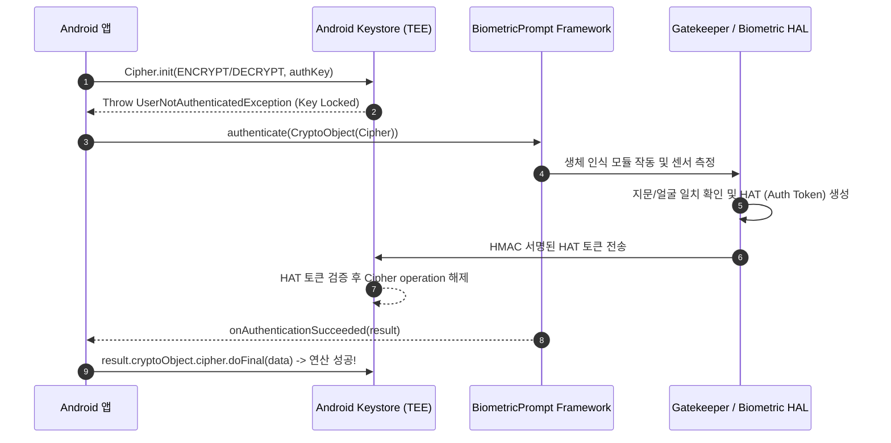

## BiometricPrompt 는 Keystore 키 사용을 인가한다

`BiometricPrompt`는 단순한 인증 UI 팝업이 아니며, 하드웨어 **Keystore에 보관된 암호키의 사용 잠금을 해제(Unlock)**하는 cryptographic gatekeeper로 작동한다. `setUserAuthenticationRequired(true)` 옵션으로 생성된 Keystore 키는 사용자가 지문, 지문 센서, 얼굴 인식 성공 시 TEE/Gatekeeper가 발행하는 **HAT(Hardware Authentication Token)**에 의해서만 암복호화 연산 권한이 동적으로 인가된다.



### 내부 동작 메커니즘

1. **HAT (Hardware Authentication Token)**: 생체 인증 성공 시 Gatekeeper/Fingerprint HAL이 HMAC-SHA256 기반 타임스탬프 토큰을 생성하여 TEE Keystore에 바인딩한다.
2. **Authentication Validity Duration**: `setUserAuthenticationParameters(timeoutSeconds, AUTH_BIOMETRIC_STRONG)` 설정을 통해 인증 후 N초간 키를 재사용 가능하게 하거나, `timeout = 0`으로 매 Cipher 연산마다 BiometricPrompt 승인을 강제할 수 있다.
3. **CryptoObject Binding**: `BiometricPrompt.CryptoObject(cipher)` 형태로 Cipher 객체를 인가 래핑하여 전달함으로써, 프론트엔드 UI 승인 성공 시점에만 정확히 해당 Cipher 연산을 수행할 수 있도록 바인딩한다.

### BiometricPrompt + CryptoObject 바인딩 연동 예시 (Kotlin)

```kotlin
import androidx.biometric.BiometricPrompt
import androidx.core.content.ContextCompat
import androidx.fragment.app.FragmentActivity
import javax.crypto.Cipher

fun authenticateAndDecrypt(
    activity: FragmentActivity,
    cipher: Cipher,
    onSuccess: (ByteArray) -> Unit,
    onError: (String) -> Unit
) {
    val executor = ContextCompat.getMainExecutor(activity)
    
    val biometricPrompt = BiometricPrompt(activity, executor,
        object : BiometricPrompt.AuthenticationCallback() {
            override fun onAuthenticationSucceeded(result: BiometricPrompt.AuthenticationResult) {
                super.onAuthenticationSucceeded(result)
                val authenticatedCipher = result.cryptoObject?.cipher
                if (authenticatedCipher != null) {
                    val decryptedBytes = authenticatedCipher.doFinal(encryptedData)
                    onSuccess(decryptedBytes)
                }
            }
            override fun onAuthenticationError(errorCode: Int, errString: CharSequence) {
                onError(errString.toString())
            }
        }
    )

    val promptInfo = BiometricPrompt.PromptInfo.Builder()
        .setTitle("보안 데이터 인증")
        .setSubtitle("생체 정보를 통해 저장소 잠금을 해제합니다")
        .setNegativeButtonText("취소")
        .setAllowedAuthenticators(androidx.biometric.BiometricManager.Authenticators.BIOMETRIC_STRONG)
        .build()

    // CryptoObject로 Cipher 객체를 래핑하여 생체 인증 시작
    biometricPrompt.authenticate(promptInfo, BiometricPrompt.CryptoObject(cipher))
}
```

### 관찰 가능한 증거 (Observable Evidence)

- **adb dumpsys를 통한 Keymint / Gatekeeper 바인딩 상태 점검**:
  ```bash
  adb shell dumpsys keystore2
  ```

- **인증 없이 Key 사용 시 발생하는 예외**:
  ```text
  android.security.keystore.UserNotAuthenticatedException: User not authenticated
      at android.security.keystore2.AndroidKeyStoreCipherSpiBase.ensureKeystoreOperationInitialized
  ```

### 판단 기준

Platform security 노트는 앱 권한보다 낮은 계층에서 device integrity 와 mandatory policy 가 어떻게 강제되는지 판단하는 기준으로 읽는다.

### 경계

client-side check 를 authorization으로 오해하지 않고 server verification, boot trust, sandbox boundary 를 분리한다.

상위 문서: [보안 저장소 계약](secure-storage-contracts.md)

관련 노트: [Android Keystore는 추출 불가능성으로 키를 보호한다](android-keystore-protects-keys-by-non-exportability.md)
