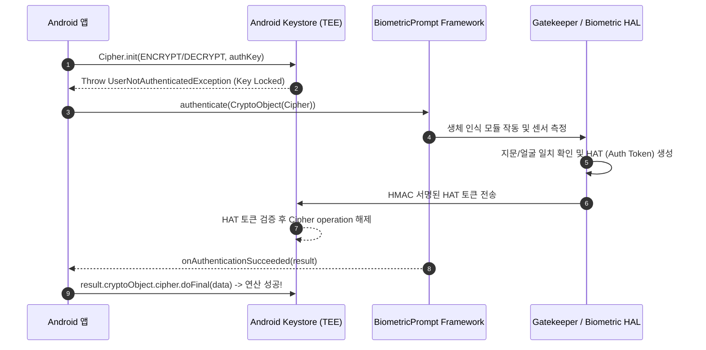

## BiometricPrompt 는 Keystore 키 사용을 인가한다

`BiometricPrompt`는 시스템 인증 UI이며, `CryptoObject`와 함께 사용하면 auth-per-use Android Keystore 키의 특정 암호 연산을 인증 성공과 결합할 수 있다. Android Keystore 키는 하드웨어 또는 소프트웨어 보안 수준일 수 있다. `setUserAuthenticationRequired(true)`만으로 모든 키가 매 연산마다 BiometricPrompt를 요구하는 것은 아니며, `setUserAuthenticationParameters(timeout, authenticators)`의 timeout과 허용 인증 수단이 auth-per-use와 time-based 정책을 결정한다.



### 내부 동작 메커니즘

1. **인증 토큰 전달**: Android 인증 구성요소가 성공 결과를 Keystore/KeyMint가 검증할 수 있는 인증 토큰으로 전달한다. 앱은 토큰 형식이나 특정 HAL 구현에 의존하지 않는다.
2. **Authentication Validity Duration**: `setUserAuthenticationParameters(timeoutSeconds, authenticators)`에서 `timeout = 0`인 auth-per-use 키와, 인증 후 일정 시간 재사용하는 time-based 키를 구분한다.
3. **CryptoObject Binding**: `BiometricPrompt.CryptoObject(cipher)`는 auth-per-use 키의 해당 연산을 프롬프트와 연결한다. time-based 키나 기기 자격 증명 fallback 흐름에서는 CryptoObject 없는 인증이 맞을 수 있다.

### BiometricPrompt + CryptoObject 바인딩 연동 예시 (Kotlin)

```kotlin
import androidx.biometric.BiometricPrompt
import androidx.core.content.ContextCompat
import androidx.fragment.app.FragmentActivity
import javax.crypto.Cipher

fun authenticateAndDecrypt(
    activity: FragmentActivity,
    cipher: Cipher,
    encryptedData: ByteArray,
    onSuccess: (ByteArray) -> Unit,
    onError: (String) -> Unit
) {
    val executor = ContextCompat.getMainExecutor(activity)
    
    val biometricPrompt = BiometricPrompt(activity, executor,
        object : BiometricPrompt.AuthenticationCallback() {
            override fun onAuthenticationSucceeded(result: BiometricPrompt.AuthenticationResult) {
                super.onAuthenticationSucceeded(result)
                val authenticatedCipher = result.cryptoObject?.cipher
                    ?: return onError("인증된 암호 연산을 받지 못했습니다")
                runCatching { authenticatedCipher.doFinal(encryptedData) }
                    .onSuccess(onSuccess)
                    .onFailure { onError("복호화에 실패했습니다") }
            }
            override fun onAuthenticationError(errorCode: Int, errString: CharSequence) {
                onError(errString.toString())
            }
        }
    )

    val promptInfo = BiometricPrompt.PromptInfo.Builder()
        .setTitle("보안 데이터 인증")
        .setSubtitle("생체 정보를 통해 저장소 잠금을 해제합니다")
        .setNegativeButtonText("취소")
        .setAllowedAuthenticators(androidx.biometric.BiometricManager.Authenticators.BIOMETRIC_STRONG)
        .build()

    // CryptoObject로 Cipher 객체를 래핑하여 생체 인증 시작
    biometricPrompt.authenticate(promptInfo, BiometricPrompt.CryptoObject(cipher))
}
```

### 관찰 가능한 증거 (Observable Evidence)

- **adb dumpsys를 통한 Keymint / Gatekeeper 바인딩 상태 점검**:
  ```bash
  adb shell dumpsys keystore2
  ```

- **인증 없이 Key 사용 시 발생하는 예외**:
  ```text
  android.security.keystore.UserNotAuthenticatedException: User not authenticated
      at android.security.keystore2.AndroidKeyStoreCipherSpiBase.ensureKeystoreOperationInitialized
  ```

### 판단 기준

Secure storage 노트는 키 소유권(Key Ownership), 인증 암호화(AEAD), 생체 인증 바인딩, 백업 제외 설계가 서로 다른 방어선임을 구분하는 기준으로 읽는다.

### 경계

암호화 라이브러리 적용 자체를 안전 보장으로 오해하지 않고, 키 수명주기와 데이터 백업 경계를 별도로 설계한다.

상위 문서: [보안 저장소 계약](secure-storage-contracts.md)

관련 노트: [Android Keystore는 추출 불가능성으로 키를 보호한다](android-keystore-protects-keys-by-non-exportability.md)

### 공식 문서

- https://developer.android.com/identity/sign-in/biometric-auth
- https://developer.android.com/reference/androidx/biometric/BiometricPrompt.CryptoObject
- https://developer.android.com/privacy-and-security/keystore

검증일: 2026-08-06. CryptoObject를 auth-per-use 키 연산으로 한정하고 time-based 키·기기 자격 증명 흐름과 구분했다.
