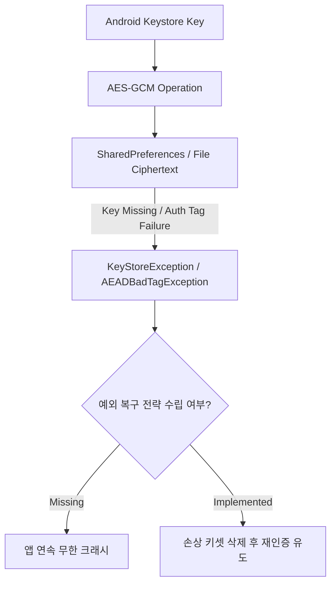

## 암호화 저장소 API 는 키와 데이터 경계 설계를 대체하지 않는다

암호화 저장소 추상화는 디스크 암호화를 쉽게 만들 수 있지만, **키 수명주기(Key Lifecycle), 키 회전(Key Rotation), 데이터 분류 및 예외 복구 경계 설계**를 자동으로 해결하지 않는다. 특히 `androidx.security:security-crypto` 1.1.0에서 `EncryptedSharedPreferences`, `EncryptedFile`, `MasterKey`를 포함한 모든 API가 deprecated 되었다. 새 코드는 플랫폼 `SharedPreferences`/`File`과 Android Keystore·표준 JCA 암호 API를 조합하거나, 보안 검토된 별도 저장소 계층을 사용한다.



### 내부 동작 메커니즘

1. **Deprecated API 경계**: 기존 `EncryptedSharedPreferences`는 Tink keyset과 Android Keystore master key를 사용했지만 현재 API reference는 플랫폼 API와 Android Keystore 직접 사용을 안내한다. 기존 앱은 즉시 데이터를 지우지 말고 읽기·재암호화·원자적 교체를 포함한 migration을 설계한다.
2. **Key Invalidation/손실**: 백업 복원, 앱 데이터 복원 불일치, 인증 정책 변경 등으로 키를 사용할 수 없으면 암호문은 복구되지 않을 수 있다. 모든 예외를 잡아 파일을 자동 삭제하면 데이터 손실과 인증 상태 우회를 만들 수 있다.
3. **Boundary Mistake**: 재발급 가능한 세션 캐시와 사용자가 복구할 수 없는 정본 데이터를 같은 키/복구 정책으로 취급하지 않는다.

### 플랫폼 API를 이용한 최소 AES-GCM 저장 예시 (Kotlin)

```kotlin
import android.security.keystore.KeyGenParameterSpec
import android.security.keystore.KeyProperties
import android.util.Base64
import java.security.KeyStore
import javax.crypto.Cipher
import javax.crypto.KeyGenerator
import javax.crypto.SecretKey
import javax.crypto.spec.GCMParameterSpec

private const val KEY_ALIAS = "session-cache-v1"

fun getOrCreateKey(): SecretKey {
    val keyStore = KeyStore.getInstance("AndroidKeyStore").apply { load(null) }
    (keyStore.getKey(KEY_ALIAS, null) as? SecretKey)?.let { return it }

    return KeyGenerator.getInstance(KeyProperties.KEY_ALGORITHM_AES, "AndroidKeyStore")
        .apply {
            init(
                KeyGenParameterSpec.Builder(
                    KEY_ALIAS,
                    KeyProperties.PURPOSE_ENCRYPT or KeyProperties.PURPOSE_DECRYPT,
                )
                    .setBlockModes(KeyProperties.BLOCK_MODE_GCM)
                    .setEncryptionPaddings(KeyProperties.ENCRYPTION_PADDING_NONE)
                    .setRandomizedEncryptionRequired(true)
                    .build()
            )
        }
        .generateKey()
}

fun encryptForStorage(plaintext: ByteArray, key: SecretKey): String {
    val cipher = Cipher.getInstance("AES/GCM/NoPadding")
    cipher.init(Cipher.ENCRYPT_MODE, key)
    val ciphertextAndTag = cipher.doFinal(plaintext)
    return listOf(cipher.iv, ciphertextAndTag)
        .joinToString(":") { Base64.encodeToString(it, Base64.NO_WRAP) }
}

fun decryptFromStorage(encoded: String, key: SecretKey): ByteArray {
    val parts = encoded.split(':', limit = 2)
    require(parts.size == 2) { "Malformed encrypted value" }
    val iv = Base64.decode(parts[0], Base64.NO_WRAP)
    val ciphertextAndTag = Base64.decode(parts[1], Base64.NO_WRAP)
    val cipher = Cipher.getInstance("AES/GCM/NoPadding")
    cipher.init(Cipher.DECRYPT_MODE, key, GCMParameterSpec(128, iv))
    return cipher.doFinal(ciphertextAndTag)
}
```

호출자는 암호문만 `SharedPreferences`에 저장한다. 복호화에서 `AEADBadTagException`, `KeyPermanentlyInvalidatedException`, `UnrecoverableKeyException` 등이 발생하면 모든 `Exception`을 삼키고 삭제하지 않는다. 해당 데이터가 재발급 가능한 세션이면 명시적으로 로그아웃·재인증하고, 정본 데이터면 복구 UI나 서버/사용자 백업 경로로 전환한다.

### 관찰 가능한 증거 (Observable Evidence)

- **생성된 SharedPreference XML 물리 구조 디버깅**:
  ```bash
  adb shell cat /data/data/com.example.app/shared_prefs/secure_prefs.xml
  ```
  출력: 민감 값은 IV와 인증 태그를 포함한 Base64 암호문으로 저장되어야 한다. 키 이름까지 민감하다면 평문 preference key에도 식별 정보를 넣지 않는다.
- **키 손상 시 발생 예외**:
  ```text
  java.security.GeneralSecurityException: could not decrypt key
      at com.google.crypto.tink.KeysetHandle.read
  ```

### 판단 기준

Secure storage 노트는 키 소유권(Key Ownership), 인증 암호화(AEAD), 생체 인증 바인딩, 백업 제외 설계가 서로 다른 방어선임을 구분하는 기준으로 읽는다.

### 경계

암호화 라이브러리 적용 자체를 안전 보장으로 오해하지 않고, 키 수명주기와 데이터 백업 경계를 별도로 설계한다.

상위 문서: [보안 저장소 계약](secure-storage-contracts.md)

관련 노트: [Android Keystore는 추출 불가능성으로 키를 보호한다](android-keystore-protects-keys-by-non-exportability.md), [AES-GCM은 고유한 IV와 Authentication Tag를 요구한다](aes-gcm-requires-unique-iv-and-authentication-tag.md)

### 공식 문서

- https://developer.android.com/jetpack/androidx/releases/security
- https://developer.android.com/reference/androidx/security/crypto/EncryptedSharedPreferences
- https://developer.android.com/privacy-and-security/keystore

검증일: 2026-08-06. `security-crypto:1.1.0`의 전 API deprecated 상태를 반영하고, 삭제 후 재생성하는 광범위 예외 처리 대신 Android Keystore와 AES-GCM의 명시적 복구 경계를 제시했다.
