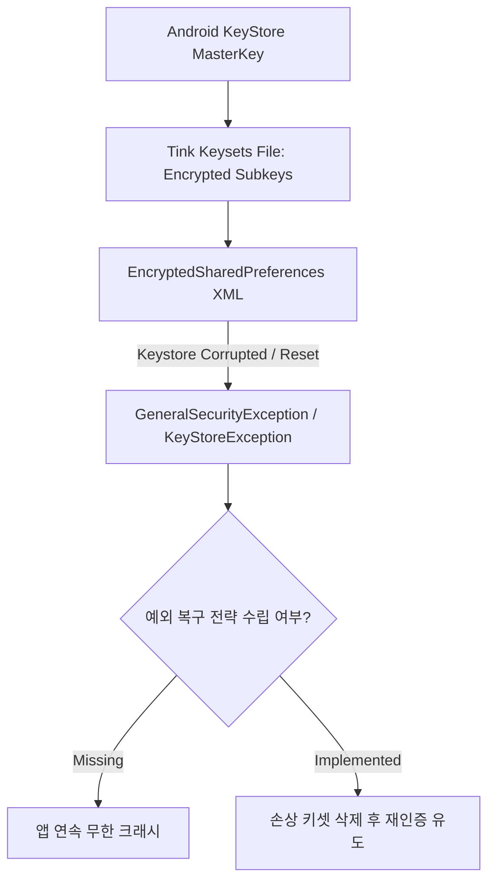

## 암호화 저장소 API 는 키와 데이터 경계 설계를 대체하지 않는다

`EncryptedSharedPreferences`, Jetpack Security(Tink), 암호화 Room 데이터베이스 같은 고위험 추상화 라이브러리는 파일 디스크 암호화를 손쉽게 제공하지만, **키 수명주기(Key Lifecycle), 키 회전(Key Rotation), 데이터 분류 및 예외 복구 경계 설계**를 자동으로 해결해주지 않는다.



### 내부 동작 메커니즘

1. **Envelope Encryption Architecture**: EncryptedSharedPreferences는 Keystore의 Master Key를 사용하여 Tink Keyset 파일내의 서브키(Subkeys)를 암호화하고, 실제 SharedPreference Key/Value는 서브키(`AES256_SIV` / `AES256_GCM`)로 암호화하는 이중 봉투 구조를 가진다.
2. **Key Store Invalidation Vulnerability**: OS 업데이트, 화면 잠금 변경, 생체 정보 재등록으로 인해 하드웨어 Keystore 키가 깨지거나 삭제되면 Tink Keyset 복호화가 불가능해져 전체 암호화 저장소가 정지한다.
3. **Boundary Mistake**: 정본 마스터키 수명과 단순 캐시 파일의 수명을 동일시하면 손상 시 앱이 복구할 수 없는 상태에 빠진다.

### 안전한 EncryptedSharedPreferences 생성 및 예외 핸들링 예시 (Kotlin)

```kotlin
import android.content.Context
import android.content.SharedPreferences
import androidx.security.crypto.EncryptedSharedPreferences
import androidx.security.crypto.MasterKey

fun getSafeEncryptedSharedPreferences(context: Context): SharedPreferences {
    val masterKey = MasterKey.Builder(context)
        .setKeyScheme(MasterKey.KeyScheme.AES256_GCM)
        .build()

    return try {
        EncryptedSharedPreferences.create(
            context,
            "secure_prefs",
            masterKey,
            EncryptedSharedPreferences.PrefKeyEncryptionScheme.AES256_SIV,
            EncryptedSharedPreferences.PrefValueEncryptionScheme.AES256_GCM
        )
    } catch (e: Exception) {
        // Keystore 손상이나 키 무효화 예외 발생 시 손상된 암호화 파일 삭제 후 재생성
        context.deleteSharedPreferences("secure_prefs")
        EncryptedSharedPreferences.create(
            context,
            "secure_prefs",
            masterKey,
            EncryptedSharedPreferences.PrefKeyEncryptionScheme.AES256_SIV,
            EncryptedSharedPreferences.PrefValueEncryptionScheme.AES256_GCM
        )
    }
}
```

### 관찰 가능한 증거 (Observable Evidence)

- **생성된 SharedPreference XML 물리 구조 디버깅**:
  ```bash
  adb shell cat /data/data/com.example.app/shared_prefs/secure_prefs.xml
  ```
  출력: 모든 XML key/value 값이 `AfG...=` 형태의 Base64 암호문 스트링으로 치환되어 저장됨.
- **키 손상 시 발생 예외**:
  ```text
  java.security.GeneralSecurityException: could not decrypt key
      at com.google.crypto.tink.KeysetHandle.read
  ```

### 판단 기준

Platform security 노트는 앱 권한보다 낮은 계층에서 device integrity 와 mandatory policy 가 어떻게 강제되는지 판단하는 기준으로 읽는다.

### 경계

client-side check 를 authorization 으로 오해하지 않고 server verification, boot trust, sandbox boundary 를 분리한다.

상위 문서: [보안 저장소 계약](secure-storage-contracts.md)

관련 노트: [Android Keystore는 추출 불가능성으로 키를 보호한다](android-keystore-protects-keys-by-non-exportability.md), [AES-GCM은 고유한 IV와 Authentication Tag를 요구한다](aes-gcm-requires-unique-iv-and-authentication-tag.md)
