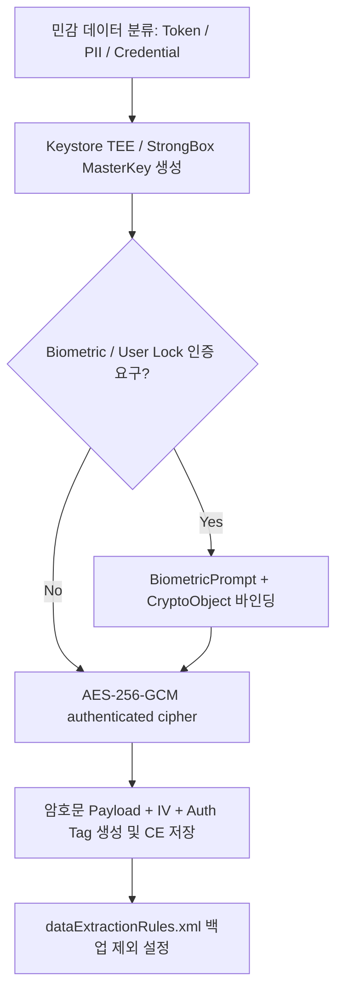

## 보안 저장소 계약

Android 보안 저장소 계약은 단순히 파일 경로를 선택하는 것에 그치지 않고, 민감 데이터 분류, 암호키 비추출성 관리(Hardware Keystore), AES-GCM 인증 암호화, 생체 인증 연동, 자동 백업 제외(Backup Rules), 그리고 키 무효화 시 재인증 복구 전략을 체계적으로 결합하는 보안 모델이다.



### 내부 동작 메커니즘

1. **Hardware Key Binding**: Android Keystore 시스템은 Master Key 원본 바이트를 Linux RAM 공간에 노출하지 않고 TEE 또는 StrongBox 하드웨어 보안 칩 내에 비추출성(`isExportable = false`) 상태로 고정한다.
2. **Authenticated Encryption (AEAD)**: AES-GCM 알고리즘을 적용하여 Confidentiality(비밀성)와 Integrity(무결성)를 동시 보장하며, 매 암호화 시마다 12-byte 무작위 IV(Initialization Vector)와 128-bit Authentication Tag를 필수 생성한다.
3. **Backup Protection Boundary**: Keystore 생성 키는 기기 고유(Device-bound) 속성을 가져 백업/복원 시 다른 기기로 복사되지 않는다. 따라서 암호문 데이터는 백업 대상에서 명시적으로 제외해야 한다.

### 키 생성 및 저장소 설정 진단 명령어

```bash
# keystore2 시스템 서비스 상의 키 슬롯 및 데몬 덤프 확인
adb shell dumpsys keystore2

# 앱 패키지의 dataExtractionRules 백업 규칙 적용 확인
adb shell dumpsys package com.example.app | grep -i "backup"
```

### 관찰 가능한 증거 (Observable Evidence)

- Keystore 키 사용 시 앱 프로세스 덤프(`heap dump`)에서 키 바이트 원본(`byte[]`)이 탐지되지 않음.
- 기기 변경 복원 후 Keystore 키 부재로 인해 `UnrecoverableKeyException` 또는 `AEADBadTagException` 예외 발생.

### 정본 노트

- [Android Keystore는 추출 불가능성으로 키를 보호한다](android-keystore-protects-keys-by-non-exportability.md)
- [AES-GCM은 고유한 IV와 Authentication Tag를 요구한다](aes-gcm-requires-unique-iv-and-authentication-tag.md)
- [BiometricPrompt는 Keystore 키 사용을 인가한다](biometricprompt-authorizes-keystore-key-use.md)
- [암호화 저장소 API는 키와 데이터 경계 설계를 대체하지 않는다](encrypted-storage-apis-do-not-replace-key-and-data-boundary.md)
- [민감 데이터는 암호화와 키 소유권을 요구한다](sensitive-data-requires-encryption-and-key-ownership.md)
- [보안 저장소 정책은 저장하지 말아야 할 데이터와 백업 금지 항목을 포함한다](secure-storage-policy-includes-what-not-to-store-and-backup.md)

관련 지도: [저장소 수명과 백업 경계](../storage-lifecycle-and-backup/storage-lifecycle-and-backup.md)
