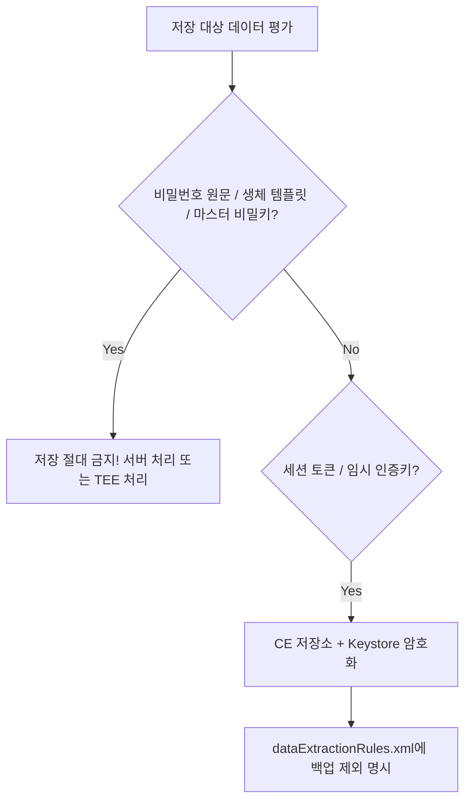

## 보안 저장소 정책은 저장하지 말아야 할 데이터와 백업 금지 항목을 포함한다

가장 안전한 보안 저장소 정책은 **데이터를 아예 저장하지 않는 것**이다. 저장 필요성이 입증되더라도, 1) 하드코딩 금지 항목, 2) 저장 금지 민감 항목(비밀번호, 생체 원문), 3) **Android Auto Backup 및 Device-to-Device 이전 시 자동 백업 제외(Exclude) 정책**을 명확히 명세해야 한다.



### 내부 동작 메커니즘

1. **Keystore Key Non-Transferability**: 하드웨어 Keystore의 Master Key는 기기 고유 칩셋에 종속되므로 Cloud Backup이나 D2D 이전을 통해 다른 기기로 복사되지 않는다.
2. **Orphan Ciphertext Problem**: 만약 암호화된 `secure_prefs.xml` 파일만 새 기기로 복원되고 Keystore Master Key가 복원되지 않는다면, 새 기기에서 앱 실행 시 복호화 불가능 예외가 발생한다.
3. **Android 12+ Extraction Rules**: Android 12(API 31)부터 적용되는 `android:dataExtractionRules` 명세를 통해 클라우드 백업과 기기 간 직접 전송(D2D) 규칙을 개별 차단해야 한다.

### 데이터 백업 제외 규칙 정의 예시 (XML & Manifest)

```xml
<!-- res/xml/data_extraction_rules.xml -->
<?xml version="1.0" encoding="utf-8"?>
<data-extraction-rules>
    <cloud-backup>
        <!-- 암호화 저장소 및 토큰 파일 백업에서 제외 -->
        <exclude path="shared_prefs/secure_prefs.xml" />
        <exclude path="databases/sensitive_db.db" />
    </cloud-backup>
    <device-to-device>
        <exclude path="shared_prefs/secure_prefs.xml" />
        <exclude path="databases/sensitive_db.db" />
    </device-to-device>
</data-extraction-rules>
```

```xml
<!-- AndroidManifest.xml 적용 -->
<application
    android:allowBackup="true"
    android:dataExtractionRules="@xml/data_extraction_rules"
    android:fullBackupContent="false">
</application>
```

### 관찰 가능한 증거 (Observable Evidence)

- **adb를 활용한 백업 동작 수동 테스트**:
  ```bash
  # 백업 매니저를 통해 대상 앱의 백업 즉시 실행 테스트
  adb shell bmgr backupnow com.example.app

  # 백업 아카이브 생성 덤프 확인
  adb backup -f sample_backup.ab com.example.app
  ```
- **백업 정책 누락 시 노출 위험**: 새 기기 복원 후 Keystore 접근 불가로 인한 `KeyStoreException` 또는 `GeneralSecurityException` 무한 발생.

### 판단 기준

Platform security 노트는 앱 권한보다 낮은 계층에서 device integrity 와 mandatory policy 가 어떻게 강제되는지 판단하는 기준으로 읽는다.

### 경계

client-side check 를 authorization 으로 오해하지 않고 server verification, boot trust, sandbox boundary 를 분리한다.

상위 문서: [보안 저장소 계약](secure-storage-contracts.md)

관련 노트: [백업과 복원에서 데이터 경계를 설계하기](../storage-lifecycle-and-backup/backup-restore-requires-explicit-data-boundaries.md)
