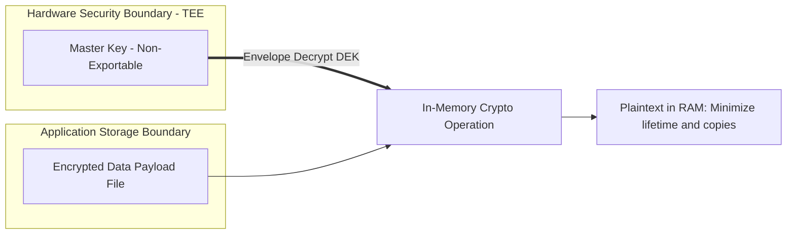

## 민감 데이터는 암호화와 키 소유권을 요구한다

민감 데이터(개인식별정보 PII, 인증 토큰, 결제 자격증명 등)를 안전하게 보호하려면 데이터 암호화뿐만 아니라 **키의 소유권 경계(Key Ownership Boundary)**를 명확히 분리해야 한다. 암호문 데이터 파일과 복호화 키가 동일한 보안 신뢰 경계(예: 동일 디렉터리 내 평문 파일)에 배치되면 파일 암호화는 무용지물이 된다.



### 내부 동작 메커니즘

1. **Envelope Encryption (봉투 암호화)**: 데이터를 암호화하는 DEK(Data Encryption Key)와 DEK를 암호화하는 KEK(Key Encryption Key / Keystore Master Key)의 소유 계층을 분리한다.
2. **In-Memory Lifetime Bounding**: 복호화된 평문의 수명과 복사 횟수를 줄인다. `ByteArray`/`CharArray`는 사용 후 덮어쓸 수 있지만 이는 해당 배열에 대한 best-effort 완화일 뿐, 런타임·라이브러리가 만든 복사본이나 이전 힙 페이지까지 소거한다고 보장하지 않는다. 불변 `String`은 내용을 덮어쓸 수 없으므로 비밀 원문 표현으로 피한다.
3. **Key Ownership Separation**: 앱 코드는 키의 원본 바이트 소유권을 갖지 않으며, 오직 Android Keystore 핸들을 통한 암복호화 연산 수행 권한만을 소유한다.

### 안전한 메모리 소거 및 봉투 암호화 패턴 예시 (Kotlin)

```kotlin
import javax.crypto.SecretKey

fun processSensitiveTokenSafely(
    encryptedTokenPayload: ByteArray,
    masterKey: SecretKey,
    tokenConsumer: (ByteArray) -> Unit
) {
    // 소비자도 String으로 변환하거나 불필요한 복사본을 만들지 않는 계약이어야 한다.
    val decryptedBytes = AesGcmCipherHelper.decrypt(encryptedTokenPayload, masterKey)

    try {
        tokenConsumer(decryptedBytes)
    } finally {
        // 해당 배열을 덮어쓰는 best-effort 완화. JVM 전체 메모리 소거 보장은 아니다.
        decryptedBytes.fill(0)
    }
}
```

### 관찰 가능한 증거 (Observable Evidence)

- **adb shell 메모리 덤프 및 프로파일링 확인**:
  ```bash
  adb shell dumpsys meminfo com.example.app
  ```

- **Android Studio Profiler Heap Dump 분석**:
  - 메모리 소거 미적용 시: `java.lang.String` 또는 배열 검색에서 평문 토큰이 관찰될 수 있음.
  - 배열을 덮어쓴 뒤에도 런타임·암호 라이브러리·소비자가 만든 복사본이 남을 수 있다. heap dump에서 값이 보이지 않는다는 사실은 완전 소거의 증명이 아니다.

### 판단 기준

Secure storage 노트는 키 소유권(Key Ownership), 인증 암호화(AEAD), 생체 인증 바인딩, 백업 제외 설계가 서로 다른 방어선임을 구분하는 기준으로 읽는다.

### 경계

암호화 라이브러리 적용 자체를 안전 보장으로 오해하지 않고, 키 수명주기와 데이터 백업 경계를 별도로 설계한다.

상위 문서: [보안 저장소 계약](secure-storage-contracts.md)

관련 노트: [Android Keystore는 추출 불가능성으로 키를 보호한다](android-keystore-protects-keys-by-non-exportability.md)

### 공식 문서

- https://developer.android.com/privacy-and-security/keystore
- https://developer.android.com/privacy-and-security/risks/log-info-disclosure

검증일: 2026-08-06. 불변 `String`을 만든 뒤 배열을 지우면 평문 소거가 보장된다는 잘못된 예시를 제거하고, 가변 버퍼의 best-effort 수명 단축과 복사·로그 최소화로 교정했다.
