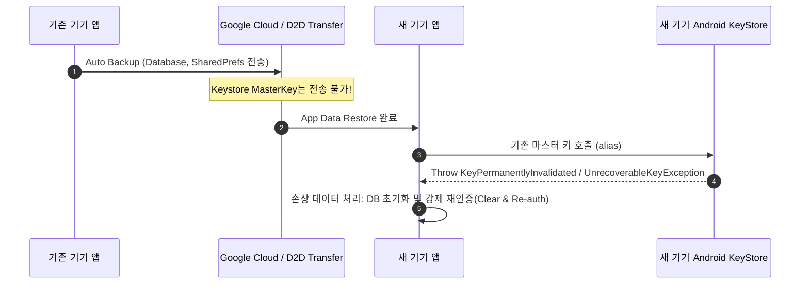

## 백업과 복원에서 데이터 경계를 설계하기

Android의 **Auto Backup(구글 드라이브 백업)**과 **Device-to-Device(D2D 기기 직접 이전)**는 사용자 편의를 위해 앱 저장 데이터를 자동 복사한다. 하지만 **Keystore 암호키는 다른 기기로 절대 이전되지 않는다**. 데이터 백업 경계를 명시적으로 설계하지 않으면 1) 복호화 불가능한 고립 암호문(Orphan Ciphertext)으로 인한 앱 충돌, 또는 2) 디스크에 전송된 세션 토큰으로 인한 타 기기 계정 도용 문제가 발생한다.



### 내부 동작 메커니즘

1. **`dataExtractionRules.xml` Separation**: Android 12(API 31) 이상에서는 Cloud Backup (`<cloud-backup>`)과 Device-to-Device Transfer (`<device-to-device>`) 규칙을 분리 적용할 수 있다.
2. **Exclude Sensitive Files**: Keystore 키로 암호화된 파일, SharedPreference, 로그인 세션 토큰, PII 데이터베이스는 백업 대상에서 exclusions로 처리한다.
3. **Post-Restore Re-Auth Verification**: 복원 후 최초 실행 시 앱은 백업된 데이터의 유효성을 검사하고, 마스터 키가 없거나 손상되었을 경우 기존 데이터를 안전하게 purge 하고 사용자를 재로그인 페이지로 안내해야 한다.

### 백업 추출 규칙 명세 예시 (XML & Kotlin Check)

```xml
<!-- res/xml/data_extraction_rules.xml -->
<?xml version="1.0" encoding="utf-8"?>
<data-extraction-rules>
    <cloud-backup>
        <include domain="shared_prefs" path="app_config.xml"/>
        <exclude domain="shared_prefs" path="secure_user_tokens.xml"/>
        <exclude domain="database" path="encrypted_db.db"/>
    </cloud-backup>
    <device-to-device>
        <include domain="shared_prefs" path="app_config.xml"/>
        <exclude domain="shared_prefs" path="secure_user_tokens.xml"/>
    </device-to-device>
</data-extraction-rules>
```

```kotlin
// 복원 후 첫 진입 시 세션 키 유효성 검사 및 정화(Clean-up)
fun verifyOrCleanRestoredSession(context: Context) {
    val prefs = context.getSharedPreferences("app_config", Context.MODE_PRIVATE)
    val isRestored = prefs.getBoolean("is_restored_from_backup", false)

    if (isRestored) {
        // 암호화 키 손상 가능성에 대비하여 이전 토큰 찌꺼기 삭제
        context.deleteSharedPreferences("secure_user_tokens")
        context.deleteDatabase("encrypted_db.db")
        prefs.edit().putBoolean("is_restored_from_backup", false).apply()
        // 사용자 재인증 UI로 유도
    }
}
```

### 관찰 가능한 증거 (Observable Evidence)

- **adb 백업 매니저 테스팅 명령**:
  ```bash
  # 백업 실행 및 복원 시뮬레이션
  adb shell bmgr run
  adb shell bmgr restore com.example.app
  ```
- **복원 후 조치 미흡 시 에러 예외 트레이스**:
  ```text
  java.io.IOException: Error decrypting key: KeyStoreException: Key not found
  ```

### 판단 기준

Platform security 노트는 앱 권한보다 낮은 계층에서 device integrity 와 mandatory policy 가 어떻게 강제되는지 판단하는 기준으로 읽는다.

### 경계

client-side check 를 authorization 으로 오해하지 않고 server verification, boot trust, sandbox boundary 를 분리한다.

상위 문서: [저장소 생명주기와 백업 계약](storage-lifecycle-and-backup.md)

관련 노트: [보안 저장소 정책은 저장하지 말아야 할 데이터와 백업 금지 항목을 포함한다](../secure-storage-contracts/secure-storage-policy-includes-what-not-to-store-and-backup.md)
