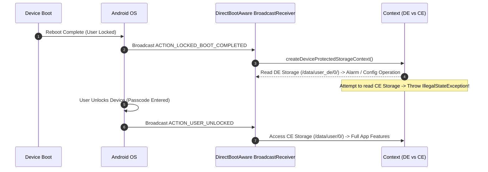

## Direct Boot 에서 허용되는 데이터와 실행 수명

Android **Direct Boot 모드**는 기기가 전원 온 후 재부팅되었지만 **사용자가 PIN, 패턴, 비밀번호를 입력하여 잠금을 해제하기 전**의 단계를 의미한다. 이 시점에는 Credential Encrypted(CE) 저장소가 거부되며 오직 **Device Encrypted(DE) 저장소만 접근 가능**하다. 따라서 Direct Boot 환경에서는 알람, 알림, 통화 등 최소한의 디바이스 작동용 non-sensitive 설정 데이터만 DE에 허용해야 한다.



### 내부 동작 메커니즘

1. **`android:directBootAware="true"`**: `AndroidManifest.xml`에 이 속성이 명시된 Component(BroadcastReceiver, Service, Provider)만 Direct Boot 모드 중에 OS에 의해 인스턴스화된다.
2. **Device Protected Storage Context**: `context.createDeviceProtectedStorageContext()`를 통해 리턴된 `Context`를 통해서만 DE 파일 시스템 디렉터리(`/data/user_de/0/<pkg>/`)에 접근할 수 있다.
3. **CE Exclusion**: 사용자가 잠금을 해제하기 전 일반 `context.filesDir` (CE 영역)에 접근하거나 Room DB/SharedPreference를 열려고 하면 암호화 키 부재로 인한 I/O Exception이 발생한다.

### Direct Boot 컴포넌트 선언 및 사용 구현 예시 (XML & Kotlin)

```xml
<!-- AndroidManifest.xml -->
<receiver
    android:name=".AlarmBootReceiver"
    android:directBootAware="true"
    android:exported="true">
    <intent-filter>
        <action android:name="android.intent.action.LOCKED_BOOT_COMPLETED" />
    </intent-filter>
</receiver>
```

```kotlin
// AlarmBootReceiver.kt
import android.content.BroadcastReceiver
import android.content.Context
import android.content.Intent
import android.os.UserManager

class AlarmBootReceiver : BroadcastReceiver() {
    override fun onReceive(context: Context, intent: Intent) {
        if (intent.action == Intent.ACTION_LOCKED_BOOT_COMPLETED) {
            // Direct Boot 시점이므로 DE Context 생성 후 최소 알람 설정만 읽기
            val directBootContext = context.createDeviceProtectedStorageContext()
            val dePrefs = directBootContext.getSharedPreferences("boot_alarm_prefs", Context.MODE_PRIVATE)
            val alarmTime = dePrefs.getLong("next_alarm_timestamp", 0L)
            
            scheduleSystemAlarm(context, alarmTime)
        }
    }

    private fun scheduleSystemAlarm(context: Context, time: Long) { /* 알람 등록 */ }
}
```

### 관찰 가능한 증거 (Observable Evidence)

- **adb를 활용한 Direct Boot 브로드캐스트 테스트**:
  ```bash
  # 잠금 부팅 완료 브로드캐스트 강제 전송 시뮬레이션
  adb shell am broadcast -a android.intent.action.LOCKED_BOOT_COMPLETED
  ```
- **Direct Boot 중 CE 접근 시 에러로그**:
  ```text
  java.lang.IllegalStateException: SharedPreferences in credential encrypted storage are not available until after user is unlocked
      at android.app.ContextImpl.getSharedPreferences
  ```

### 판단 기준

Storage lifecycle 노트는 FBE CE/DE 가용 시점, Direct Boot 단계, 캐시 휘발성, 백업 복원 경계가 서로 다른 판단 축임을 구분하는 기준으로 읽는다.

### 경계

저장 위치 선택을 보안 등급 선택과 동일시하지 않고, 가용성(availability)과 기밀성(confidentiality)을 분리해서 판단한다.

상위 문서: [저장소 생명주기와 백업 계약](storage-lifecycle-and-backup.md)

관련 노트: [FBE에서 CE와 DE를 나누는 저장소 경계](fbe-ce-and-de-separate-storage-availability.md)
