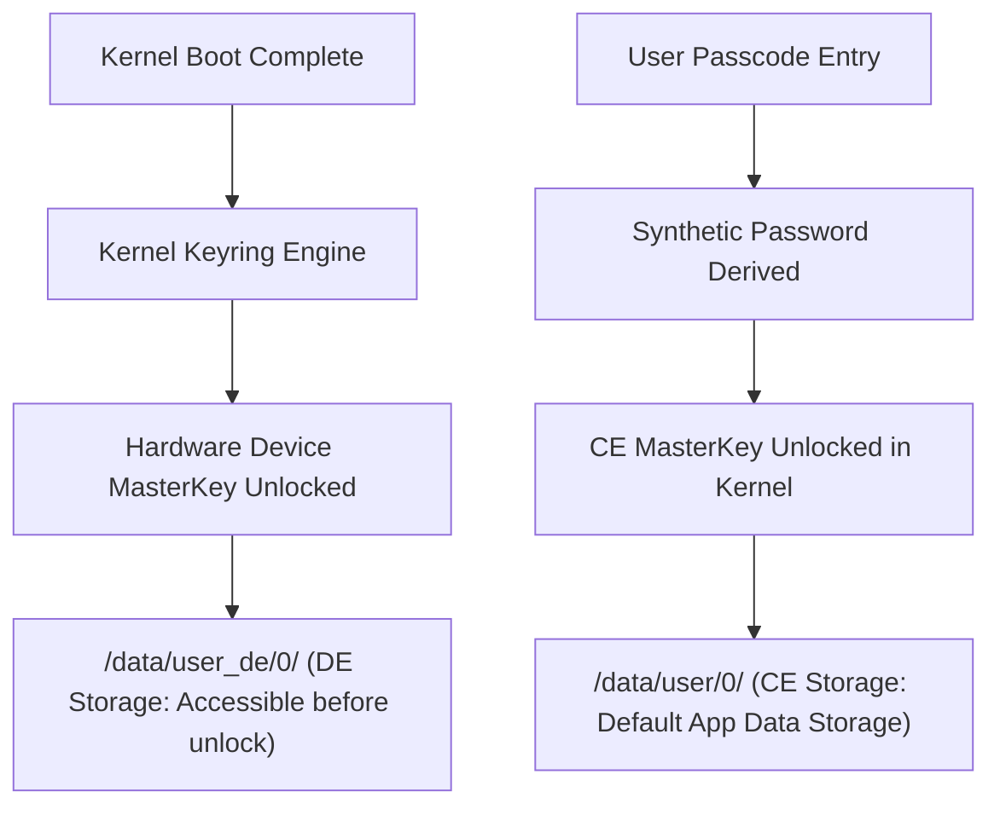

## FBE 에서 CE 와 DE 를 나누는 저장소 경계

Android **FBE(File-Based Encryption)**는 기기의 파일 저장소를 **Credential Encrypted(CE) storage**와 **Device Encrypted(DE) storage**의 두 가지 물리적/암호학적 경계로 분리한다. CE는 사용자가 PIN/비밀번호로 잠금을 해제해야만 암호키가 로드되는 기본 경계이며, DE는 부팅 직후 사용자 잠금과 상관없이 하드웨어 키로 바로 접근 가능한 경계다.



### 내부 동작 메커니즘

1. **Kernel `fscrypt` Integration**: Linux Kernel의 `fscrypt` (ext4/f2fs filesystem encryption) 엔진이 디렉터리 inode별로 서로 다른 키링(Keyring)을 바인딩한다.
2. **CE Key Unlocking**: CE 마스터키는 사용자의 PIN/패스워드/패턴 기반의 Synthetic Password와 TEE 게이트키퍼에 의해 이중 암호화되어 보관된다. 따라서 사용자가 첫 잠금을 풀기 전에는 커널 메모리에 키 자체가 존재하지 않는다.
3. **DE Key Unlocking**: DE 마스터키는 부트로더/TEE 검증 성공 직후 커널 키링에 자동 언락되므로, 부팅 직후 곧바로 파일 IO 연산이 가능하다.

### CE vs DE Context 접근 및 상태 확인 구현 예시 (Kotlin)

```kotlin
import android.content.Context
import android.os.Build
import android.os.UserManager

fun inspectStorageAvailability(context: Context) {
    val userManager = context.getSystemService(Context.USER_SERVICE) as UserManager
    
    // 사용자가 기기 잠금을 풀었는지 검사
    val isUserUnlocked = userManager.isUserUnlocked

    if (isUserUnlocked) {
        // CE Storage 접근 안전
        val ceFile = context.filesDir // /data/user/0/com.example.app/files
    } else {
        // Direct Boot 상황 - DE Storage 사용 필수
        val deContext = context.createDeviceProtectedStorageContext()
        val deFile = deContext.filesDir // /data/user_de/0/com.example.app/files
    }
}
```

### 관찰 가능한 증거 (Observable Evidence)

- **adb를 통한 물리 디렉터리 경로 차이 확인**:
  - CE 경로: `/data/user/0/com.example.app` (잠금 상태 시 `ENOKEY` 또는 접근 거부)
  - DE 경로: `/data/user_de/0/com.example.app` (부팅 완료 시 언제나 접근 가능)
- **`UserManager.isUserUnlocked()` 반환값 검증**:
  - 부팅 직후(Direct Boot): `false`
  - 패스워드 입력 후: `true`

### 판단 기준

Storage lifecycle 노트는 FBE CE/DE 가용 시점, Direct Boot 단계, 캐시 휘발성, 백업 복원 경계가 서로 다른 판단 축임을 구분하는 기준으로 읽는다.

### 경계

저장 위치 선택을 보안 등급 선택과 동일시하지 않고, 가용성(availability)과 기밀성(confidentiality)을 분리해서 판단한다.

상위 문서: [저장소 생명주기와 백업 계약](storage-lifecycle-and-backup.md)

관련 노트: [Direct Boot에서 허용되는 데이터와 실행 수명](direct-boot-requires-minimal-device-protected-data.md)
