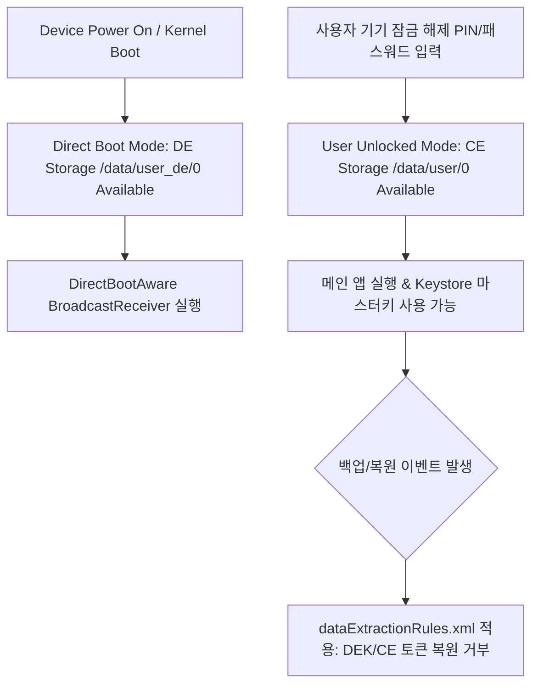

## 저장소 생명주기와 백업 계약

저장소 수명주기(Storage Lifecycle)와 백업 계약은 **FBE(File-Based Encryption) CE/DE 저장소 접근 가능 상태**, **Direct Boot 부팅 단계**, **임시 캐시 자동 트리밍**, **Scoped Storage 격리**, 그리고 **백업 복원 시 데이터 경계 명세**를 결합하는 프레임워크 아키텍처다.



### 내부 동작 메커니즘

1. **FBE Keyring Unlock Phases**: 부팅 완료 직후에는 Hardware Key 기반의 DE Key만 커널에 로드되어 DE 저장소만 읽을 수 있으며, 사용자가 비밀번호를 입력해야 사용자 패스워드로 보호되는 CE Key가 해제된다.
2. **Direct Boot Boundary**: 잠금 해제 전 실행되는 컴포넌트는 오직 `context.createDeviceProtectedStorageContext()`를 통해 생성된 DE Context만 접근해야 한다.
3. **Cache Eviction Guarantee**: `cacheDir` 및 `codeCacheDir`에 저장된 파일은 OS에 의해 언제든지 자동 삭제될 수 있으며 SSOT(Single Source of Truth)로 다루어질 수 없다.

### 저장소 위치 진단 명령어

```bash
# DE 저장소 경로 디렉터리 권한 확인
adb shell ls -ld /data/user_de/0/com.example.app

# CE 저장소 경로 디렉터리 권한 확인 (사용자 잠금 해제 상태 요구)
adb shell ls -ld /data/user/0/com.example.app
```

### 관찰 가능한 증거 (Observable Evidence)

- 잠금 상태에서 CE 저장소 파일(`/data/user/0/`) 접근 시 커널 level `I/O Error` 또는 `EACCES` 발생.
- `adb shell pm trim-caches` 실행 시 `cache/` 디렉터리 내부 파일들이 소멸함을 확인.

### 정본 노트

- [FBE에서 CE와 DE를 나누는 저장소 경계](fbe-ce-and-de-separate-storage-availability.md)
- [Direct Boot에서 허용되는 데이터와 실행 수명](direct-boot-requires-minimal-device-protected-data.md)
- [캐시와 재생성 가능한 데이터의 수명](cache-is-recreatable-data-not-source-of-truth.md)
- [Scoped Storage와 암호화가 나누는 서로 다른 개인정보 경계](scoped-storage-and-encryption-protect-different-boundaries.md)
- [백업과 복원에서 데이터 경계를 설계하기](backup-restore-requires-explicit-data-boundaries.md)

관련 지도: [보안 저장소 계약](../secure-storage-contracts/secure-storage-contracts.md)
