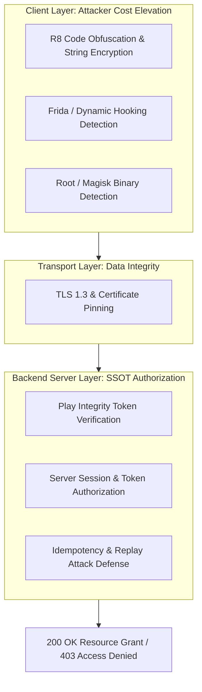

## Android 보안 실무는 클라이언트 신뢰가 아니라 방어 계층 설계다

Android 보안 실무의 핵심 철학은 **클라이언트(앱)를 절대 100% 신뢰할 수 있는 구역으로 보지 않는 다계층 심층 방어(Defense in Depth)**다. 코드 난독화(R8/DexGuard), 루팅 검사, Frida/Xposed 동적 훅킹 탐지 등은 공격 비용(Attacker Cost)을 증대시키는 보조적 수단일 뿐이며, 최종 보안 결정 및 권한 인가(Authorization)는 **백엔드 서버 검증, Hardware Root of Trust(Play Integrity), cryptographic 키 경계**에 기반해야 한다.



### 내부 동작 메커니즘

1. **Client Control Limits**: 클라이언트는 공격자의 손(Rooted Device, Frida Instrumentation, Memory Inspection)에 노출될 수 있으므로, 인스펙션 탐지 코드는 항상 바이패스될 수 있다는 위협 모델을 전제한다.
2. **Network Layer Binding (Network Security Config)**: `network_security_config.xml`을 통한 Strict TLS 1.3 강제 및 Certificate Pinning 적용으로 중간자 공격(MITM)을 예방한다.
3. **Server-Side SSOT Authorization**: 중요한 비즈니스 로직(결제, 비밀번호 변경, 자산 이체 등)은 앱의 검증 완료 국기(flag)를 믿지 않고, 서버에서 Play Integrity Token, SSL Pinning, Nonce, HMAC 서명을 종합 판단하여 최종 승인한다.

### 다계층 네트워크 보안 설정 예시 (XML & Kotlin OkHttp)

```xml
<!-- res/xml/network_security_config.xml -->
<?xml version="1.0" encoding="utf-8"?>
<network-security-config>
    <domain-config cleartextTrafficPermitted="false">
        <domain includeSubdomains="true">api.example.com</domain>
        <pin-set expiration="2027-01-01">
            <pin digest="SHA-256">7HIpAC24H3531gN5NlcGSjgchFweGvG0gEqUt0Ai2LY=</pin>
            <!-- 백업 인증서 핀 -->
            <pin digest="SHA-256">fwA070Ag2zyBZjROGhVBS45kuI1V58VU2844wvA55N8=</pin>
        </pin-set>
    </domain-config>
</network-security-config>
```

### 관찰 가능한 증거 (Observable Evidence)

- **adb를 활용한 디버그 플래그 및 설치 상태 검증**:
  ```bash
  adb shell dumpsys package com.example.app | grep -i "flags"
  ```

- **Frida 동적 진단 시도 시 관찰되는 탐지 로그**:
  ```text
  W/SecurityAgent: [DefenseInDepth] Suspicious ptrace attachment or frida-server port 27042 detected!
  ```
- **MITM 대리 서버(Charles / Fiddler) 조작 시 예외**:
  ```text
  javax.net.ssl.SSLHandshakeException: Pin verification failed!
      at okhttp3.CertificatePinner.check(CertificatePinner.kt:102)
  ```

### 판단 기준

이 노트는 세부 절차를 모두 담기보다 Android 개념을 판단할 때 유지해야 하는 책임 경계를 고정한다.

### 경계

구현 디테일은 연결된 정본으로 넘기고, 이 노트에는 중복 설명보다 판단 기준을 남긴다.

관련 노트: [Play Integrity token은 서버가 검증하는 위험 신호이지 권한 자체가 아니다](../../integrity-and-attestation/integrity-contracts/play-integrity-token-is-server-verified-risk-signal-not-authorization.md), [Android 민감 데이터는 암호화와 키 소유권을 함께 설계한다](../../secure-storage/secure-storage-contracts/sensitive-data-requires-encryption-and-key-ownership.md)
