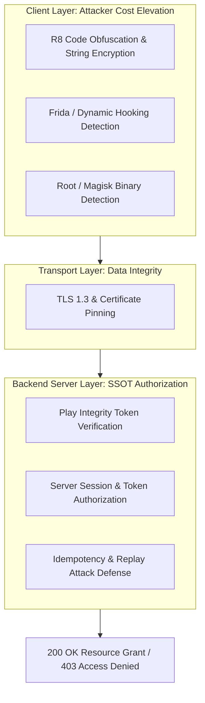

## Android 보안 실무는 클라이언트 신뢰가 아니라 방어 계층 설계다

배경 지식: [Certificate Pinning(인증서 고정)](../../../../../security/fundamentals/certificate-pinning.md)

---

### 초보자를 위한 핵심 개념 요약

Android 보안 개발에서 가장 자주 발생하는 착각은 **"앱 내부에서 검사했으니 안전하다"**라는 생각입니다. 사용자 기기에 다운로드되어 실행되는 모바일 앱(클라이언트)은 위변조, 루팅, 메모리 조작(Frida 훅킹) 등 공격자의 통제 하에 노출될 수밖에 없는 **불안전 구역**입니다.

따라서 모바일 보안의 핵심 철학은 **심층 방어 (Defense in Depth)**입니다. 앱 단의 보안 조치(난독화, 루팅 탐지)는 공격 비용(Attacker Cost)을 높여 공격을 늦추는 보조 장치일 뿐이며, **최종 보안 결정 및 권한 인가(Authorization)는 반드시 백엔드 서버 검증**에 기반해야 합니다.

---

### 심층 방어 (Defense in Depth) 계층 구조



---

### 3대 보안 계층 및 작동 메커니즘

1. **클라이언트 방어 계층 (Client Attacker Cost Elevation)**
   * **역할**: R8 난독화, 루팅/Magisk 탐지, Frida 동적 훅킹 탐지 등을 통해 공격자가 앱을 역공학(Reverse Engineering)하거나 조작하는 난이도와 비용을 극대화합니다.
   * **한계**: 공격자가 디버거나 커널 수준 훅킹을 사용할 경우 탐지 로직이 바이패스(Bypass)될 수 있으므로, 클라이언트의 검사 성공 여부 플래그를 결코 100% 신뢰해서는 안 됩니다.

2. **전송 계층 방어 (Transport Layer Integrity)**
   * **역할**: `network_security_config.xml` 설정과 [Certificate Pinning](../../../../../security/fundamentals/certificate-pinning.md)을 적용하여 앱과 서버 간 통신 데이터가 프록시(Charles, Fiddler)나 중간자 공격(MITM)으로 엿보이거나 조작되는 것을 방지합니다.
   * **작동**: OS 기본 CA 서명 저장소만 신뢰하는 대신, 서버 인증서의 공개키 해시값을 앱에 미리 고정하여 정확히 일치할 때만 암호화 채널을 엽니다.

3. **백엔드 서버 검증 계층 (Server-Side SSOT Authorization)**
   * **역할**: 모든 중요한 비즈니스 로직(결제, 비밀번호 변경, 자산 이체 등)의 **단일 진실 출처(Single Source of Truth, SSOT)** 역할을 수행합니다.
   * **검증**: 클라이언트가 보낸 데이터 외에도 [Play Integrity Token](../../integrity-and-attestation/integrity-contracts/play-integrity-token-is-server-verified-risk-signal-not-authorization.md), Nonce, HMAC 서명 등을 서버에서 종합 평가해 최종 요청 승인 여부를 결정합니다.

---

### 다계층 네트워크 보안 설정 예시 (XML & Network Security Config)

```xml
<!-- res/xml/network_security_config.xml -->
<?xml version="1.0" encoding="utf-8"?>
<network-security-config>
    <domain-config cleartextTrafficPermitted="false">
        <domain includeSubdomains="true">api.example.com</domain>
        <pin-set expiration="2027-01-01">
            <!-- 메인 인증서 공개키 SHA-256 해시 -->
            <pin digest="SHA-256">7HIpAC24H3531gN5NlcGSjgchFweGvG0gEqUt0Ai2LY=</pin>
            <!-- 백업 인증서 핀 -->
            <pin digest="SHA-256">fwA070Ag2zyBZjROGhVBS45kuI1V58VU2844wvA55N8=</pin>
        </pin-set>
    </domain-config>
</network-security-config>
```

---

### 관찰 가능한 증거 (Observable Evidence)

- **adb를 활용한 패키지 플래그 검증**:
  ```bash
  adb shell dumpsys package com.example.app | grep -i "flags"
  ```

- **Frida 동적 진단 시도 시 관찰되는 탐지 로그**:
  ```text
  W/SecurityAgent: [DefenseInDepth] Suspicious ptrace attachment or frida-server port 27042 detected!
  ```

- **MITM 대리 서버(Charles / Fiddler) 조작 시 SSL 핀 검증 예외**:
  ```text
  javax.net.ssl.SSLHandshakeException: Pin verification failed!
      at okhttp3.CertificatePinner.check(CertificatePinner.kt:102)
  ```

---

### 연관 노트

- [Certificate Pinning(인증서 고정)](../../../../../security/fundamentals/certificate-pinning.md)
- [Play Integrity token은 서버가 검증하는 위험 신호이지 권한 자체가 아니다](../../integrity-and-attestation/integrity-contracts/play-integrity-token-is-server-verified-risk-signal-not-authorization.md)
- [Android 민감 데이터는 암호화와 키 소유권을 함께 설계한다](../../secure-storage/secure-storage-contracts/sensitive-data-requires-encryption-and-key-ownership.md)

