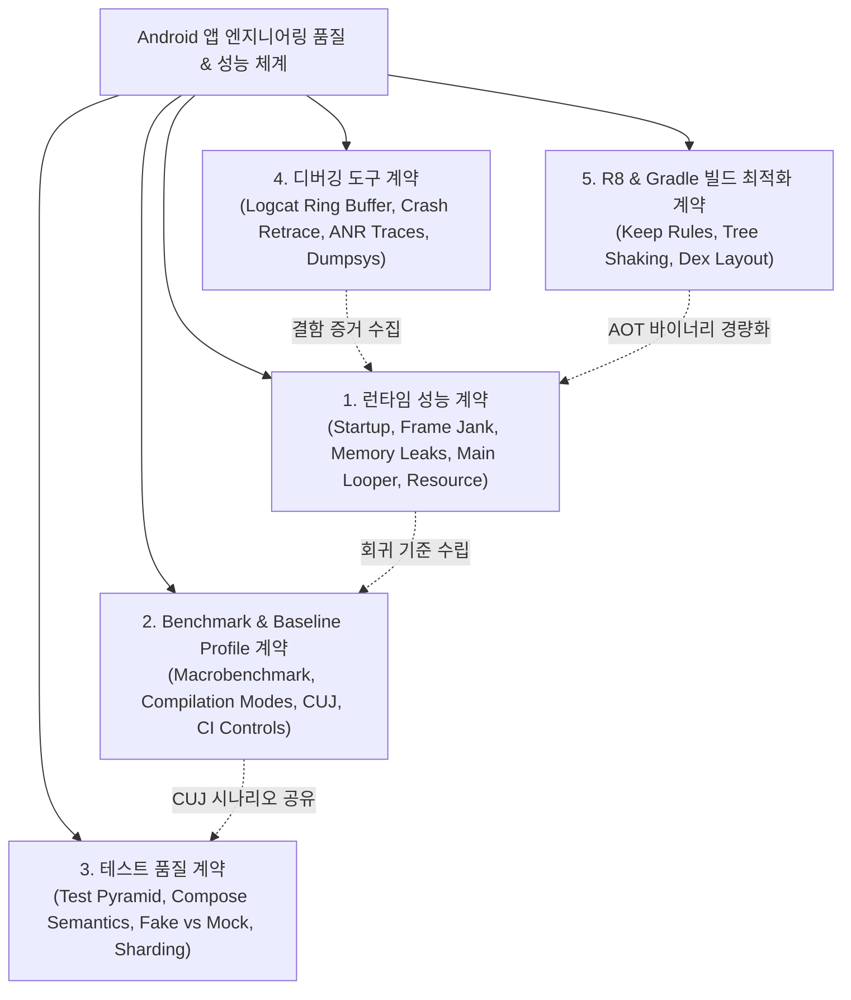

## Android 성능, 품질, 빌드 최적화 지도

이 지도는 Android 앱의 종합 품질을 단일 영역으로 취급하지 않고 **런타임 사용자 성능(Runtime Performance)**, **반복 가능한 벤치마크 및 프로필 최적화(Benchmark & Baseline Profile)**, **피드백 비용 기반 테스트 전략(Test Quality)**, **결함 분기 진단 도구(Debugging Tools)**, **배포 산출물 최적화(Build Optimization)**로 명확히 분리하여 체계화한다.

* 배경 지식: [Learning Spine 11장 — 관찰·테스트·품질 feedback](../00_foundations/learning-spine/11-observation-testing-and-quality-feedback.md)
* 빌드 산출물 최적화 소유권: [Packaging and Deployment](../03_packaging_deployment/android-packaging-deployment.md) (R8, Keep Rules, DEX 최적화는 성능 결과와 만나는 경계에서 연결)

---

### 1. 종합 품질 및 성능 체계도

---

### 2. 하위 도메인별 핵심 질문 및 도구 매트릭스

| 하위 도메인 허브 | 핵심 엔지니어링 질문 | 핵심 측정 지표 / 규격 | 주요 도구 및 API |
| :--- | :--- | :--- | :--- |
| **[런타임 성능 계약](performance/performance.md)** | "실제 사용자가 체감하는 시작, 렌더링, 메모리, 배터리 병목은 무엇인가?" | TTID/TTFD, Frame Budget(16.6ms/8.3ms), PSS/Leak, ANR 0건 | `dumpsys (gfxinfo, meminfo)`, StrictMode, LeakCanary |
| **[Benchmark와 Baseline Profile 계약](benchmark/benchmark-baseline.md)** | "통제된 환경에서 릴리스 간 성능 회귀를 어떻게 수량적으로 방지하는가?" | `StartupTimingMetric`, `FrameTimingMetric`, $\Delta\%$ 개선율 | `MacrobenchmarkRule`, `BaselineProfileRule`, Dex2Oat |
| **[테스트 품질 계약](testing/testing-quality.md)** | "피드백 비용과 신뢰성을 고려해 테스트 스위트를 어떻게 배분하는가?" | 피라미드 비율(70% Unit), SSIM 픽셀 차이, LPT Sharding | JUnit 5, ComposeTestRule, Roborazzi, Firebase Test Lab |
| **[디버깅 도구 계약](debugging/debugging.md)** | "발생한 결함(Crash/ANR/Log/State)의 원인을 어떤 도구로 좁히는가?" | De-obfuscated Stack Trace, SIGQUIT, Ring Buffer | Logcat, R8 Retrace, `ApplicationExitInfo`, ADB |
| **[Compose 성능 계약](../02_app_framework/jetpack-compose/performance/compose-performance.md)** | "Compose UI 계층의 불필요한 리컴포지션과 레이아웃 지연을 어떻게 막는가?" | Recomposition Skip Rate, Stability Inference | Compose Compiler Metrics, Layout Inspector |
| **[R8/Gradle 빌드 최적화](../03_packaging_deployment/optimization/build-optimization.md)** | "DEX 크기 수축과 최적화된 바이트코드 배치를 어떻게 달성하는가?" | APK/AAB 다운로드 크기, DEX 메서드 수 | R8 ProGuard Rules, Startup Profile |

---

## 3. 정본 허브 및 주요 레퍼런스 노드

- [런타임 성능 계약](performance/performance.md)
  - [Android 성능은 측정 후 최적화한다](performance/performance-measurement-principles.md)
  - [Android 시작 성능은 TTID와 TTFD로 나눈다](performance/startup-performance-metrics.md)
  - [렌더링 성능은 프레임 지연의 원인을 분리한다](performance/rendering-jank-frame-deadlines.md)
  - [Android 메모리는 사용량보다 회수되지 않는 객체를 본다](performance/memory-performance-leak-evidence.md)
  - [메인 스레드 작업은 앱 응답성을 결정한다](performance/main-thread-responsiveness.md)
  - [배터리, 네트워크, 저장소 성능은 자원 정책이다](performance/resource-efficiency-policies.md)
  - [Profiler, Perfetto, dumpsys는 벤치마크가 아니라 진단 도구다](performance/profiler-perfetto-diagnosis.md)
- [Benchmark와 Baseline Profile 계약](benchmark/benchmark-baseline.md)
  - [Macrobenchmark는 실제 사용자 여정을 측정한다](benchmark/macrobenchmark-user-journeys.md)
  - [Macrobenchmark의 컴파일 모드는 테스트 계약의 일부다](benchmark/macrobenchmark-compilation-modes.md)
  - [Startup mode와 reportFullyDrawn이 시작 측정 기준을 정한다](benchmark/startup-measurement-reportfullydrawn.md)
  - [CUJ 선택은 벤치마크 행동을 안정화한다](benchmark/cuj-selection-stability.md)
  - [Baseline Profile 생성은 핵심 사용자 여정을 기록한다](benchmark/baseline-profile-generation.md)
  - [Baseline Profile 검증은 profiled와 unprofiled 성능을 비교한다](benchmark/baseline-profile-verification.md)
  - [Benchmark 결과는 물리 기기와 CI 조건을 통제해야 한다](benchmark/benchmark-physical-device-controls.md)
- [테스트 품질 계약](testing/testing-quality.md)
  - [테스트 레이어는 피드백 비용으로 선택한다](testing/test-pyramid-strategy.md)
  - [Unit, Integration, UI, E2E 테스트는 실패 신호가 다르다](testing/test-levels-failure-signals.md)
  - [Compose UI 테스트는 testTag와 semantics를 분리한다](testing/compose-ui-tests-semantics.md)
  - [Espresso 는 View 기반 UI 를 동기적으로 테스트하며 IdlingResource 로 비동기 작업 완료를 기다린다](testing/espresso-idling-resources.md)
  - [Screenshot testing은 시각 회귀를 검출한다](testing/screenshot-testing-visual-regression.md)
  - [회귀와 flaky 테스트는 릴리즈 게이트의 신뢰도를 낮춘다](testing/flaky-tests-regression-gates.md)
  - [Coroutine 과 Flow 테스트는 dispatcher 와 virtual time 을 통제해야 한다](testing/coroutine-flow-testing.md)
  - [CI는 Firebase Test Lab 같은 클라우드 디바이스 매트릭스에서 테스트를 실행하고 로컬 에뮬레이터 매트릭스와는 다른 계약을 가진다](testing/firebase-test-lab-matrix.md)
  - [파이프라인 sharding 은 테스트 개수가 아니라 과거 실행 시간 기준으로 분배해야 한다](testing/test-pipeline-sharding.md)
  - [TalkBack 수동 검증과 Accessibility Scanner 자동 검사는 서로 다른 결함군을 잡는다](testing/accessibility-testing-scanner-talkback.md)
  - [Test double는 행동의 소유권으로 Fake와 Mock을 구분해 선택한다](testing/test-doubles-fake-vs-mock.md)
- [디버깅 도구 계약](debugging/debugging.md)
  - [Logcat, crash, ANR, debugger는 서로 다른 질문에 답한다](debugging/logcat-crash-anr-diagnosis.md)
  - [ADB, emulator, device tool은 테스트 환경을 제어한다](debugging/adb-emulator-device-tools.md)
  - [dumpsys (안드로이드 시스템 서비스 상태 진단 도구)](debugging/dumpsys.md)
  - [Crashlytics/Analytics SDK는 Android vitals에 없는 옵트인 컨텍스트를 더한다](debugging/crashlytics-analytics-vitals.md)
- [Compose 성능 계약](../02_app_framework/jetpack-compose/performance/compose-performance.md)
- [R8와 Gradle 빌드 최적화 계약](../03_packaging_deployment/optimization/build-optimization.md)

