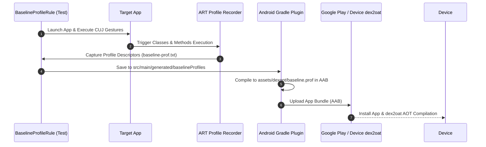

## Baseline Profile 생성은 핵심 사용자 여정을 기록한다

상위 문서: [Android 성능, 품질, 빌드 최적화 지도](../android-performance-testing-map.md)
관련 지도: [Benchmark와 Baseline Profile 계약](./benchmark-baseline.md)
관련 노트: [Android 성능은 측정 후 최적화한다](../performance/performance-measurement-principles.md)

Baseline Profile 생성은 릴리스 빌드 패키징 시 ART(Android Runtime)가 앱 설치 단계에서 `dex2oat`로 사전 AOT 컴파일할 핫 클래스 및 메서드 심볼 파일(`baseline-prof.txt`)을 핵심 사용자 여정(CUJ) 추적을 통해 산출하는 과정이다.

### 1. 프로필 생성 및 DEX AOT 컴파일 메커니즘

- **ART Profile 규격**:
  - `H`: Hot Method (자주 호출되는 메서드, JIT threshold 초과).
  - `S`: Startup Method (시작 단계에서 호출되는 메서드).
  - `L`: Post-Startup Method (시작 직후 호출되는 메서드).
- **프로필 생성 수명주기**:
  1. `BaselineProfileRule` 실행 시 ART 트레이서가 켜진 상태로 대상 앱 실행.
  2. CUJ 시나리오(시작 + 목록 스크롤 + 화면 전환) 수행 중 추적된 클래스/메서드 심볼 수집.
  3. `src/main/generated/baselineProfiles/baseline-prof.txt` 파일로 자동 기록 및 모듈 저장.
  4. AGP(Android Gradle Plugin)가 APK/AAB 패키징 시 `assets/dexopt/baseline.prof` 바이너리로 압축 탑재.
  5. Google Play Store 설치 시 Play Cloud Profile과 결합되어 온디바이스 `dex2oat` AOT 컴파일 수행.

### 2. Baseline Profile 생성 및 컴파일 산출 흐름



### 3. Baseline Profile 생성 Kotlin 코드 구체 예시

```kotlin
import androidx.baselineprofile.realm.BaselineProfileRule
import androidx.test.ext.junit.runners.AndroidJUnit4
import androidx.test.uiautomator.By
import androidx.test.uiautomator.Direction
import androidx.test.uiautomator.Until
import org.junit.Rule
import org.junit.Test
import org.junit.runner.RunWith

@RunWith(AndroidJUnit4::class)
class BaselineProfileGenerator {

    @get:Rule
    val baselineProfileRule = BaselineProfileRule()

    @Test
    fun generateBaselineProfile() = baselineProfileRule.collect(
        packageName = "com.example.app",
        includeInStartupProfile = true // 앱 시작 전용 프로필 별도 분리 생성
    ) {
        // 1. 앱 시작 흐름 기록
        pressHome()
        startActivityAndWait()

        // 2. 피드 진입 및 스크롤 핫코드 기록
        device.wait(Until.hasObject(By.res("feed_list")), 5_000)
        val feedList = device.findObject(By.res("feed_list"))
        feedList.fling(Direction.DOWN)
        device.waitForIdle()

        // 3. 상세 화면 진입 핫코드 기록
        val item = device.findObject(By.res("feed_item_0"))
        item?.click()
        device.waitForIdle()
    }
}
```

### 4. 관측 가능한 산출 증거 (Observable Evidence)

#### 생성된 baseline-prof.txt 심볼 파일 내용 덤프

```text
# Baseline Profile Rules for com.example.app
HSLLcom/example/app/MainActivity;
HSLLcom/example/app/MainActivity;->onCreate(Landroid/os/Bundle;)V
HSLLcom/example/app/ui/feed/FeedViewModel;-><init>(Lcom/example/app/data/Repository;)V
H Lcom/example/app/ui/feed/ComposableSingletons$FeedScreenKt;->lambda-1$app_release(Landroidx/compose/runtime/Composer;I)V
Lcom/example/app/data/model/FeedItem;
HSLLandroidx/compose/runtime/SlotTable;->open()V
```

### 5. 생성 품질 가이던스

- **신규 릴리스 재생성**: 주요 의존성(Compose, [Coroutines](../../02_app_framework/data/async-flow/coroutines/kotlin-coroutines.md), Room) 업그레이드 또는 CUJ 로직 변경 시 반드시 프로필을 재생성하여 형상 관리에 저장한다.
- **불필요 코드 제외**: 에러 처리 경로나 일회성 개발자 화면은 생성 시나리오에서 제외하여 AOT 바이너리 용량 및 디스크 오버헤드를 예방한다.

